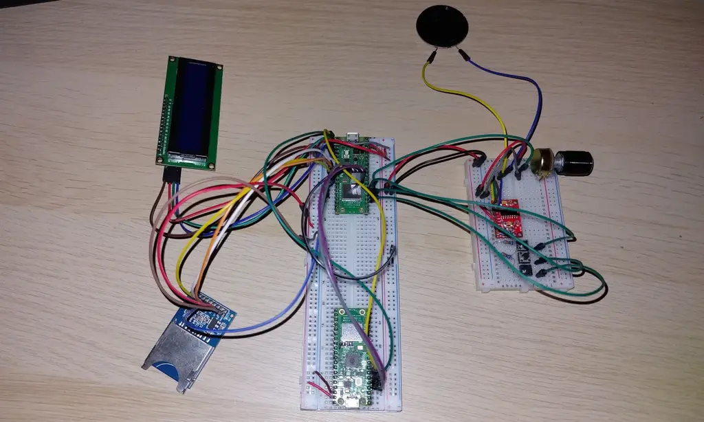
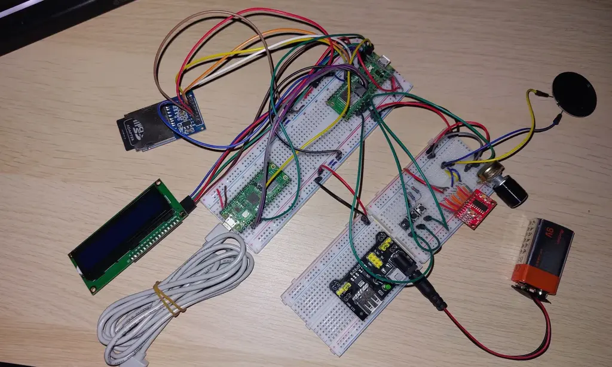

# Music Player
A device that plays, stops and skips music.

:::info 

**Author**: Dragan Delia-Alexa \
**GitHub Project Link**: https://github.com/UPB-PMRust-Students/project-ddeliaffelia

:::

## Description

Simple, compact music player built using a Raspberry Pi Pico W, programmed in Rust. It will allow users to play,
pause, and skip songs stored on an SD card through a speaker, whose volume can be controlled using a
potentiometer. The playing song's title will be shown on an LCD.

## Motivation

I tried to find a project idea that fits my interests and that I could enjoy working on. I have been passionate about music since I was little, and I can still recall the day my parents bought me a music player just like my brother's. Besides, I find it quite fun to work on a hardware project like this one.

## Architecture 

**Raspberry Pi Pico 2W:**
 - the centre of the project, controls all the other components
 - connections: SPI - SD card module, ADC - potentiometer, PWM - buttons, amplifier, I2C - LCD 

**LCD:**
 - displays the name of the song
 - connections: I2C - microcontroller 

**Amplifier:**
 - increases the quality and strength of the sound
 - connections: through wires - speaker, DAC
 
**Speaker:**
 - emmits the music
 - connections: through wires - amplifier 

**Potentiometer:**
 - increases or decreases the volume
 - connections: ADC - microcontroller 

**SD card module:**
 - supplements storage space for the songs that will be played
 - connections: SPI - microcontroller 

**DAC:**
 - transforms digital signal into analog signal
 - connections: SPI - microcontroller, through wires - amplifier, power supply

**Power supply:**
 - powers the DAC with 5V
 - connections: DC cable - battery, through wires - DAC

**Battery:**
 - powers the power supply
 - connections: DC cable - power supply


## Log

<!-- write your progress here every week -->

### Week 28 April - 4 May
Purchased components, started my research for the software part, worked on a KiCAD scheme, uploaded the basics on my website

### Week 5 - 11 May
Set up my components, focusing on the 2 Picos (connected and tested the target and debug microcontrollers). Started testing code for my components


### Week 12 - 18 May
Purchased more components after finding out about some possible errors (a 9V battery, DC cable, DAC) and set them up (except for the DAC that will arrive on the 19th). Focused on the software after assembling my components


### Week 19 - 25 May

## Hardware

In this project, the core piece is a Raspberry Pi Pico 2W that gets its digital audio play-back from an SD card inserted in a module, interfaced via SPI connection, and outputs it through a speaker, powered by a PAM8403D amplifier. The amplifier functions with analog signal, which is why a MCP4821-E/P DAC (Digital-Analog converter) is used, that gets its power from a 5V power supply with a 9V alkaline battery. A 1602 LCD displays via I2C protocol the currently playing song's title. The emitted sound's volume is controlled by a manually adjustable variable resistor (potentiometer). There are also three buttons connected to the microcontroller's GPIO pins meant to play, pause and navigate through the songs. 

### Schematics


### Bill of Materials

<!-- Fill out this table with all the hardware components that you might need.

The format is 
```
| [Device](link://to/device) | This is used ... | [price](link://to/store) |

```

-->

| Device | Usage | Price |
|--------|--------|-------|
| [Raspberry Pi Pico W](https://www.raspberrypi.com/documentation/microcontrollers/raspberry-pi-pico.html) | The microcontroller | [35 RON](https://www.optimusdigital.ro/en/raspberry-pi-boards/12394-raspberry-pi-pico-w.html) |
| [Breadboard kit](https://www.emag.ro/set-componente-electronice-led-uri-breadboard-830-puncte-componente-pentru-incepatori-compatibil-arduino-si-raspberry-pi-ouylaf-308-10149-409/pd/DH8RVLYBM/?ref=hdr-favorite_products) | Breadboard, resistors, cables, buttons, power supply | [71 RON](https://www.emag.ro/set-componente-electronice-led-uri-breadboard-830-puncte-componente-pentru-incepatori-compatibil-arduino-si-raspberry-pi-ouylaf-308-10149-409/pd/DH8RVLYBM/?ref=hdr-favorite_products) |
| [LCD Display](https://www.waveshare.com/datasheet/LCD_en_PDF/LCD1602.pdf) | Displays song | [16 RON](https://www.optimusdigital.ro/ro/optoelectronice-lcd-uri/2894-lcd-cu-interfata-i2c-si-backlight-albastru.html?search_query=LCD+1602+cu+Interfata+I2C+si+Backlight+Albastru&results=2) |
| [Amplifier](https://www.elecrow.com/download/PAM8403-datasheet.pdf?srsltid=AfmBOopAvrZSALh3lz5hqR4VpMRTfoAjwIrQ9JTq8bMPUaTYGRWY__sL) | Boosts audio | [4 RON](https://www.optimusdigital.ro/ro/audio-amplificatoare-audio/165-amplificator-in-miniatura.html) |
| [Speaker](https://ardushop.ro/ro/componente-discrete/1084-difuzor-1w-8ohm-50mm-6427854014900.html) | Plays audio | [4 RON](https://ardushop.ro/ro/componente-discrete/1084-difuzor-1w-8ohm-50mm-6427854014900.html) |
| [Potentiometer](https://projects.raspberrypi.org/en/projects/introduction-to-the-pico/11) | Changes the volume | [2 RON](https://www.optimusdigital.ro/ro/componente-electronice-potentiometre/901-rezistor-variabil-10k-wh148.html?search_query=Rezistor+Variabil+10k+WH148+%28Poten%C8%9Biometru%29&results=2) |
| [SD Card Module](https://www.optimusdigital.ro/ro/altele/98-modul-cititor-card-sd.html) | Reads SD card with songs | [6 RON](https://www.optimusdigital.ro/ro/altele/98-modul-cititor-card-sd.html) |
| [DAC](https://4donline.ihs.com/images/VipMasterIC/IC/MCHP/MCHPS03134/MCHPS03134-1.pdf?hkey=6D3A4C79FDBF58556ACFDE234799DDF0) | Converts digital signal into analog signal | [16 RON](https://ro.farnell.com/microchip/mcp4821-e-p/12bit-dac-spi-vref-single-pdip8/dp/1439411) |
| [Battery-DC cable](https://www.optimusdigital.ro/ro/fire-fire-mufate/896-fir-pentru-baterie-de-9v.html?search_query=baterie&results=311) | Connects 9V battery to the power supply | [1.5 RON](https://www.optimusdigital.ro/ro/fire-fire-mufate/896-fir-pentru-baterie-de-9v.html?search_query=baterie&results=311) |
| [Battery](https://www.auchan.ro/baterie-alcalina-auchan-high-performance-6lr61-9v-1-bucata/p) | Powers power supply | [9 RON](https://www.auchan.ro/baterie-alcalina-auchan-high-performance-6lr61-9v-1-bucata/p) |

## Software

| Library | Description | Usage |
|---------|-------------|-------|
| [embassy-rp](https://crates.io/crates/embassy-rp) | Embassy HAL for Raspberry Pi RP2040 | Used for running Rust on Raspberry Pi |
| [embassy-executor](https://crates.io/crates/embassy-executor) | async/await executor  | Used for asynchronous programming |
| [defmt](https://docs.rs/defmt/latest/defmt/) | Highly efficient logging framework | Used for debugging |
| [cortex-m](https://crates.io/crates/cortex-m) | Low-level access to Cortex-M processors | Used for accesing Cortex-M processor |
| [lcd-lcm1602-i2c](https://crates.io/crates/lcd-lcm1602-i2c) | Driver for LCD1602 | Used to control the display |
<!-- | [rodio](https://link) | USAGE | Used for ... |
| [name](https://link) | USAGE | Used for ... | -->

## Links

<!-- Add a few links that inspired you and that you think you will use for your project -->

1. [Project Radio fm](https://www.optimusdigital.ro/ro/content/9-proiect-radio-fm)
