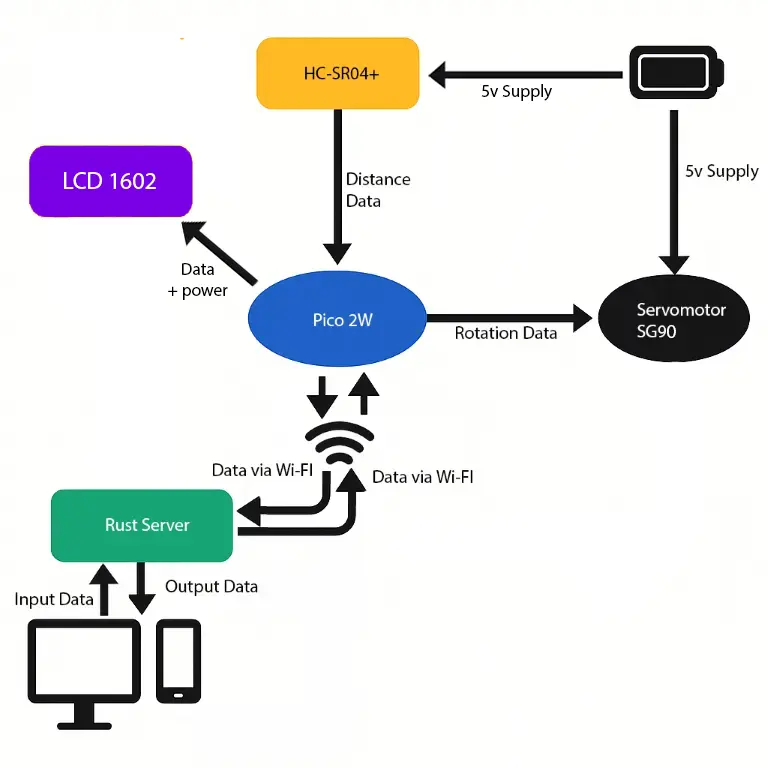
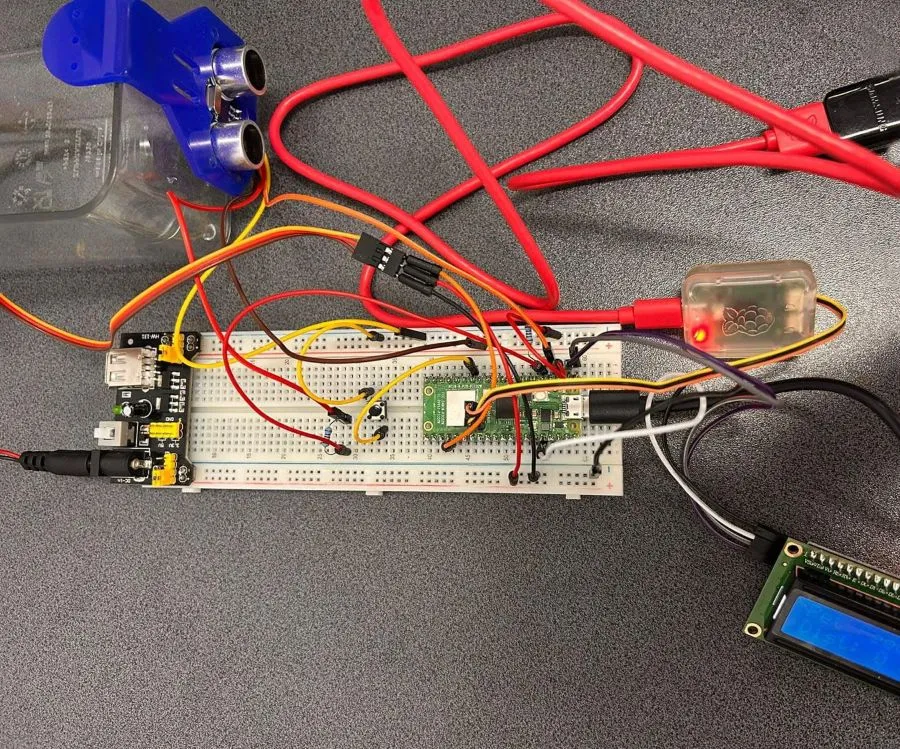
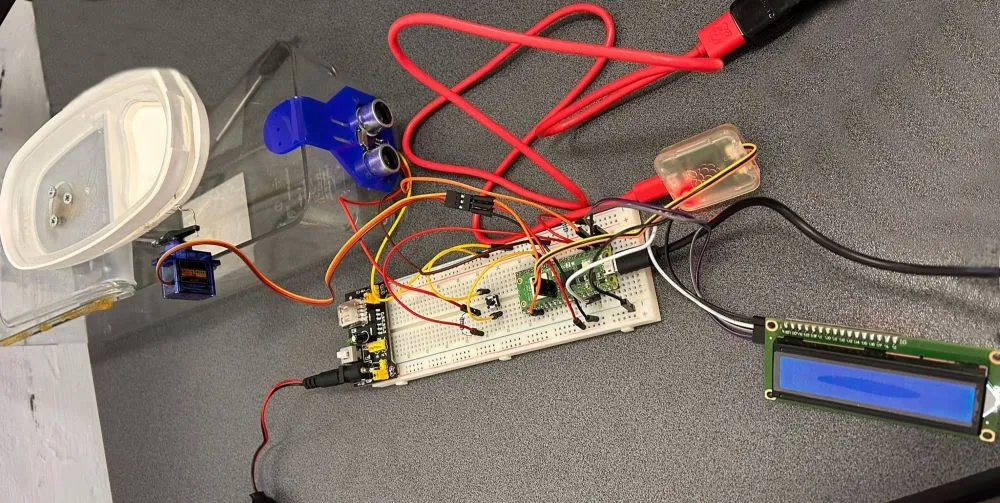
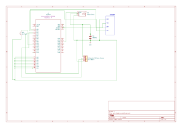

# Pet Feeder
Automatic food dispenser for animals

:::info 

**Author**: JUVERDEANU Diana-Maria \
**GitHub Project Link**: https://github.com/UPB-PMRust-Students/project-JuverdeanuDianaMaria

:::

## Description

I grew up surrounded by pets  at home, and one recurring challenge we faced as a family was planning vacations. We often had to limit our travel plans because it was difficult to find someone reliable to feed our pets while we were away. This inspired me to design a Smart Pet Feeder system built using a Raspberry Pi Pico 2W and Rust. The feeder dispenses food at scheduled times or remotely via wi-fi control. To make pet care more convenient and give pet owners more freedom and peace of mind when traveling.

## Motivation

I believe this could be a practical solution to real-life problems I've faced. Even if the project might seem a bit silly, I’m excited to have fun working with the hardware I've invested in.

## Architecture 

Main Components:

Raspberry Pico 2W: Acts as the central processing unit for the Pet Feeder, controlling the sensors and motors.

Ultrasonic Distance Sensor HC-SR04+: Detects when a pet is near the feeder.

Servo Motor SG90: Drives the mechanism to dispense the pet food.

LCD 1602: Displays a message when the object is detected.

Power Supply: Provides the necessary power to all components at 5V.
 
Wi-Fi Module: Facilitates communication with external devices.

Connection Overview:
The Raspberry Pi Pico 2W acts as the central controller of the Pet Feeder, directly interfacing with the ultrasonic distance sensor (HC-SR04+), the SG90 servomotor, and an LCD1602 display. When the pet approaches the feeder, the sensor detects proximity, and the Pico 2W automatically activates the servo to dispense food. Simultaneously, the LCD1602 displays relevant status messages such as "Object detected" and the current measured distance, providing real-time feedback.
The Pico also runs a Wi-Fi access point and hosts a local web server, allowing the owner to manually trigger feeding from a browser interface. The SG90 servomotor is responsible for physically releasing food from a dedicated container and is powered by a stable 5V supply. The ultrasonic distance sensor ensures that food is only dispensed when the pet is actually nearby, preventing unnecessary activation.
This architecture ensures seamless interaction between sensing, actuation, and user control, enabling both automatic and manual feeding through reliable, Wi-Fi-based communication, with the Pico 2W orchestrating all core functions and the LCD1602 providing local visual feedback.

## Log

<!-- write your progress here every week -->

### Week 5 - 11 May
Bought hardware parts. Mounted the Raspberry Pi Pico 2W on breadboard. Wrote the code for the ultrasonic sensor (HC-SR04+). Tested PWM for SG90 servo motor. 
### Week 12 - 18 May
Wrote the code for the servomotor (SG90) and for the button. Tested the LCD.
### Week 19 - 25 May

## Hardware

Pico 2W - brain of the Pet Feeder

Servo Motor  SG90 - delivers food

Ultrasonic Distance Sensor HC-SR04+ - detects pet

LCD 1602 - displays a message 

Power Supply - battery 5V

### Schematics

This is the kicad schematic.

### Bill of Materials

| Device | Usage | Price |
|--------|--------|-------|
| [Raspberry Pi Pico 2W](https://www.raspberrypi.com/documentation/microcontrollers/pico-series.html) | The microcontroller | [39 RON](https://www.optimusdigital.ro/ro/placi-raspberry-pi/13327-raspberry-pi-pico-2-w.html?gad_source=1&gbraid=0AAAAADv-p3BYbmtR0U4AB0vh3IzVtnhct&gclid=Cj0KCQjw2tHABhCiARIsANZzDWpC5jvEeQu1M-4aPsGLz0h_VUH-1oeoOhxuRTAuJpaxGS73j50IQKQaAkviEALw_wcB) |
| [Servo Motor SG90]( https://www.optimusdigital.ro/ro/motoare-servomotoare/2261-micro-servo-motor-sg90-180.html?search_query=SG90&results=11) | The Servo Motor | [12 RON]( https://www.optimusdigital.ro/ro/motoare-servomotoare/2261-micro-servo-motor-sg90-180.html?search_query=SG90&results=11) |
| [Raspberry Pi Pico Debug probe](https://www.raspberrypi.com/documentation/microcontrollers/debug-probe.html) | Pico Debug Probe | [66 RON]( https://www.optimusdigital.ro/ro/) |
| [HC-SR04+ Distance sensor](https://www.optimusdigital.ro/en/ultrasonic-sensors/2328-senzor-ultrasonic-de-distana-hc-sr04-compatibil-33-v-i-5-v.html?search_query=sr04&results=20) | Used to measure the distance from the pet to the device | [15 RON]( https://www.optimusdigital.ro/ro/) |
| [LCD 1602]( https://www.optimusdigital.ro/ro/optoelectronice-lcd-uri/2894-lcd-cu-interfata-i2c-si-backlight-albastru.html?search_query=0104110000003584&results=1) |LCD module that communicates via I2C interface and displays 2 rows of 16 characters each | [17 RON]( https://www.optimusdigital.ro/ro/) |

## Software
| Library | Description | Usage |
|---------|-------------|-------|
| embassy-executor  | Asynchronous runtime for embedded Rust | Runs the `main()` function as an async task and enables multitasking  |
| embassy-rp  | Hardware Abstraction Layer (HAL) for Raspberry Pi Pico (RP2040)           |Configures PWM (servo), GPIO (button), I²C (LCD), and other peripherals |
| embassy-time  | Async timing utilities (timers, delays) | Used for `Timer::after_secs()` and debounce delays |
| hd44780-driver  | Driver for HD44780 LCD over I²C via PCF8574 expander | Initializes and writes messages to the 1602 LCD |
| heapless  | Provides stack-allocated types like `String<32>` without heap allocation | Used to build display messages for the LCD without `std` |
| fixed  | Fixed-point arithmetic types | Used to precisely set PWM frequency divider via `to_fixed()`  |
| defmt  | Efficient logging framework for embedded devices | Displays debug/info messages via `info!` during runtime  |
| defmt-rtt  | Sends `defmt` logs over RTT (Real-Time Transfer) via USB  | Streams logs to the host for debugging over USB |
| panic-probe  | Panic handler that outputs the panic reason through `defmt`  | Captures and logs panics during runtime for debugging   |
| core::fmt::Write  | Enables formatted string output to heapless `String`| Used with `write!(...)` macro to write to a `String<32>`  |

## Links

1. [inspiration 1](https://youtu.be/bvon9nxhqHk?si=2qOuvlQmeptNkpEQ)
2. [inspiration 2](https://youtu.be/vKdQXICO-r0?si=8dzN55QKdWMFFRC1)

