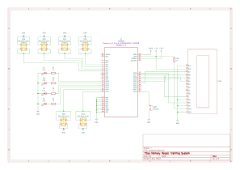

# Memory Recall Training System
An Embedded Game for Cognitive and Reaction Speed Enhancement

:::info 

*Author*: Ioana-Alexia DEACONU \
*GitHub Project Link*: https://github.com/UPB-PMRust-Students/project-alexiadeaconu

:::

## Description

Memory Recall Training System is a microcontroller-based interactive game that challenges players to enhance their short-term memory and reaction speed. It works by generating and displaying sequences of LED activations which the player must reproduce correctly using buttons. The system dynamically adjusts its behavior based on selected difficulty levels and provides real-time audio-visual feedback via a buzzer and LCD. At the end of each game, the system displays the final score, calculated based on accuracy and reaction time, and sends the result to an online leaderboard via Wi-Fi.

## Motivation

This project was chosen due to its potential to combine several embedded systems topics: hardware control (LEDs, buttons, PWM for sound), real-time input processing, user interface via an LCD, and network communication. Moreover, the cognitive aspect of the game provides a meaningful and engaging application of embedded technology in educational or therapeutic contexts.

## Architecture

#### 1. Difficulty Button
- *Function*: User input to select game difficulty.
- *Behavior*: Cycles through Easy, Medium, Hard.

#### 2. Difficulty Selector
- *Function*: Reads the state of the Difficulty Button.
- *Behavior*: Maintains the currently selected difficulty level.
- *Interaction*: Informs the Game Controller to adjust sequence logic and scoring weights.

#### 3. Game Controller
- *Function*: Central unit managing the game logic.
- *Responsibilities*:
  - Starts game when initiated.
  - Coordinates sequence generation, input validation, and score calculation.

#### 4. Random Sequence Generator
- *Function*: Generates a random sequence of LED combinations.
- *Tool*: Uses `oorandom::Rand32`.
- *Output*: Passes the generated sequence to the Output Task.

#### 5. Output Task (LEDs + Buzzer)
- *Function*: Provides visual and audio feedback.
- *Behavior*:
  - Activates LEDs in a predefined sequence.
  - Plays distinct tones for each LED using the buzzer.

#### 6. User Button Input
- *Function*: Allows user to replicate the LED sequence.
- *Behavior*: Captures physical button presses and passes them to the Input Validator.

#### 7. Input Validator
- *Function*: Compares the player's input to the original generated sequence.
- *Logic*:
  - Correct input: trigger Reaction Time Measurer and continue game.
  - Incorrect input: end game and trigger Scoring System.

#### 8. Reaction Time Measurer
- *Function*: Measures the player's response time.
- *Tool*: Uses `embassy-time` timers.
- *Output*: Reaction time data used in scoring.

#### 9. Scoring System
- *Function*: Calculates the player's final score.
- *Criteria*:
  - Input accuracy
  - Reaction time
  - Difficulty level

#### 10. LCD Display
- *Function*: Displays game state and results.
- *Tool*: Uses `hd44780-driver`.
- *Content*:
  - Current difficulty
  - Reaction times
  - Final score

#### 11. Score Sender
- *Function*: Sends final score to leaderboard.
- *Tools*: `embassy-net`, `reqwest`, `serde`
- *Behavior*:
  - Converts score to JSON
  - Sends via POST request to server

## Log

<!-- write your progress here every week -->

### Week 5 - 11 May

#### Hardware Integration
- Assembled the full hardware setup using jumper wires and two breadboards.
- Connected the components: 4 LEDs, 6 push buttons, LCD1602 display (in 4-bit mode), Raspberry Pi Pico 2W microcontroller and Debug Probe.
- Verified the functionality of each hardware component through basic individual tests (LED blinking, button press detection, display initialization).

#### Software Development
- Wrote the main application that defines the game logic and rules.
- Initialized peripherals (LEDs, buttons, LCD) using `embassy_sync::Mutex` for safe concurrent access in async tasks.
- Implemented the following:
  - Random LED sequence generation using the `oorandom` crate.
  - Input handling to compare player responses with the generated sequence.
  - Visual feedback.
  - Reaction time measurement using `embassy_time::Instant` and display on the LCD at the end of each correct input.
  - Score display on the LCD at the end of each game.

### Week 12 - 18 May

#### Hardware Integration
- Integrated the passive buzzer into the hardware setup.
- Successfully verified its functionality through basic sound tests, including varying tones and frequencies.

#### Software Development
- Implemented the following:
  - Audio feedback for each LED activation and for each button press during user input.
  - Difficulty selection via button presses before game start and display on the LCD.
  - Game initiation after difficulty selection via "Play" button.
  - Game-over function that plays a short melody and animates LEDs in a playful pattern.
  - Game restart without USB reset.

### Week 19 - 25 May

## Hardware

The project uses the **Raspberry Pi Pico 2W** as the main microcontroller, powered via USB and programmed using a **Raspberry Pi Debug Probe** over the SWD interface. Key hardware components include:

- **LEDs** (Red, Yellow, Green, Blue): Connected to GPIO pins via *220Ω resistors* to limit current.

- **Push Buttons**: 6 buttons connected to GPIO pins. 

- **Passive Buzzer**: Connected to a PWM-capable GPIO pin for audio tone output.

- **1602 LCD Module**: Wired in 4-bit parallel mode, using six GPIOs for control and data.

- **Breadboards (830 points)**: Used to prototype the circuit layout.

- **Male-to-Male Jumper Wires**: For connecting components to the breadboard and microcontroller.

- **Power Distribution**: 3.3V and GND from the Pico are shared across the breadboard rails.

All components are integrated onto the breadboard to form a compact and testable embedded system.

### Schematics

### Bill of Materials

<!-- Fill out this table with all the hardware components that you might need.

The format is 

| [Device](link://to/device) | This is used ... | [price](link://to/store) |

-->

| Device | Usage | Price |
|--------|--------|-------|
| [Raspberry Pi Pico 2W](https://www.raspberrypi.com/documentation/microcontrollers/raspberry-pi-pico.html) | The microcontroller | [39.66 RON](https://www.optimusdigital.ro/en/raspberry-pi-boards/13327-raspberry-pi-pico-2-w.html) |
| [Debug Probe](https://www.raspberrypi.com/documentation/microcontrollers/debug-probe.html) | Programming & debugging | [69.06 RON](https://ro.farnell.com/raspberry-pi/sc0889/debug-connector-3-pin-raspberry/dp/4163983) |
| [LCD Module 1602 Backlight Yellow Green 5V](https://www.waveshare.com/datasheet/LCD_en_PDF/LCD1602.pdf) | Display | [9.82 RON](https://www.optimusdigital.ro/en/lcds/867-modul-lcd-1602-cu-backlight-galben-verde-de-5v.html) |
| [LEDs](https://www.farnell.com/datasheets/1498852.pdf) | Visual indicators | [4 x 0.39 RON](https://www.optimusdigital.ro/en/leds/696-led-rou-de-3-mm-cu-lentile-difuze.html) |
| Resistors 0.25W 220Ω | LED current limiting | [4 x 0.10 RON](https://www.optimusdigital.ro/en/resistors/1097-025w-220-resistor.html) |
| Push Buttons | User input | [6 x 1.99 RON](https://www.optimusdigital.ro/en/buttons-and-switches/1115-white-button-with-round-cover.html) |
| Passive Buzzer | Audio feedback | [0.99 RON](https://www.optimusdigital.ro/en/buzzers/12247-3-v-or-33v-passive-buzzer.html) |
| Breadboard HQ (830 points)| Prototyping connections | [2 x 9.98 RON](https://www.optimusdigital.ro/en/breadboards/8-breadboard-hq-830-points.html) |
| Male-to-Male Jumper Wires | For wiring components | [7.99 RON](https://www.optimusdigital.ro/en/wires-with-connectors/12-breadboard-jumper-wire-set.html) |

## Software

| Library | Description | Usage |
|---------|-------------|-------|
| [embassy-rs](https://github.com/embassy-rs/embassy) | Asynchronous embedded framework | Core async runtime and I/O handling |
| [embassy-executor](https://github.com/embassy-rs/embassy/tree/main/embassy-executor) | Task scheduling and execution framework for embedded systems | Used for managing asynchronous tasks with Spawner |
| [embassy-rp](https://github.com/embassy-rs/embassy/tree/main/embassy-rp) | Raspberry Pi Pico 2W hardware abstraction | Used for controlling GPIO pins, PWM, and peripherals |
| [embassy-net](https://github.com/embassy-rs/embassy/tree/main/embassy-net) | Network stack | Used for HTTP POST score submission |
| [embassy-sync](https://github.com/embassy-rs/embassy/tree/main/embassy-sync) | Synchronization primitives for async code | Provides Mutex for protecting shared resources in async tasks |
| [embassy-time](https://github.com/embassy-rs/embassy/tree/main/embassy-time) | Time handling for asynchronous applications | Used for managing timers and delays (Duration, Timer, Instant) |
| [hd44780-driver](https://crates.io/crates/hd44780-driver) | LCD driver | Control of the LCD |
| [heapless](https://crates.io/crates/heapless) | Fixed-size strings | Efficient string manipulation without heap |
| [oorandom](https://crates.io/crates/oorandom) | Random number generation library | LED sequence generation |
| [reqwest](https://github.com/seanmonstar/reqwest) | HTTP client library | HTTP requests (POST for score submission) |
| [serde](https://github.com/serde-rs/serde) | Serialization/deserialization framework | Used for serializing and deserializing data (JSON for network communication) |
| [defmt](https://github.com/knurling-rs/defmt) | Efficient embedded logging framework | Debug output and panic diagnostics |
| [panic-probe](https://crates.io/crates/panic-probe) | Minimal panic handler for embedded systems | Handles panic situations and logs output via defmt |

## Links

<!-- Add a few links that inspired you and that you think you will use for your project -->

1. [Project Inspiration](https://www.youtube.com/watch?v=FZLmSVf_AiY)
2. [Playing Songs on a Passive Buzzer](https://esp32.implrust.com/buzzer/play-songs/index.html)
3. [Case Design](https://www.youtube.com/watch?v=XN7a0z1gjsI)
