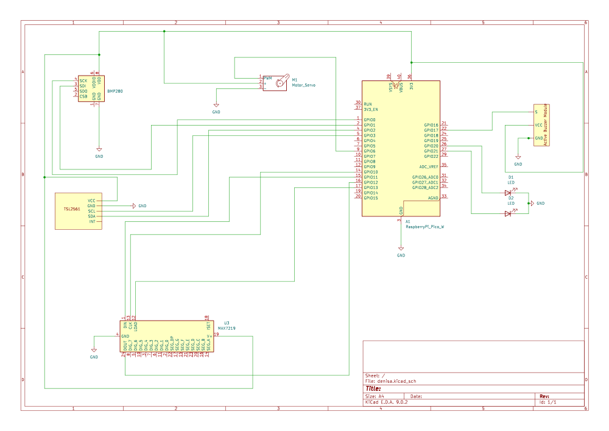
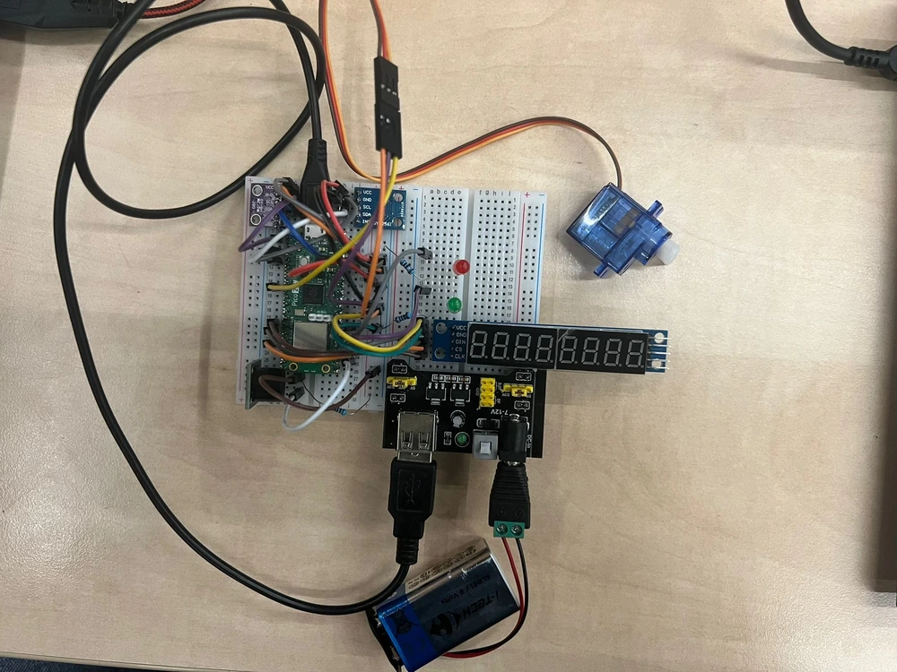
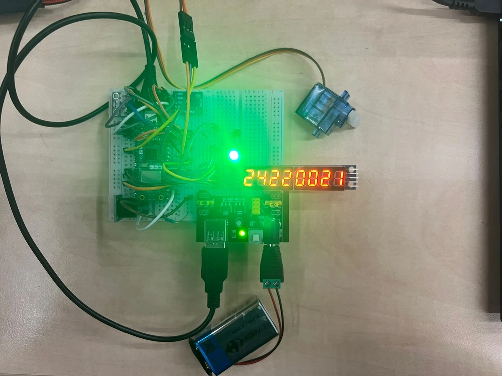
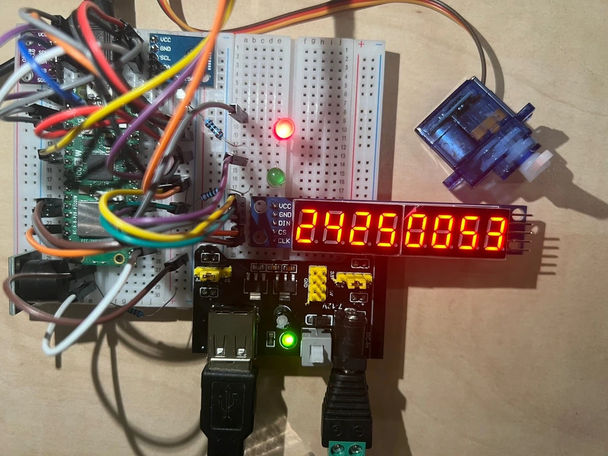

# Pet Sense
PetSense is a smart system that monitors temperature, light, triggering events and alarms based on sensor data.

:::info

**Author**: Dudui Ioana-Denisa \
**GitHub Project Link**: https://github.com/UPB-PMRust-Students/project-denisa31012005

:::

## Description

PetSense is a smart environmental monitoring system designed to help keep pets comfortable and safe in their living space. It uses sensors to track temperature and light levels, which are important factors in a pet’s environment—especially for small animals or those sensitive to heat and light.

An active buzzer alerts the owner with different sounds if the conditions become uncomfortable, like if it gets too hot or too bright. This helps pet owners take quick action to improve the environment.

The system uses a pub/sub communication model to efficiently manage and respond to these changes, making sure each component reacts when needed. For example, if the temperature sensor (connected via I2C) detects heat beyond a set level, the buzzer might sound and other parts of the system respond.

A real-time 8-segment display screen shows the current temperature and pressure, so owners can easily check how things are going without needing to use a phone or computer.

To help manage the feeding process automatically, a servomotor is used.

For visual feedback, 2 leds are used:the green LED turns on when the environment is comfortable(the temperature and light levels are in a safe range) while the red led lights up when something isn’t right(if it’s too hot, too bright).

A timer function also helps by checking conditions at regular intervals, ensuring the pet’s environment is monitored consistently without manual checks.

## Motivation

I chose this project because I wanted to create something that could monitor and react to real-world conditions, like temperature and light. It seemed like a challenge to use sensors to gather data and trigger alarms when something unusual happens.Also, I thought it would be a great way to improve my skills with embedded systems.I wanted to build something practical that could be useful in everyday situations, like keeping track of the environment in a room.

## Architecture 


The Raspberry Pi Pico serves as the central control unit, managing all components within the PetSense system.

The temperature sensor(via I2C) monitors the ambient temperature and provides real-time data to the Pico for evaluation.

The light sensor measures the brightness of the surroundings and sends that information to the Pico, which decides what to do based on preset light level thresholds.

The active buzzer emits different alarms depending on changes in the environment—like too much light or an uncomfortable temperature—based on alerts sent through the system’s communication channel.

The 8-segment display shows the current temperature and pressure readings,offering users a clear view of the environmental conditions.

The servomotor reacts to a timer.

The 2  LEDs are used to give visual feedback:the green LED lights up when the temperature and light are within safe and comfortable ranges,and the red LED turns on if conditions become unfavorable—such as high heat, excessive brightness.

A built-in timer keeps track of time intervals, allowing the system to run regular checks and carry out actions at set times automatically.


## Log

<!-- write every week your progress here -->

### Week 6 - 12 May
In the first week of my PetSense project,I bought the necesarry components for the project to keep everything organized.Then,I started working on the schematics,documentation and architecture, taking my time to plan out the design carefully while coding and testing the components to see if they were working accordingly.I also drew the initial KiCad schematic.

### Week 7 - 19 May
This week, I completed the KiCad schematic and finished the electronic design for the PetSense system. I also purchased the remaining components needed for the project to ensure I had everything. In terms of software, I worked on completing the code, with a particular focus on the servomotor functionality, ensuring it responds correctly to timer-based events. Additionally, I finished the overall project design and architecture,improving how each component interacts within the system to ensure efficient response to environmental changes.
### Week 20 - 26 May

## Hardware

**Raspberry Pi Pico**
- Role:
Acts as the central controller for the pet environment monitoring system. It coordinates communication between all components including sensors  and the Event Channel. It runs the core logic, gathers data from sensors, evaluates thresholds, publishes events, and ensures that each subscriber(display, buzzer, servo, LEDs) reacts appropriately.

- Connection:
    - **I2C0:**
        - **SDA:** Connected to **PIN_0**(used for BMP280)
        - **SCL:** Connected to **PIN_1**(used for BMP280)
    - **I2C1:**
        - **SDA:** Connected to **PIN_2**(used for TSL2561)
        - **SCL:** Connected to **PIN_3**(used for TSL2561)
    - **SPI1:**
        - **CLK:** Connected to **PIN_10**(used for the 8-segment display)
        - **MOSI:** Connected to **PIN_11**(used for the 8-segment display)
        - **MISO:** Connected to **PIN_12**(used for the 8-segment display)
        - **CS:** Connected to** PIN_13**(used for the 8-segment display)
    - **PWM Slice 3:**
        - **PWM Output A:** Connected to **PIN_6**(used for the Servomotor)
    - **GPIO:**
        - **Buzzer:** Connected to **PIN_17**
        - **Red LED:** Connected to **PIN_20**
        - **Green LED:** Connected to **PIN_21**

**Sensor Manager (Temperature & Light)**
- Role: Continuously gathers readings from the temperature (via I2C)and light sensors.

- Connection:
    - **BMP280:**
        - **SDA:** Connected to Raspberry Pi Pico W **PIN_0**(via I2C0)
        - **SCL:** Connected to Raspberry Pi Pico W **PIN_1**(via I2C0)
    - **TSL2561:**
        - **SDA:** Connected to Raspberry Pi Pico W **PIN_2**(via I2C1)
        - **SCL:** Connected to Raspberry Pi Pico W **PIN_3**(via I2C1)

**Event Publisher & Event Channel**
- Role: The Event Publisher checks if sensor readings cross critical thresholds.If they do, it sends corresponding events to the Event Channel.

- Connection:
    - **Interface:** Internal to the Raspberry Pi Pico W's software

**8-segment Display**
- Role: Shows real-time temperature and pressure values.

- Connection:
    - **CLK:** Connected to Raspberry Pi Pico W **PIN_10**(via SPI1)
    - **MOSI:** Connected to Raspberry Pi Pico W **PIN_11**(via SPI1)
    - **MISO:** Connected to Raspberry Pi Pico W **PIN_12**(via SPI1)
    - **CS:** Connected to Raspberry Pi Pico W **PIN_13**(via SPI1)

**Buzzer Controller**
- Role: Provides an audio warning signal when critical environmental limits are exceeded.

- Connection:
    - Connected to Raspberry Pi Pico W **PIN_17**

**Servomotor Controller**
- Role: Mechanically responds in order to ensure the deeding process.

- Connection:
    - Connected to Raspberry Pi Pico W **PIN_6**(PWM output from PWM Slice 3)

**LED Indicator Controller**

- Role: Provides feedback about the pet's environment(green for good parameters, red for not appropiate parameters).
- Connection:
    - **Red LED:** Connected to Raspberry Pi Pico W **PIN_20**
    - **Green LED:** Connected to Raspberry Pi Pico W **PIN_21**

### Schematics
The KiCad Schematic:








### Bill of Materials

<!-- Fill out this table with all the hardware components that you might need.

The format is 
```
| [Device](link://to/device) | This is used ... | [price](link://to/store) |

```

-->

| Device | Usage | Price |
|--------|--------|-------|
| [Raspberry Pi Pico W](https://www.raspberrypi.com/documentation/microcontrollers/raspberry-pi-pico.html) | The microcontroller | [35 RON](https://www.optimusdigital.ro/en/raspberry-pi-boards/12394-raspberry-pi-pico-w.html) |
| [BMP280](https://cdn-shop.adafruit.com/datasheets/BST-BMP280-DS001-11.pdf) | Temperature and Humidity Sensor | [7.99 RON](https://www.optimusdigital.ro/ro/senzori-senzori-de-temperatura/99-senzor-de-temperatura-si-si-umiditate-dht11.html) |
| [LDR](https://www.alldatasheet.com/datasheet-pdf/download/203054/TAOS/TSL2561.html) | Light Intensity Sensor | [6.95 RON](https://www.optimusdigital.ro/ro/senzori-senzori-optici/167-modul-cu-fotorezistor.html) |
| Active Buzzer |  AlertBuzzer | [1.5 RON](https://www.optimusdigital.ro/en/buzzers/12513-pcb-mounted-active-buzzer-module.html) |
| [Breadboard HQ](https://www.optimusdigital.ro/en/index.php?controller=attachment&id_attachment=154) |  Breadboard | [4.56 RON](https://www.optimusdigital.ro/ro/prototipare-breadboard-uri/44-breadboard-400-points.html?search_query=Breadbo&results=129) |
| [Micro Servomotor SG90 180°](http://www.ee.ic.ac.uk/pcheung/teaching/DE1_EE/stores/sg90_datasheet.pdf) | Servomotor | [11.99 RON](https://www.optimusdigital.ro/ro/motoare-servomotoare/2261-micro-servo-motor-sg90-180.html?search_query=Micro+ServoMotor+SG90+180&results=2) |
| [MAX7219 8-Digit LED Display](https://www.optimusdigital.ro/en/index.php?controller=attachment&id_attachment=557) | 8-segment Display | [9.99 RON](https://www.optimusdigital.ro/en/led-displays/1287-display-led-cu-8-cifre-max7219.html?srsltid=AfmBOoqY8gCNAsJnaFbp30I2PDShnUiALcMPw_PGNOiijFUtsAILSLwJ) |
| [Breadboard power supply](http://www.petervis.com/Raspberry_PI/Breadboard_Power_Supply/YwRobot_Breadboard_Power_Supply.html) | Power Supply | [4.69 RON](https://www.optimusdigital.ro/ro/electronica-de-putere-stabilizatoare-liniare/61-sursa-de-alimentare-pentru-breadboard.html?search_query=BreadBoard+power+supply&results=2J) |
| Male Power Plug with Clamp | Male Power Plug | [0.99 RON](https://www.optimusdigital.ro/ro/conectori/7440-mufa-alimentare-tata-cu-prindere-2155.html?srsltid=AfmBOorepA92CUVsLJR854RhBATtMPYxpU4r0XOHojXvRoX9DjkniWCd) |
| [L298N Dual Motor Driver Module Red](https://www.optimusdigital.ro/ro/index.php?controller=attachment&id_attachment=152) | Motor Driver | [10.99 RON](https://www.optimusdigital.ro/ro/drivere-de-motoare-cu-perii/145-driver-de-motoare-dual-l298n.html?srsltid=AfmBOoqmT8gGRo4iluTbxuk4dE3rM2PnIkjKcga6MsK_L60B8pugYWo2) |
| 9V battery holder | Battery Holder | [1.29 RON](https://www.optimusdigital.ro/ro/suporturi-de-baterii/20-conector-pentru-baterie-de-9-v.html?srsltid=AfmBOooABPmH-X0hZnJXKllkOcd9ttBL2RUlQMMSRqhOjPZ4M9-qFL5P) |
| Red LED | LED | [0.39 RON](https://www.optimusdigital.ro/ro/optoelectronice-led-uri/696-led-rou-de-3-mm-cu-lentile-difuze.html?aarch_query=led+rosu&results=166) |
| Green LED | LED | [0.39 RON](https://www.optimusdigital.ro/ro/optoelectronice-led-uri/697-led-verde-de-3-mm-cu-lentile-difuze.html?search_query=led+verde&results=90) |

## Software

| Library | Description | Usage |
|---------|-------------|-------|
| [st7789](https://github.com/almindor/st7789) | Display driver for ST7789 | Used for the display for the Pico Explorer Base |
| [embedded-graphics](https://github.com/embedded-graphics/embedded-graphics) | 2D graphics library | Used for drawing to the display |

## Links

<!-- Add a few links that inspired you and that you think you will use for your project -->

1. [Raspberry Pi Automatic Cat Feeder](https://www.youtube.com/watch?v=xJ6TVPJNrc8)
2. [Automatic cat feeder-PART 1](https://www.youtube.com/watch?v=JkKmJ7eeQjQ)
3. [Automatic cat feeder-PART 2](https://www.youtube.com/watch?v=tp6coaSNY9I)
