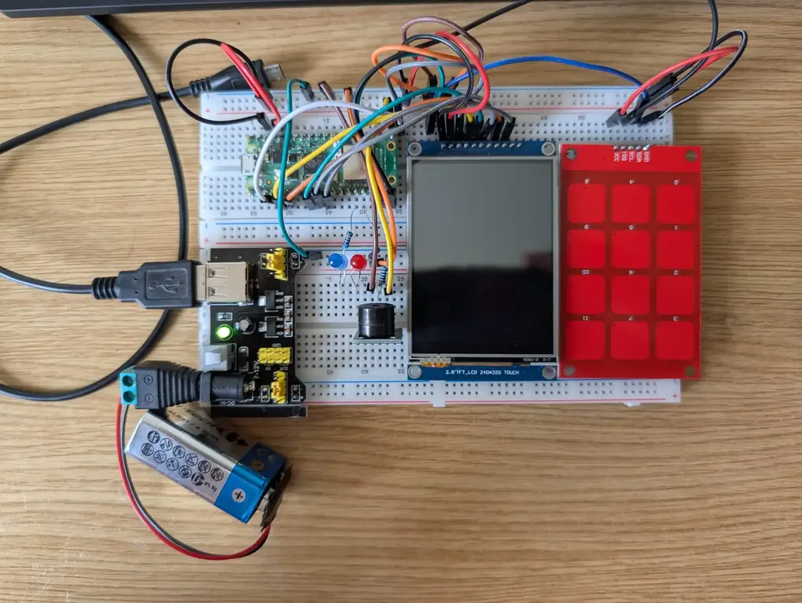
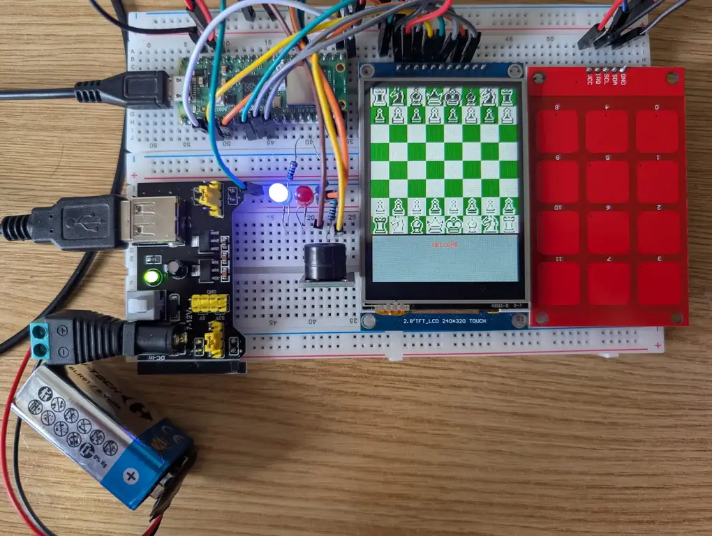
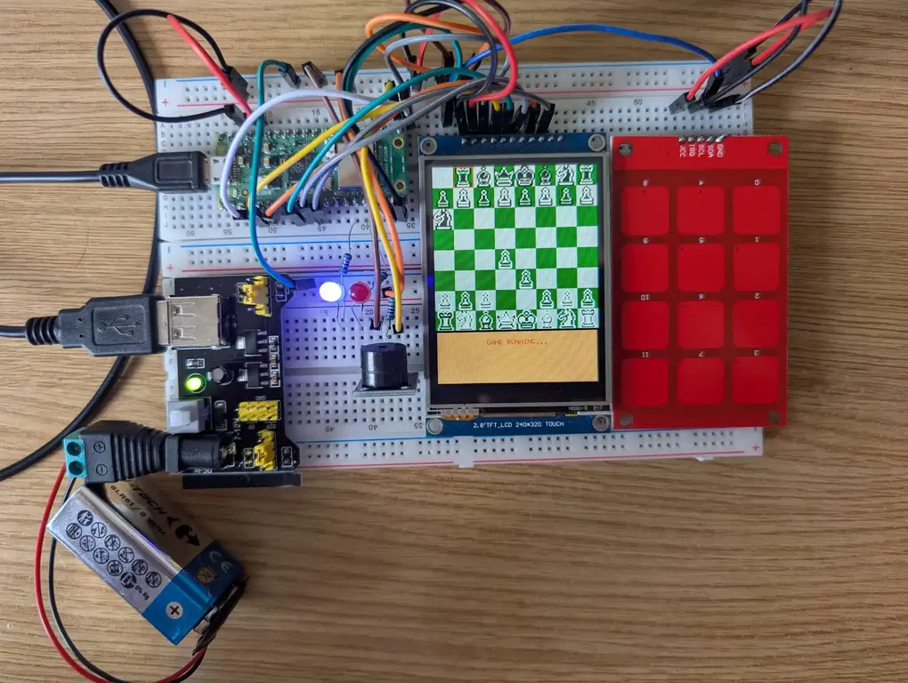
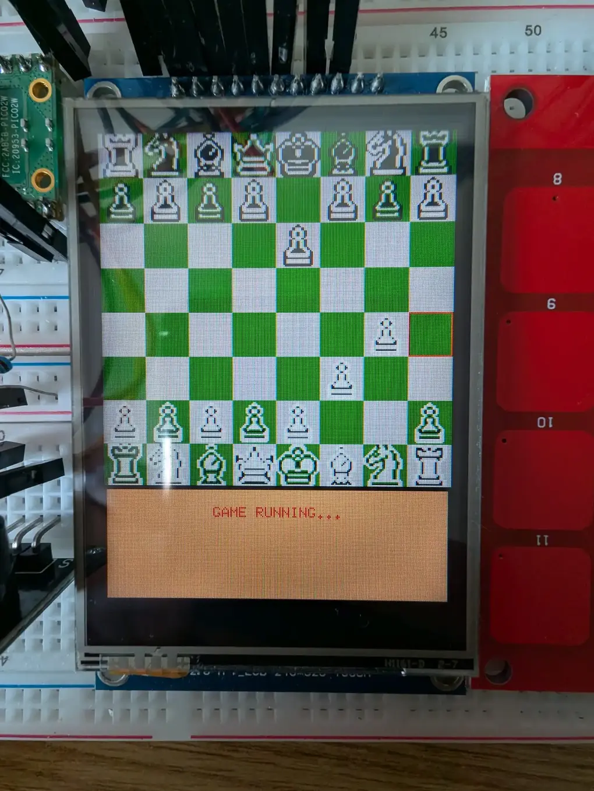
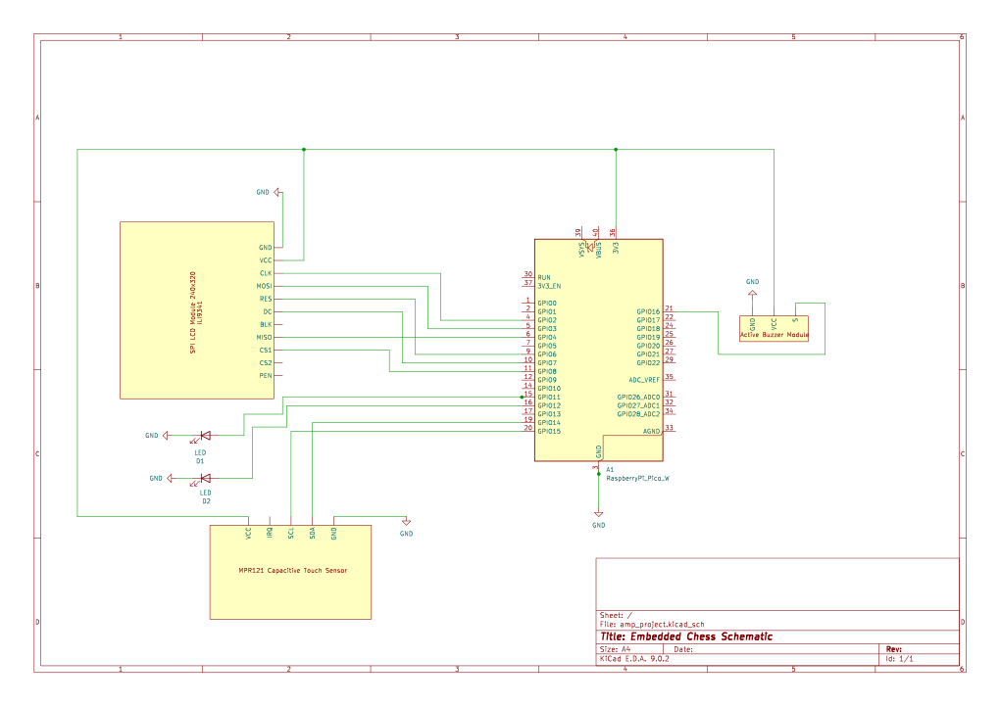

# Embedded Chess
Chess engine and game running on a fully embedded system.

:::info 

**Author**: Oprea Ionuț-Georgian \
**GitHub Project Link**: https://github.com/UPB-PMRust-Students/project-mas-vi

:::

## Description

This project implements a fully functional chess game designed to run on the resource-constrained **Raspberry Pi Pico microcontroller**. It integrates a custom-developed chess engine with a user interface (UI) displayed on an external LCD. User interaction is primarily handled through a connected keyboard, allowing players to navigate menus, select pieces, and input moves.

### Features:

- **Game Mode Selection**: Upon startup, the system presents a main menu on the connected LCD, allowing users to select between two distinct game modes: Player vs Player (PvP) for two human competitors, or Player vs AI (PvAI) where a single human challenges the integrated computer opponent. Users navigate this menu using designated keyboard inputs.
- **Integrated Chess Engine**: The core of the game is the custom-built chess engine, responsible for rigorous move validation according to standard chess rules (including special moves like castling and en passant) and, in PvAI mode, generating strategic moves for the computer opponent.
- **Auditory Feedback (Buzzer)**: A piezoelectric buzzer provides distinct auditory cues for validating keyboard input.
- **Turn Indication (LEDs)**: Two dedicated LEDs provide a clear visual indication of whose turn it is to move, the 
Blue LED indicating White's turn while the Red LED corresponds to Black's turn.

## Motivation

I choose this project as I am passionate about chess and wanted to see the extent to which a chess engine could run on a mirco controller.
I knew this involved a lot of optimization and wanted to take the challange.
## Architecture 

### Architecture:


### Game Loop:


## Log

<!-- write every week your progress here -->

### Week 6 - 12 May

- All the necessary components for the project, which had been ordered previously, were received.
- The various hardware components were assembled and connected together according to the project design.
- Initial testing was conducted on the core chess engine logic and the main game loop, which were developed prior to the arrival of all physical components.
- The game is currently in a functional state, allowing for gameplay, but requires the implementation of algorithms to enhance optimal piece selection logic.
- The project development log and related documentation were updated to reflect the recent progress and changes.

### Week 7 - 19 May
- Ongoing development continued focused on refining the optimal piece selection algorithms.
- The project log and accompanying documentation specifically for the Hardware Milestone were updated and expanded upon to include more detailed information.
- The electronic scheme within the KiCad project files was updated to reflect the current hardware configuration.
- Completion of the physical hardware assembly and setup was achieved.

### Week 20 - 26 May

## Hardware

### Pictures
<table>
<tr>
<td>



</td>
<td>



</td>
</tr>
<tr>
<td>



</td>
<td>


</td>
</tr>
</table>



### Components Usage
For the project, the following were used:

- A **Raspberry Pi Pico 2W** serves as the central processing unit for the entire system. It is responsible for rendering the game state and interface graphics onto the LCD, polling input from the MPR121 Keyboard Module, controlling the Active Buzzer Module for auditory feedback, managing the game loop, and executing the complex logic of the integrated Chess Engine.
- The **ILI9341 LCD 240x320 Display** is used to display the game board, piece positions, menu options for game mode selection, and other relevant graphical user interface (GUI) elements to the user.
- The **MPR121 Keyboard Module** acts as the main input interface for the user. It processes signals from a connected capacitive touch keypad translating key presses into data that the Pico can interpret for navigating menus, selecting chess pieces, and specifying move destinations.
- The **Active Buzzer Module** the active buzzer module is integrated into the system specifically to provide immediate auditory feedback to the user. Its primary intended use is to emit a confirmation tone or signal upon successful detection of a key press.
- The **Two Leds** are utilized as simple but effective visual indicators. They are wired and controlled by the Pico to clearly show which player, either White or Black, currently has the turn to make a move.

### Component Connections

- **ILI9341 LCD 240x320 Display**
    - ***Interface***: SPI (SPI0)
    - ***PIN Connections***:
        - GND: GND
        - VCC: 3.3V
        - CLK: PIN_2
        - MOSI: PIN_3
        - MISO: PIN_4
        - RES: PIN_6
        - DC: PIN_7
        - CS: PIN_8

- **MPR121 Keyboard Module** 
    - ***Interface***: I2C (I2C1)
    - ***PIN Connections***:
        - GND: GND
        - VCC: 3.3V
        - SCL: PIN_15
        - SDA: PIN_16

- **Active Buzzer Module** 
    - ***Interface***: GPIO
    - ***PIN Connections***:
        - GND: GND
        - VCC: 3.3V
        - S: PIN_16

- **Blue Led**:
    - ***Interface***: GPIO
    - ***PIN Connections***:
        - CATHODE: GND
        - ANODE: PIN_11

- **RED Led**:
    - ***Interface***: GPIO
    - ***PIN Connections***:
        - CATHODE: GND
        - ANODE: PIN_12


### Schematics



### Bill of Materials

<!-- Fill out this table with all the hardware components that you might need.

The format is 
```
| [Device](link://to/device) | This is used ... | [price](link://to/store) |

```

-->

| Device | Usage | Price |
|--------|--------|-------|
| [Raspberry Pi Pico 2W](https://datasheets.raspberrypi.com/picow/pico-2-w-datasheet.pdf) | The microcontroller | [40 RON](https://www.optimusdigital.ro/ro/placi-raspberry-pi/13327-raspberry-pi-pico-2-w.html) |
|[SPI LCD Module](https://www.crystalfontz.com/controllers/Ilitek/ILI9341/)|The Display|[70 RON](https://www.optimusdigital.ro/en/lcds/3544-modul-lcd-spi-de-28-cu-touchscreen-controller-ili9341-i-xpt2046-240x320-px.html)|
|[MPR121 Module with Keypad](https://cdn-shop.adafruit.com/datasheets/MPR121.pdf)|Capacitive Touch Sensor |[30 RON](https://www.optimusdigital.ro/en/touch-sensors/5693-mpr121-capacitive-touch-sensor-module-with-keypad.html)|
|[Active Buzzer Module](https://www.handsontec.com/dataspecs/module/active%20buzzer%20module.pdf)|Used to signal touch |[5 RON](https://www.optimusdigital.ro/en/buzzers/12513-pcb-mounted-active-buzzer-module.html)|
|[Blue Led](https://descargas.cetronic.es/WW05A3SBQ4-N.pdf)|Blue Led|[0.29 RON](https://www.optimusdigital.ro/en/leds/12237-led-albastru-de-5-mm.html?search_query=led&results=2047)|
|[Red Led](https://us.rs-online.com/m/d/6355b8aba0b01578df0bb7b871ceefd7.pdf)|Red Led|[0.39 RON](https://www.optimusdigital.ro/en/leds/29-5-mm-red-led-with-difused-lens.html?search_query=led&results=2047)|
|[Male-Male Wires](https://www.tubesandmore.com/sites/default/files/associated_files/s-w604_spec.pdf)|Connection Wires|[5 RON](https://www.optimusdigital.ro/en/wires-with-connectors/884-set-fire-tata-tata-40p-10-cm.html?search_query=male+to+male&results=805)|
|[Breadboard Power Supply](https://www.handsontec.com/dataspecs/mb102-ps.pdf)|Power Supply|[5 RON](https://www.optimusdigital.ro/en/linear-regulators/61-breadboard-source-power.html?search_query=breadboard&results=360)|
|[Breadboard](https://media.digikey.com/pdf/data%20sheets/3m%20pdfs/solderless%20breadboard%20acces.pdf)|Breadboards for Components connection|[2 x 12 RON](https://www.optimusdigital.ro/en/breadboards/13244-breadboard-175-x-67-x-9-mm.html?search_query=breadboard&results=360)|
|[220 Ω Resistor](https://www.electronicwings.com/components/resistor-220-ohms/1/datasheet)|Voltage Dividers|[2 x 0.10 RON](https://www.optimusdigital.ro/en/resistors/10958-05w-220-resistor.html?search_query=Res&results=4091)|
|[Debug Probe](https://datasheets.raspberrypi.com/debug/raspberry-pi-debug-probe-product-brief.pdf)|Software Debugging on the Pico|[67 RON](https://www.optimusdigital.ro/en/accesories/12777-raspberry-pi-debug-probe.html?search_query=debug+probe&results=8)|

## Software

| Library | Description | Usage |
|---------|-------------|-------|
|[cortex_m_rt](https://github.com/rust-embedded/cortex-m)|A runtime crate for ARM Cortex-M microcontrollers|Provides the necessary entry point (#[entry]) and minimal runtime environment for the application to start and run on the Cortex-M0+ core of the Raspberry Pi Pico|
|[ili9341](https://github.com/yuri91/ili9341-rs)|A hardware abstraction layer (HAL) driver crate for interfacing with the ILI9341 TFT LCD controller via SPI|Used to handle low-level communication with the physical ILI9341 display hardware|
| [embedded-graphics](https://github.com/embedded-graphics/embedded-graphics) | A 2D graphics library providing traits and drawing primitives for embedded systems| Utilized for defining and creating graphical elements such as points, lines, rectangles, text, and colors (like Rgb565). These elements are then rendered to the display via the ili9341 driver|
|[embedded-alloc](https://github.com/rust-embedded/embedded-alloc)|The Rust standard library's allocation APIs and collection types, re-exported for use with a custom global allocator in no_std|Provides essential data structures that require dynamic memory allocation|
|[mpr121-hal](https://gitlab.com/tendsinmende/mpr121-hal)|A Hardware Abstraction Layer (HAL) driver for the MPR121 capacitive touch sensor controller, typically using I2C|Employed to interface with the MPR121 module over the I2C bus, allowing the system to read the state of the capacitive touch electrodes and interpret them as keyboard input.|
|[embedded-canvas ](https://github.com/LechevSpace/embedded-canvas)|A library that provides a canvas abstraction over embedded-graphics for more structured drawing operations|Used to create a drawing surface or context (Canvas) on top of the embedded-graphics framework|
|[defmt](https://github.com/knurling-rs/defmt)|A firmware debugging and logging framework optimized for embedded systems|Used (info!, panic!) for structured logging and debugging output, typically routed via defmt_rtt to a host computer, aiding in development and troubleshooting|
|[embassy_rp](https://github.com/embassy-rs/embassy)|A Hardware Abstraction Layer (HAL) for the Raspberry Pi RP2040 microcontroller, built for the Embassy framework|rovides high-level, asynchronous drivers and APIs for the RP2040's peripherals, including GPIO (gpio), I2C (peripherals::I2C1), and SPI (spi), used to interact with the connected hardware|
|[embassy_embedded_hal](https://github.com/embassy-rs/embassy)|Provides implementations of the embedded-hal traits built on top of Embassy's asynchronous drivers|Specifically, shared_bus::blocking::spi::SpiDevice is used here to create a concrete SPI device instance suitable for use with the ili9341 driver, potentially allowing the SPI bus to be shared|

## Links

<!-- Add a few links that inspired you and that you think you will use for your project -->

1. [Creating a Chess Engine in Python](https://youtube.com/playlist?list=PLBwF487qi8MGU81nDGaeNE1EnNEPYWKY_&si=s_FbRTKng44ahwd3)
