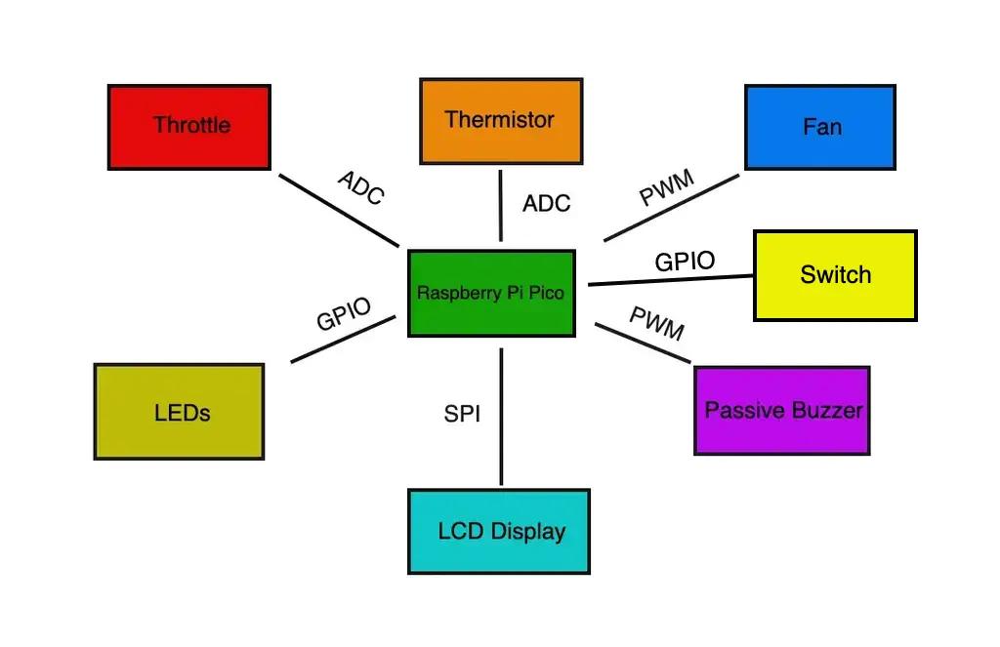
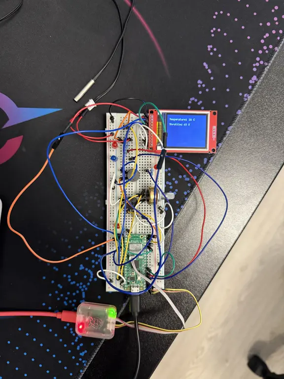
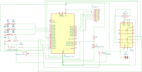

# Simulated Automotive ECU
A simulated automotive ECU that reads throttle and coolant temperature sensors, displays them on an LCD digital dashboard, and controls engine behavior, warning indicators, and a cooling fan using Rust on a microcontroller.

:::info 

**Author**: Dorobantu Iulian-Adrian \
**GitHub Project Link**: https://github.com/UPB-PMRust-Students/project-adriandorobantu

:::

## Description

This project implements a simulated Electronic Control Unit (ECU) for an automotive system using the Raspberry Pi Pico WH microcontroller. It reads analog inputs from a throttle position sensor (potentiometer) and a coolant temperature sensor (thermistor), processes the data in real time, and outputs relevant system states.

A key feature of the project is its simulated digital dashboard, displayed on an LCD screen, which shows live throttle percentage and coolant temperature, mimicking a real vehicle interface. Based on sensor values, the ECU controls various outputs: activating a cooling fan when temperature exceeds a threshold, adjusting a simulated engine RPM, and triggering visual and audible warnings for overheating or abnormal behavior.

## Motivation

I chose to develop this project because I’m deeply passionate about cars and fascinated by the technology that powers them. The Electronic Control Unit (ECU) has revolutionized the automotive world by shifting control from purely mechanical systems to intelligent, software-driven logic. 

## Architecture 

**Central control unit**
- **Role**: Acts as the brain of the ECU system. It reads input from sensors, executes control logic in real time, updates the digital dashboard, and manages actuator outputs based on current conditions.
- **Key functions**: Input acquisition, data processing, threshold evaluation, system coordination.

**Warning System**
- **Interface**: GPIO, PWM 
- **Role**: Provides visual and audible alerts when critical conditions occur, such as engine overheating, sensor faults, when the rev limiter is reached and when the driver's seatbelt is not buckled.
- **Components Managed**: LEDs for visual warnings, passive buzzer for audible alerts. 
- **Control Logic**: LEDs for visual warnings, passive buzzer for audible alerts.

**Throttle Input Module**
- **Interface**: ADC
- **Role**: Simulates the accelerator pedal by measuring voltage changes from a user-controlled input (e.g., potentiometer). Converts analog signal to throttle percentage for use in engine behavior simulation.
- **Signal Processing**: Reads analog value, applies scaling or smoothing, and forwards to control logic.

**Temperature Monitoring Module**
- **Interface**: ADC
- **Role**: Monitors coolant temperature using a thermistor sensor. Interprets temperature readings and flags overheat conditions for system response.
- **Function**: Inputs temperature data into the control unit for fan activation and warning generation.

**Output Control Module**
- **Interface**: GPIO, PWM
- **Role**: Controls actuators such as the cooling fan, warning LEDs, and buzzer based on logic provided by the Central Control Unit.
- **Response Handling**: Turns fan on/off, manages alerts, and simulates engine RPM response.

**Digital Dashboard Interface**
- **Interface**: SPI
- **Role**: Simulates a vehicle’s dashboard by displaying live data such as throttle percentage, engine RPM, coolant temperature, and fault warnings.
- **Function**: Receives data from the control unit and presents it to the user through a graphical interface.

## Log

### Week 5 - 11 May
I began to search for all of the neccesary components, in order to start putting the project together. The first lines of code are beggining to be written, and all of the hardware details are being sorted out. While I wait for the components to arrive, I am also looking into making a 3D printed case for my ECU.

### Week 12 - 18 May
In this week I started to assemble my project, step by step. I also decided to implement a new functionality into my project, a seatbelt warning system. I have managed to reach a completion rate of about 85%, with the only tasks left to do being connecting and programming the cooling system and playing around with the interface of the digital dashboard.

### Week 19 - 25 May

## Hardware

- **Raspberry Pi Pico WH**: Main microcontroller, reads sensors and controls outputs.
- **10kΩ Potentiometer**: Simulates throttle input (gas pedal).
- **10kΩ NTC Thermistor**: Measures coolant temperature.
- **Passive Buzzer**: Emits audible alerts for overheating or faults.
- **LEDs with 220Ω Resistors**: Provide visual warnings and rev limit indication.
- **DC Fan**: Simulates engine cooling, activated based on temperature.
- **Switch**: Simulates whether the seatbelt is buckled or not.
- **SPI LCD Display**: Acts as a digital dashboard for real-time data visualization.
- **Breadboard & Jumper Wires**: For prototyping and interconnecting components.

### Project Photo

### Schematics

### Bill of Materials

| Device | Usage | Price |
|--------|--------|-------|
| [Raspberry Pi Pico WH](https://www.raspberrypi.com/documentation/microcontrollers/raspberry-pi-pico.html) | The microcontroller | [39 RON](https://www.optimusdigital.ro/ro/placi-raspberry-pi/12395-raspberry-pi-pico-wh.html?search_query=Raspberry+Pi+Pico+WH&results=26) |
| [Plusivo Wireless Super Starter Kit](https://www.plusivo.com/electronics-kit/66-plusivo-wireless-super-starter-kit-with-esp8266-programmable-with-arduino-ide.html) | A kit from which I have used components | [79,99 RON](https://www.optimusdigital.ro/en/optimus-digital-kits/7356-kit-wireless-super-starter-cu-esp8266.html?search_query=plusivo+starter+kit&results=16) |
| [10kΩ Potentiometer](https://www.plusivo.com/electronics-kit/66-plusivo-wireless-super-starter-kit-with-esp8266-programmable-with-arduino-ide.html) | Throttle input | [Included in the kit](https://www.optimusdigital.ro/en/optimus-digital-kits/7356-kit-wireless-super-starter-cu-esp8266.html?search_query=plusivo+starter+kit&results=16) |
| [10kΩ NTC Thermistor](https://www.optimusdigital.ro/ro/senzori-senzori-de-temperatura/8203-termistor-ntc-de-10k-rezistent-la-apa-cu-cablu-de-05-m.html?s) | Measuring the coolant temperature | [6,49 RON](https://www.optimusdigital.ro/ro/senzori-senzori-de-temperatura/8203-termistor-ntc-de-10k-rezistent-la-apa-cu-cablu-de-05-m.html?s) |
| [Passive Buzzer](https://www.plusivo.com/electronics-kit/66-plusivo-wireless-super-starter-kit-with-esp8266-programmable-with-arduino-ide.html) | Audible warnings | [Included in the kit](https://www.optimusdigital.ro/en/optimus-digital-kits/7356-kit-wireless-super-starter-cu-esp8266.html?search_query=plusivo+starter+kit&results=16) |
| [LEDs with 220Ω, 1k, 10k Resistors](https://www.plusivo.com/electronics-kit/66-plusivo-wireless-super-starter-kit-with-esp8266-programmable-with-arduino-ide.html) | Visual Warnings | [Included in the kit](https://www.optimusdigital.ro/en/optimus-digital-kits/7356-kit-wireless-super-starter-cu-esp8266.html?search_query=plusivo+starter+kit&results=16) |
| [DC Fan](https://www.plusivo.com/electronics-kit/66-plusivo-wireless-super-starter-kit-with-esp8266-programmable-with-arduino-ide.html) | Simulates coolant temperature regulation | [Included in the kit](https://www.optimusdigital.ro/en/optimus-digital-kits/7356-kit-wireless-super-starter-cu-esp8266.html?search_query=plusivo+starter+kit&results=16) |
| [L293D motor driver](https://www.plusivo.com/electronics-kit/66-plusivo-wireless-super-starter-kit-with-esp8266-programmable-with-arduino-ide.html) | Controls DC Fan | [Included in the kit](https://www.optimusdigital.ro/en/optimus-digital-kits/7356-kit-wireless-super-starter-cu-esp8266.html?search_query=plusivo+starter+kit&results=16) |
| [LCD Display](https://ardushop.ro/ro/electronica/2124-modul-lcd-spi-128x160-6427854032546.html) | Digital Dashboard | [43,58 RON](https://ardushop.ro/ro/electronica/2124-modul-lcd-spi-128x160-6427854032546.html) |

## Software

| Library | Description | Usage |
|---------|-------------|-------|
| [st7735-lcd](https://crates.io/crates/st7735-lcd) | ST7735-specific driver crate to send commands/data to the display | Used for the LCD display |
| [embedded-graphics](https://github.com/embedded-graphics/embedded-graphics) | 2D graphics library | Used for drawing to the display |
| [embassy-rp](https://github.com/embassy-rs/embassy/tree/main/embassy-rp) | RP2040 Peripherals | Used for accessing the peripherals |
| [heapless](https://github.com/rust-embedded/heapless) | String Library | 	Used for making strings for writing to the lcd |
| [embbeded-hal](https://github.com/rust-embedded/embedded-hal) | Hardware abstraction layer | 	Used for interacting with hardware components. |
| [defmt](https://github.com/knurling-rs/defmt) | Logging crate (used with Embassy)| 	Used for debugging/logging to RTT (Real Time Terminal)|
| [embassy-time](https://github.com/embassy-rs/embassy/tree/main/embassy-time) | Async timers/delays | 	Used for delays, blinking LEDs, buzzer timing, fan debounce|
| [embassy-executor](https://github.com/embassy-rs/embassy/tree/main/embassy-executor) | Async runtime | 	Used for running async fn tasks in Embassy|
| [libm](https://crates.io/crates/libm) | Math | 	Used for converting raw data from the thermistor into degrees Celsius|
| [core](https://doc.rust-lang.org/core/) | Minimal standard library | 	Used for formating strings for drawing on the LCD|

## Links

1. [Testing analogue throttle on Arduino](https://www.youtube.com/watch?v=HzXL2NGaWAs)
2. [Arduino DS18B20 temperature sensor tutorial](https://www.youtube.com/watch?v=lIpgGru2Wv0)
3. [Arduino Dashboard](https://www.youtube.com/watch?v=L3ufJTFX2v0)
4. [ST7735 lcd examples](https://github.com/sajattack/st7735-lcd-examples)
