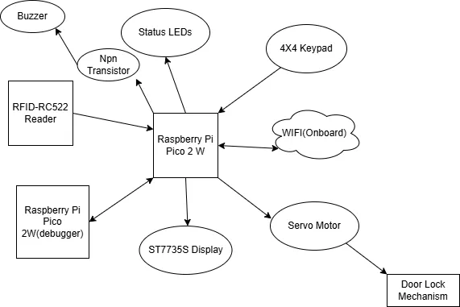
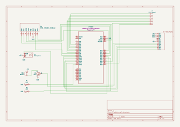

# Rusty Lock Access System
The Rusty Lock Access System is a multi-authentication security solution designed to control access using multiple user validation methods.

:::info

**Author**: Bejinaru Matei-Cristian\
**GitHub Project Link**: https://github.com/UPB-PMRust-Students/project-Matty27100

::::
## Description
Built around the Raspberry Pi Pico 2W microcontroller, this project integrates an RFID reader, Wi-Fi-based control, a matrix keypad, LCD feedback display, and a servo motor attatched by an iron wire to a door latch. The goal is to provide secure, user-friendly access control that can be managed both locally and remotely.
## Motivation
I've been brainstorming project ideas with a friend who shares my passion for technology and automation earlier this year. We came up with a few concepts for the Innovation Labs competition, with smart-home equipment being a central theme. Although we weren’t able to participate, the idea of creating a smart device stuck with me. When the time came to choose a project for this course, I knew I wanted to pursue something in that direction. That’s how I arrived at the idea of building a versatile smart lock system.
## Architecture 
### Logical Diagram
The Diagram with all the components:

### How it works

### Initialization: 
The system boots and initializes all components. The LCD displays a waiting message.

### Authentication:

***RFID:*** When a card is detected, its UID is checked against a known list.

***Keypad***: A valid PIN entered via the keypad is accepted.

***Wi-Fi***: Pressing the "Unlock" button on the web app sends a request that, if received, triggers the unlock.

### Unlocking: 
A validated user causes the servo to open the lock and display a message for a few seconds.

### Locking: 
After a delay, the servo returns to the locked position.

## Log
### Week 5 - 11 May
Once my project idea was approved, I ordered most of the required components and began implementation step by step. I started by configuring the second Pico as a debugger. After that, I got the RFID reader to work, successfully lighting up a LED upon tag detection. After that, I moved on to integrating the LCD display through I2C.

### Week 12 - 18 May
All key systems are now integrated: RFID, keypad, LCD, buzzer, LEDs, servo, and web control, functioning together as a full access system. This week, I've focused heavily on the web server integration and improving the interactivity through hardware and HTML:

1. Wi-Fi access point successfully configured on the Pico using the CYW43 chip.

2. Served a responsive HTML page from the Pico via a TCP server with an Unlock button.
   Pressing the web button now:
  - Toggles a physical LED
  - Unlocks the servo motor
  - Displays "Access Granted" on the LCD
  - Buzzer plays a confirmation tone

3. Hardware Additions/Changes:
  - I've had some problems with setting up the old LCD Display so I've bought a new 1.44" ST7735S Display that is now fully configured through SPI.
  - 4x4 keypad used for PIN entry and set up a 5 digit code.
  - Servo motor connected to a physical lock mechanism using a wire. It physically moves to unlock or lock a door latch.
  - 5V active buzzer connected via an NPN transistor. Produces sounds for granted and denied access.
  - Second LED that lights up only when access is denied.

4. Functionality:
  - Full locking cycle: The displays shows "Waiting for Access Card or PIN". The system unlocks in one of the 3 ways(RFID, PIN, WEB).Lights up the LED, plays a sound on the buzzer, shows "Access Granted" on the display, puts the servo motor in the unlocked position, pulling the door latch, shows a 5 second countdown on the LCD, then re-locks.

### Week 19 - 25 May

## Hardware
The hardware setup is centered around the Raspberry Pi Pico 2W, with its built-in Wi-Fi capabilities. A variety of peripherals are used to create an interactive, multi-authentication smart lock system.

**Components Used**

**Raspberry Pi Pico 2W**            Central microcontroller; manages all logic and peripherals               
  **Raspberry Pi Pico 2W**             Microcontroller configured as a debugger for the central Pico             
  **RC522 RFID Reader**                SPI-based tag reader for user authentication                              
  **1.44inch SPI Module ST7735S**      Displays system messages over SPI.                   
  **4x4 Matrix Keypad**                Used to enter a  PIN code for access                                      
  **SG90 Micro Servo Motor**           Drives the door lock mechanism (via PWM control)                          
  **Active Buzzer**                    Emits audio feedback upon certain actions (e.g. denied access)            
  **LEDs**                             Status indicator (access granted, access denied)                            
  **External 5V Power Source**         Provides sufficient current for the LCD and servo motor                   

### Schematics
KiCad Scheme

### Bill of Materials
| Device                                                  | Usage                        | Price                           |
|---------------------------------------------------------|------------------------------|---------------------------------|
| [2xRaspberry Pi Pico 2W](https://www.raspberrypi.com/documentation/microcontrollers/pico-series.html) | Main Controller & Debugger | [39.66 RON x2](https://www.optimusdigital.ro/en/raspberry-pi-boards/13327-raspberry-pi-pico-2-w.html?srsltid=AfmBOoo5CQdoi14-RbmA_YJJrNUG1hPBzlSKgPdCOYv9U2PgJdK3bPwM) |
[RFID RC522](http://www.handsontec.com/dataspecs/RC522.pdf) | RFID Reader  | [9,99 RON](https://www.optimusdigital.ro/ro/wireless-rfid/67-modul-cititor-rfid-mfrc522.html?search_query=Modul+RFID+RC522+%28similar+cu+MFRC522%29&results=1) |
[4x4 Keypad](https://www.optimusdigital.ro/ro/senzori-senzori-de-atingere/470-tastatura-matriceala-4x4-cu-conector-pin-de-tip-mama.html?search_query=tastatura+matriceala+4x4+cu+conector+pin+de+tip+mama&results=1) | PIN Insertion | [6.99 RON](https://www.optimusdigital.ro/ro/senzori-senzori-de-atingere/470-tastatura-matriceala-4x4-cu-conector-pin-de-tip-mama.html?search_query=tastatura+matriceala+4x4+cu+conector+pin+de+tip+mama&results=1) |
[Active Buzzer Module](https://www.electronicoscaldas.com/datasheet/LTE12-Series.pdf?srsltid=AfmBOoq-FpY3VXD7NaVgtaZ0otTmO9sds9SsXFvK7EoTtfnxrfwBEN1t) | Buzzer | [1.40 RON](https://www.optimusdigital.ro/ro/audio-buzzere/633-buzzer-activ-de-5-v.html?search_query=buzzer+activ&results=18) |
[Breadboard, Jumpers & Power Supply Kit](https://www.optimusdigital.ro/ro/kituri/2222-kit-breadboard-hq-830-p.html?search_query=Kit+Breadboard+HQ830+cu+Fire+%C8%99i+Sursa&results=1) | General Wiring & Voltage | [22.00 RON](https://www.optimusdigital.ro/ro/kituri/2222-kit-breadboard-hq-830-p.html?search_query=Kit+Breadboard+HQ830+cu+Fire+%C8%99i+Sursa&results=1) |
[3 mm Diffused LED Diode Assortment Kit](https://www.optimusdigital.ro/ro/kituri/11971-set-led-uri-colorate-de-3mm-plusivo-cu-pcb-si-rezistoare-bonus-1000-buc.html?search_query=Set+led&results=192) | LEDs & Resistors | [29.99 RON](https://www.optimusdigital.ro/ro/kituri/11971-set-led-uri-colorate-de-3mm-plusivo-cu-pcb-si-rezistoare-bonus-1000-buc.html?search_query=Set+led&results=192) |
[SG90 Micro Servo Motor](http://www.ee.ic.ac.uk/pcheung/teaching/DE1_EE/stores/sg90_datasheet.pdf) | Unlocking mechanism   | [13.99 RON](https://www.optimusdigital.ro/ro/motoare-servomotoare/26-micro-servomotor-sg90.html?search_query=SG90+Micro+Servo+Motor&results=11)
[1.44inch SPI Module ST7735S](http://www.lcdwiki.com/1.44inch_SPI_Module_ST7735S_SKU:MSP1443) | Status Display| [34.99 RON](https://www.optimusdigital.ro/ro/optoelectronice-lcd-uri/8589-lcd-de-144-pentru-stc-stm32-i-arduino-5-v.html?search_query=LCD+de+1.44%27%27+pentru+STC%2C+STM32+%C8%99i+Arduino+%285+V%29&results=4)

## Software

| Library | Description | Usage |
|---------|-------------|-------|
[embassy-rp](https://docs.embassy.dev/embassy-rp/git/rp235xb/index.html) | Embassy HAL for Raspberry Pi Pico (RP2040) | Direct access and async control of peripherals like SPI, I2C, GPIO, and timers
[embassy-executor](https://docs.embassy.dev/embassy-executor/git/cortex-m/index.html) | Async executor designed for embedded systems | Manages asynchronous task execution without needing an OS |
[embassy-time](https://docs.embassy.dev/embassy-time/git/default/index.html) | Timekeeping and delay abstraction | Used for creating delays and timers without blocking |
[embassy-sync](https://docs.embassy.dev/embassy-sync/git/default/index.html) | Primitives for concurrency and synchronization | Enables mutexes, signals, and channels between async tasks |
[embassy-net](https://docs.embassy.dev/embassy-net/git/default/index.html) | Async embedded TCP/IP network stack | Used to serve a web interface over Wi-Fi (for unlocking remotely) |
[cyw43](https://github.com/embassy-rs/embassy/tree/main/drivers/cyw43) |	Driver for the CYW43 Wi-Fi chip on the Pico W | Used to join a Wi-Fi network and host a small HTTP server
[cyw43-pio](https://crates.io/crates/cyw43-pio) |	PIO SPI interface for CYW43 Wi-Fi chip | Interface for CYW43 to work over the RP2040’s PIO SPI
[embedded-graphics](https://crates.io/crates/embedded-graphics) |	Drawing library for displays | Used to render text and countdowns on the LCD
[mipidsi](https://crates.io/crates/mipidsi) |	ST7735s LCD display driver |Initializes and manages the LCD screen
[mfrc522](https://crates.io/crates/mfrc522) | 	Rust driver for the MFRC522 RFID reader |Handles tag detection and UID reading
[display-interface-spi](https://crates.io/crates/display-interface-spi) | Abstraction layer for SPI display communication | Enables SPI-based display control
[gpio](https://docs.embassy.dev/embassy-rp/git/rp235xb/gpio/index.html) | GPIO management | Used for controlling GPIO pins
[heapless](https://docs.rs/heapless/latest/heapless/) | Fixed-capacity collections for no_std | Used for String buffers and messaging
[pwm](https://docs.embassy.dev/embassy-rp/git/rp235xb/pwm/index.html) | PWM module | Used for controlling the buzzer

## Links
1. [DIY Smart Door Lock](https://www.youtube.com/shorts/Bcqeyk_-kx8)
2. [RFID DOOR LOCK](https://www.youtube.com/shorts/94idGywsd70)

