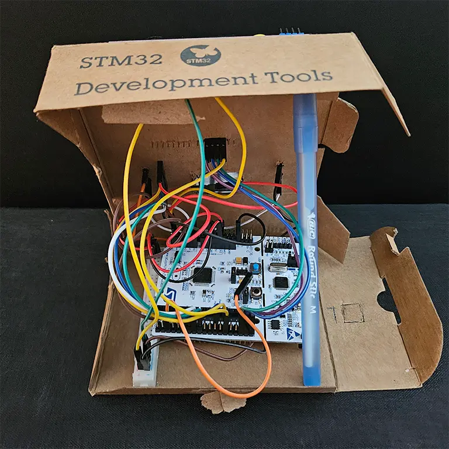
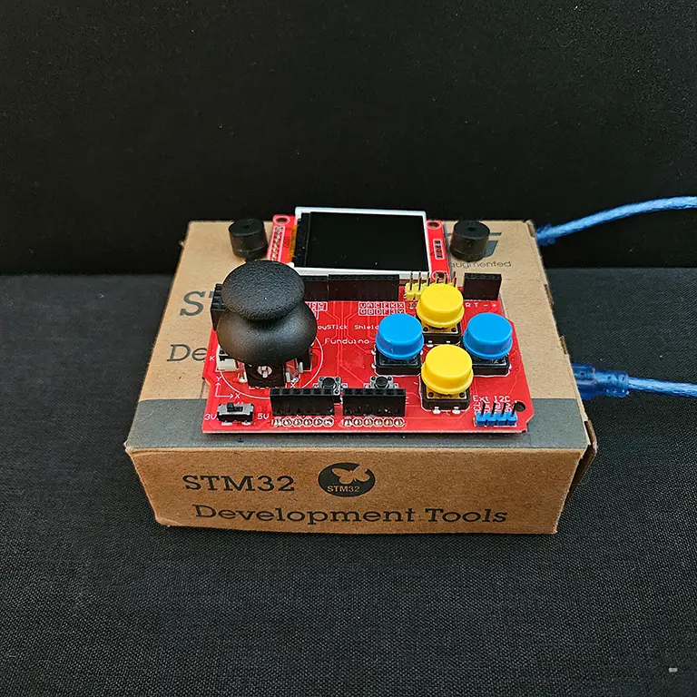
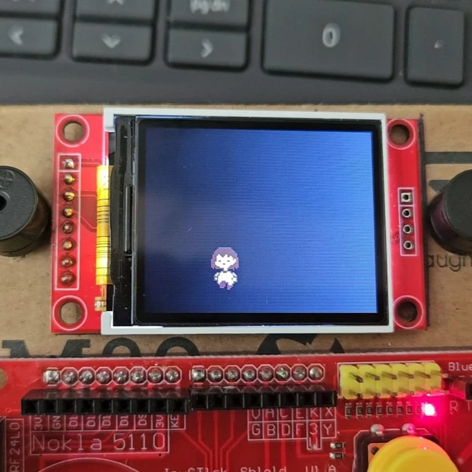
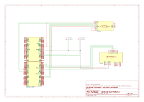

# RustScape

A compact and robust 2D video game for the NUCLEO-F411RE, written in Rust.

:::info

**Author**: Mihnea Girbacica\
**GitHub Project Link**: https://github.com/UPB-PMRust-Students/project-Mihnea8848

:::

## Description

RustScape is a 2D platformer game that aims to deliver a classic handheld gaming experience on a minimal embedded system. It's built for the NUCLEO-F411RE development board, pushing the boundaries of what's possible with microcontroller-based game development. Graphics are rendered on a vibrant 1.8" SPI TFT display (ST7735R), reminiscent of retro handhelds, while player control is achieved through an analog joystick and D-Pad Shield combo (KY-023) for movement, being a perfect choice for achieving that "retro feel". To complete the immersion, two passive buzzers provide a very makeshift soundtrack for the game and chiptune-style audio feedback. In the spirit of the DIY ingenuity, the project tries to embrace a cost-effective approach, even aiming to house the final product within the NUCLEO-F411RE's original cardboard shipping box. In the final version of this project, the players should be immersed in the game's story, overlooking the... less than desirable appearance and cheap parts.

## Motivation

As the owner of a Game Development Company, I've been fascinated by video games since childhood. The curiosity to understand their creation has always driven me. While my current work involves developing cross-platform titles for PC, Android, Linux, and VR (see https://www.roblox.com/games/3192370355/MEH-Studios-Research-Facility-Test-Server for more details), I've always held a particular fondness for retro games and the challenge of emulation. This project, with its requirement to use microprocessors, presented the perfect opportunity to combine my passion for game development with the exploration of embedded systems, allowing me to create a physical, playable tribute to classic handheld gaming. With that being said, due to the limitations (Flash Storage Space), it forces me to fix my habit of writing spaghetti code, leaving optimizations at last, or even skipping them altogether.

## Architecture

*To be added at a later time, the hardware is still not fully configured.*

## Log

<!-- write your progress here every week -->

### Week 5 - 11 May

The main goal of the first week was to make all of the peripherals work. \
Code Changelog:

- Created the Cargo.toml, with all the required dependencies
- Created module display_module.rs, that integrates the ST7735s display to the microcontroller
- Created module sound_module.rs, that integrates the 2 Passive Buzzers (one for Bass and one for Melody) to the microcontroller
- Created module controller_module.rs, that integrates all of the SHIELD buttons to the microcontroller.

Hardware Changelog:

- Decided to use the cardboard shipping box of the NUCLEO-F411RE as the chassis of the project
- Test fitted the following parts to the box: ST7735s, 2x Passive Buzzer, Fundruino SHIELD
- Glued inside of the box a small 3V3 and GND bus, taken from a small breadboard
- Tested the placement of the buzzers so that the soundtrack can be heard easily

Photos:




### Week 12 - 18 May

This week's goal was to start making the game's logic, mainly the player movement and loading up levels. I experimented different ways to load images onto the screen, but I ended up using .raw image files for their versatility and, most importantly, their relatively low storage footprint.

Code Changelog:

- Added game_module.rs, that includes very crude game logic (player movement, background loading)
- Improved the game_module.rs to move the background when the player moves to undisplayed areas.
- Optimized the code so that it works better (**!**)
- Created and added all of the required assets (The player in all of its states, the background for level1)
- Made the player stripe change based on what input is provided on the D-Pad
- Made the player stripe change it's location (move) based on the input
- Considering adding another microcontroller to the project (**!**)


Hardware Changelog:
*No hardware changes were made this week.*

:::warning Significant Changes

In this stage of development, I discovered that the NUCLEO-F411RE is severely limited in terms of RAM and FLASH storage. I am considering adding another microcontroller, *most likely the ESP32 WROOM32*, to drive the display. This will substantially increase the performance of the game.

:::

Photos:




### Week 19 - 25 May

*This week is still to come, to be added.*

## Hardware

RustScape is built using the NUCLEO-F411RE development board, which acts as the game's central processing unit. Visuals are rendered on a 1.8" SPI TFT display. Player input is managed via a shield integrating an analog joystick and buttons, enabling movement and actions. Audio feedback is delivered through two passive buzzers, generating sound effects and simple music. Jumper wires ensure flexible electrical connections. Power and code uploads are facilitated by a Mini-USB to USB-A cable. Finally, an 8-LED module is used to represent the player's health status. All components, including the NUCLEO-F411RE board, are housed within the original NUCLEO-F411RE box, serving as a budget-friendly enclosure for the handheld console.

### Schematics

*The KiCAD Schematic is not yet finished, below is an unfinished version.*



### Bill of Materials

<!-- Fill out this table with all the hardware components that you might need.

The format is 
```
| [Device](link://to/device) | This is used ... | [price](link://to/store) |

```

-->


| Device                                                                                                                                                                                                                                | Usage                                                              | Price                                                                                                                                                                                                               |
| --------------------------------------------------------------------------------------------------------------------------------------------------------------------------------------------------------------------------------------- | -------------------------------------------------------------------- | --------------------------------------------------------------------------------------------------------------------------------------------------------------------------------------------------------------------- |
| [`STM32 NUCLEO-F411RE`](https://www.st.com/en/microcontrollers-microprocessors/stm32f411re.html)                                                                                                                                      | Microcontroller that drives the peripherals, as well as game logic | [70 RON](https://ro.mouser.com/ProductDetail/STMicroelectronics/NUCLEO-F411RE?qs=Zt3UNFD9mQjdEJg18RwZ2g%3D%3D)                                                                                                      |
| [`1.8" SPI TFT Display`](https://www.optimusdigital.ro/ro/optoelectronice-lcd-uri/1311-modul-lcd-spi-de-18-128x160.html?search_query=Modul+LCD+SPI+de+1.8%27%27+%28128x160%29%09&results=3)                                           | 128x160 Color screen that displays the game                        | [29 RON](https://ro.mouser.com/ProductDetail/STMicroelectronics/NUCLEO-F411RE?qs=Zt3UNFD9mQjdEJg18RwZ2g%3D%3D)                                                                                                      |
| [`KY-023 Analog Joystick`](https://www.optimusdigital.ro/ro/shield-uri-pentru-arduino/1283-shield-joystick-pentru-arduino.html?search_query=Shield+Joystick+pentru+Arduino%09&results=4)                                              | Joystick + buttons for player movement                             | [20 RON](https://www.optimusdigital.ro/ro/shield-uri-pentru-arduino/1283-shield-joystick-pentru-arduino.html?search_query=Shield+Joystick+pentru+Arduino%09&results=4)                                              |
| [`2 x Passive Buzzer`](https://www.optimusdigital.ro/ro/audio-buzzere/12247-buzzer-pasiv-de-33v-sau-3v.html?search_query=Buzzer+Pasiv+de+3.3V+sau+3V&results=1)                                                                       | Audio feedback and soundtrack for the game                         | [2 RON](https://www.optimusdigital.ro/ro/audio-buzzere/12247-buzzer-pasiv-de-33v-sau-3v.html?search_query=Buzzer+Pasiv+de+3.3V+sau+3V&results=1)                                                                    |
| [`Mini-USB to USB-A Cable`](https://www.optimusdigital.ro/ro/cabluri-cabluri-usb/4748-cablu-albastru-usb-am-b-mini-50-cm-pentru-arduino-nano.html?search_query=Cablu+Albastru+USB+AM+-+B+Mini+30+cm+pentru+Arduino+NANO%09&results=3) | USB Cable for power and code flashing                              | [4.5 RON](https://www.optimusdigital.ro/ro/cabluri-cabluri-usb/4748-cablu-albastru-usb-am-b-mini-50-cm-pentru-arduino-nano.html?search_query=Cablu+Albastru+USB+AM+-+B+Mini+30+cm+pentru+Arduino+NANO%09&results=3) |
| [`Jumper Wires`](https://www.optimusdigital.ro/ro/fire-fire-mufate/881-set-fire-mama-mama-40p-15-cm.html?search_query=Fire+Colorate+Mama-Mama+%2840p%2C+15+cm%29&results=10)                                                          | 2 x Male-male & 1 x Female-female Cables                           | [17 RON](https://www.optimusdigital.ro/ro/fire-fire-mufate/881-set-fire-mama-mama-40p-15-cm.html?search_query=Fire+Colorate+Mama-Mama+%2840p%2C+15+cm%29&results=10)                                                |
| [`8 Red LED Module`](https://www.optimusdigital.ro/ro/optoelectronice-altele/12341-modul-cu-8-led-uri-roii.html?search_query=Modul+cu+8+LED-uri+Roșii&results=11)                                                                    | 8 LEDs to display the player health                                | [11.5 RON](https://www.optimusdigital.ro/ro/optoelectronice-altele/12341-modul-cu-8-led-uri-roii.html?search_query=Modul+cu+8+LED-uri+Roșii&results=11)                                                            |

## Software


| Library                 | Description           | Usage                                                                          |
| :------------------------ | :---------------------- | :------------------------------------------------------------------------------- |
| `embassy-stm32`         | HAL for STM32         | Abstracts the NUCLEO-F411RE's hardware (SPI, GPIO, Timers) for easier control. |
| `embassy-executor`      | Asynchronous runtime  | Enables non-blocking operations for smooth gameplay.                           |
| `embassy-time`          | Asynchronous timing   | Provides delays and timing for game logic and display updates.                 |
| `display-interface-spi` | SPI display interface | Handles low-level communication with the ST7735R.                              |
| `mipidsi`               | ST7735 driver         | Offers display initialization and control.                                     |
| `embedded-graphics`     | 2D graphics library   | Draws shapes, text, and other visuals on the screen.                           |
| `defmt`                 | Logging framework     | Provides efficient debugging output.                                           |
| `panic-probe`           | Panic handler         | Improves error handling during crashes.                                        |
| `cortex-m-rt`           | Cortex-M runtime      | Sets up the microcontroller environment.                                       |

## Links

<!-- Add a few links that inspired you and that you think you will use for your project -->

1. [Embedded Rust Book](https://docs.rust-embedded.org/book/intro.html)
2. [embassy](https://github.com/embassy-rs/embassy)
3. [embedded-graphics](https://docs.rs/embedded-graphics/latest/embedded_graphics/)
