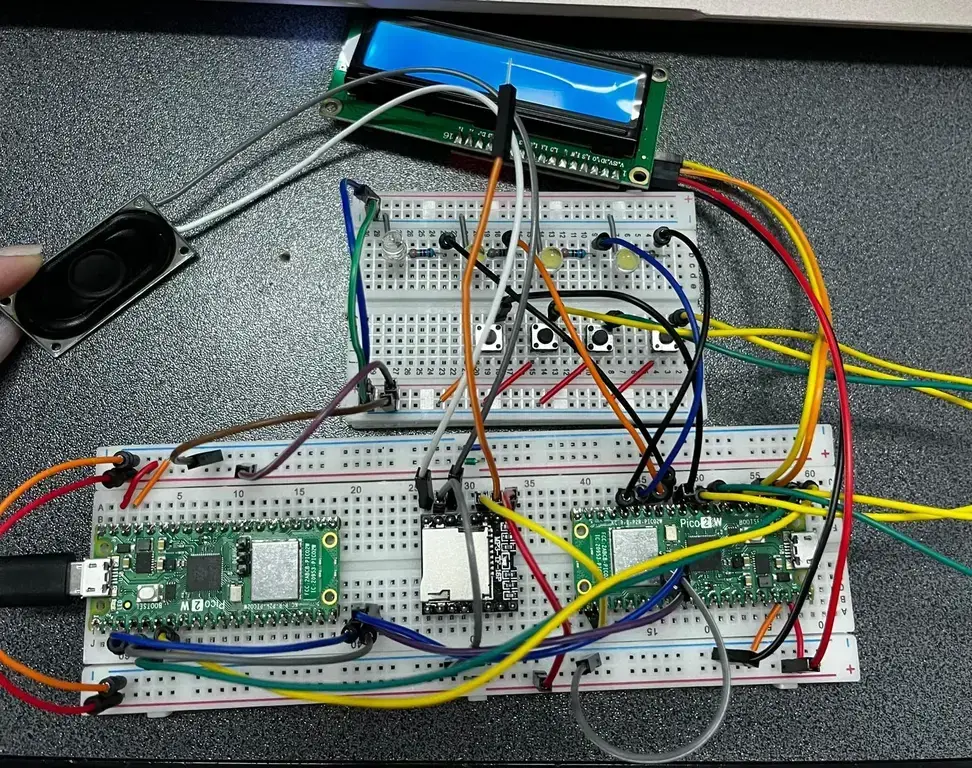
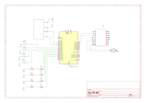

# VibeBox
A Raspberry Pi Pico-based music mood controller with LEDs, LCD, buttons and a speaker

:::info

**Author**: Bulugea Miruna Elena \
**GitHub Project Link**: https://github.com/UPB-PMRust-Students/project-mirunabulugea

:::

## Description

A Raspberry Pi Pico project that uses four buttons, each representing a mood(happy,sad,energetic and chill). When a button is pressed, a co>

## Motivation

I chose this project because I wanted to build something that combines music, hardware interaction, and visual feedback.I’ve always wanted >
## Architecture

The main components of the project are:  

- Raspberry Pi Pico W (controller)  
- Four push-buttons (for mood selection)  
- DFPPlayer Mini MP3 module (audio playback)  
- Speaker (audio output)  
- LCD 1602 I2C (displays the current mood)  
- Four LEDs (flash according to music beats)

*Connections:*  
- Each button connected to a GPIO pin  
- DFPPlayer Mini connected via UART  
- LCD connected via I2C  
- LEDs connected to GPIOs  
- Speaker connected to DFPPlayer Mini output

## Log

<!-- write your progress here every week -->

### Week 5 - 11 May
I have made resources about the components I need and bought them all .I have created the schematic using KiCad.

### Week 12 - 18 May
I began by physically wiring all the key components of the system on a breadboard,so I can start to write the code and test it .

### Week 19 - 25 May

## Hardware

Raspberry Pi Pico W:
A compact, Wi-Fi-enabled microcontroller board that serves as the core controller for the entire system. It handles button inputs, controls>

4 Push Buttons:
4 LEDs:
Visual feedback components that light up and blink in sync with the beat of the currently playing track.

1602 LCD Display with I2C Module:
A simple character display used to show the current selected mood. The I2C module simplifies wiring by reducing the number of GPIO pins nee>

DFPlayer Mini MP3 Module:
A compact MP3 player module that can read audio files from a microSD card. It’s controlled via UART from the Raspberry Pi Pico W and output>

Speaker:
Outputs the audio from the DFPlayer Mini, playing the selected music track in real time based on the mood button pressed

### Schematics

### Bill of Materials
| Device | Usage | Price |
|--------|--------|-------|
| [Raspberry Pi Pico 2W](https://www.optimusdigital.ro/ro/placi-raspberry-pi/13327-raspberry-pi-pico-2-w.html?gad_source=1&gbraid=0AAAAADv->
| [Electronic Components Kit (LEDs, Buttons, Wires, Resistors, Breadboard)](https://www.emag.ro/set-componente-electronice-breadboard-830-p>
| [DFPlayer Mini MP3 Module](https://www.optimusdigital.ro/ro/audio/1484-modul-mp3-player-in-miniatura-dfplayer-mini.html) | Plays audio fi>
| [Speaker](https://ro.farnell.com/multicomp-pro/abs-224-rc/speaker-200hz-to-20khz-4ohm-83db/dp/1761631) | Outputs audio from the MP3 modul>
| [LCD with I2C Interface and Blue Backlight](https://www.optimusdigital.ro/ro/optoelectronice-lcd-uri/2894-lcd-cu-interfata-i2c-si-backlig>
## Software

| Crate / Library | Description | Usage |
|:----------------|:----------------------------------------|:------------------------------------|
| [rp-hal](https://github.com/rp-rs/rp-hal) | Hardware Abstraction Layer (HAL) for Raspberry Pi RP2040 microcontrollers | Controls GPIO pin>
| [embedded-hal](https://github.com/rust-embedded/embedded-hal) | Hardware abstraction traits for embedded systems | Provides standard inte>
| [embedded-graphics](https://github.com/embedded-graphics/embedded-graphics) | 2D graphics library for embedded systems | Draws text and s>
| [embassy](https://github.com/embassy-rs/embassy) (optional) | Modern async framework for embedded systems | For async task management (op>
| [log](https://github.com/rust-lang/log) | Logging facade for Rust applications | Debugging and logging events like button presses or erro>
| [panic-halt](https://github.com/rust-embedded/panic-halt) | Minimal panic handler for embedded systems | Stops execution and halts the MC>

---
## Links

<!-- Add a few links that inspired you and that you think you will use for your project -->

1.[Music Player using Raspberry Pi Pico and DFPPlayer](https://www.youtube.com/watch?v=1--GBKYXRyY)
2. [pmrust/2025](https://pmrust.pages.upb.ro/docs/fils_en/project)
...
