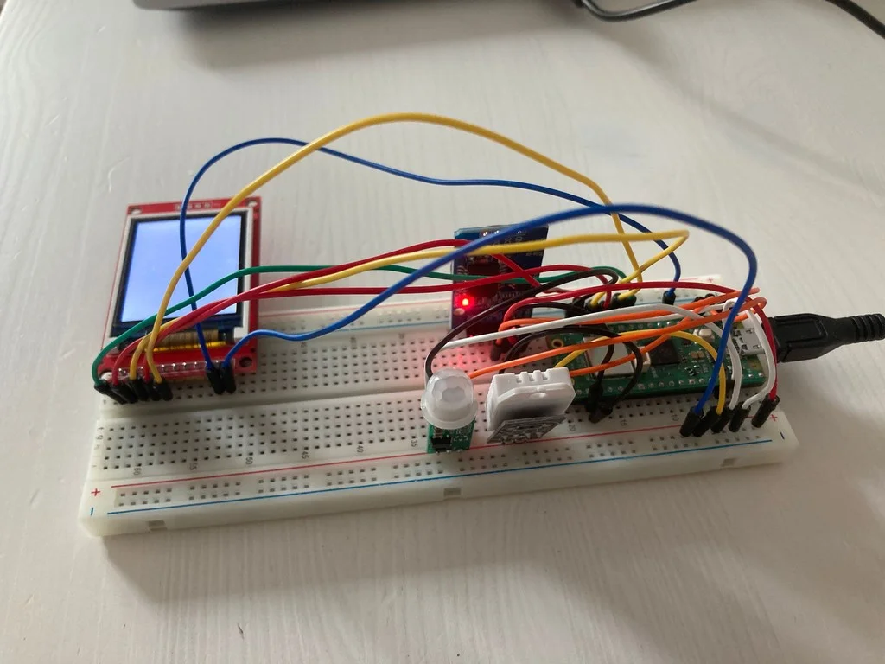
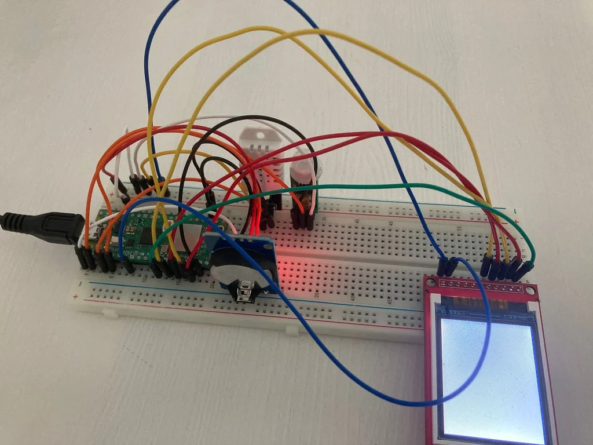
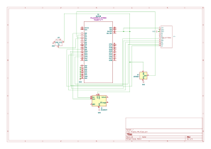

# Weather&Humidity Clock
A one line project description

:::info 

**Author**: Matache Monica Magdalena
**GitHub Project Link**:https://github.com/UPB-PMRust-Students/project-monica282004

:::

## Description

Describe in a few words your project idea.

## Motivation

Why did you choose this project?

## Architecture 

Add here the schematics with the architecture of your project. Make sure to include:
 - what are the main components (architecture components, not hardware components)
 - how they connect with each other

## Log

<!-- write your progress here every week -->

### Week 5 - 11 May

### Week 12 - 18 May

### Week 19 - 25 May

## Hardware
In my project, the Raspberry Pi Pico microcontroller serves as the central processing unit, mandated for the task. Its low power consumption ensures efficiency throughout. It also reads data and time from the DS3231 real time clock module and DHT22 Sensor and displays them, while also being able to send electrical signals to a motion sensor for an alarm effect.


### Schematics

Place your KiCAD schematics here.

### Bill of Materials

<!-- Fill out this table with all the hardware components that you might need.

The format is 
```
| [Device](link://to/device) | This is used ... | [price](link://to/store) |

```

-->

| Device | Usage | Price |
|--------|--------|-------|
| [Raspberry Pi Pico WH](https://ardushop.ro/ro/raspberry-pi/1945-raspberry-pi-pico-wh-wirelessheaders-6427854029621.html) | The main microcontroller with wireless and pre-soldered headers | [53 RON](https://www.optimusdigital.ro/en/raspberry-pi-boards/12394-raspberry-pi-pico-w.html) |
| [HC-SR505 PIR Motion Sensor](https://ardushop.ro/ro/module/508-modul-mini-senzor-pir-hc-sr505-6427854005922.html) | Detects motion to trigger the display of time and environmental data | [10,28 RON](https://ardushop.ro/ro/module/508-modul-mini-senzor-pir-hc-sr505-6427854005922.html) |
| [SPI LCD 1.8" 128x160 Module](https://ardushop.ro/ro/electronica/2124-modul-lcd-spi-128x160-6427854032546.html) | Displays time, temperature, humidity and weather | [43,58 RON](https://ardushop.ro/ro/electronica/2124-modul-lcd-spi-128x160-6427854032546.html) |
| [DS3231 Real-Time Clock Module](https://www.optimusdigital.ro/en/others/1102-ds3231-real-time-clock-module.html?search_query=DS3231+Real-time+Clock+Module&results=3) | Keeps accurate time even when the main power is off | [19 RON](https://www.optimusdigital.ro/en/others/1102-ds3231-real-time-clock-module.html) |
| [DHT22-Humidity and Temperature sensor](https://ardushop.ro/ro/electronica/2302-senzor-de-temperatura-si-umiditate-dht22-6427854031617.html) | Sense the humidity and temperature from the room| [18 RON](https://ardushop.ro/ro/electronica/2302-senzor-de-temperatura-si-umiditate-dht22-6427854031617.html) |
| Breadboard + jumper wires | Used to prototype the circuit without soldering | ~15 RON |

## Software

| Library | Description | Usage |
|---------|-------------|-------|
| [st7789](https://github.com/almindor/st7789) | Display driver for ST7789 | Used for the display for the Pico Explorer Base |
| [embedded-graphics](https://github.com/embedded-graphics/embedded-graphics) | 2D graphics library | Used for drawing to the display |

## Links

<!-- Add a few links that inspired you and that you think you will use for your project -->

1. [link](https://example.com)
2. [link](https://example3.com)
...
