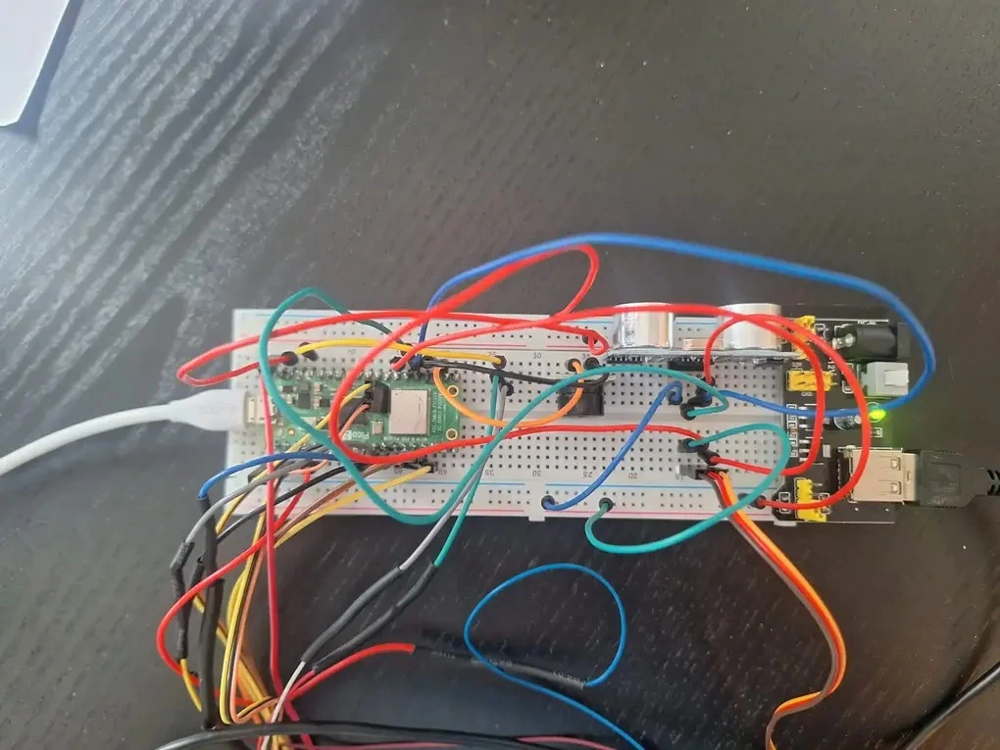
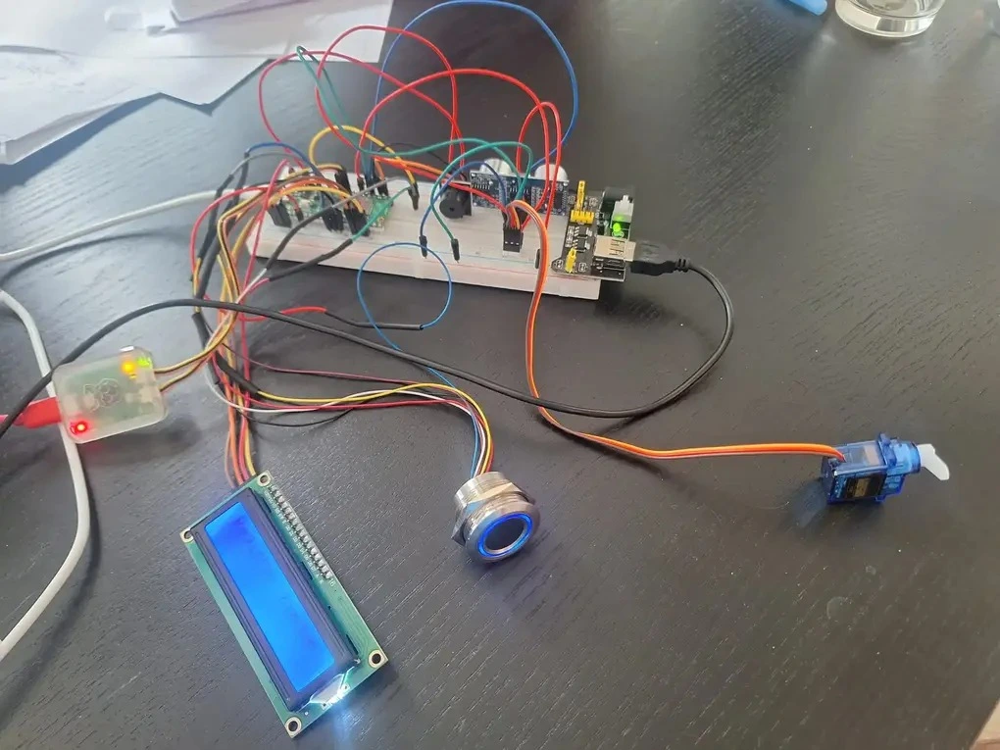
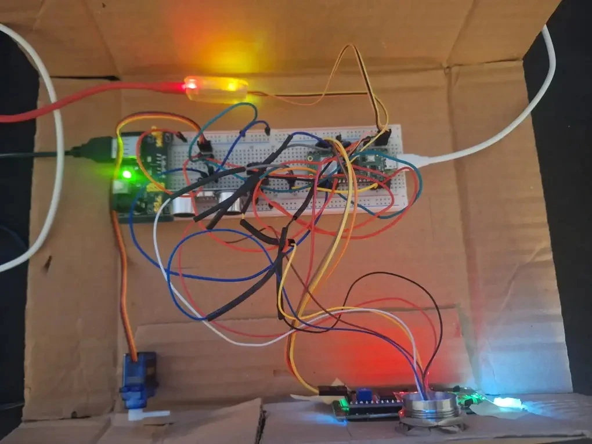
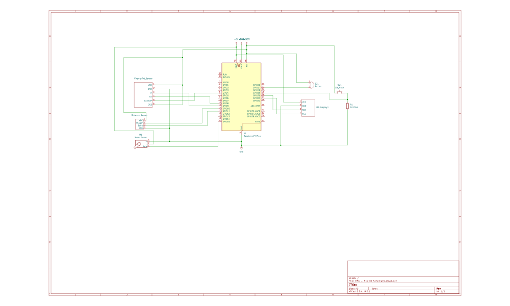

# Smart Door 

A Raspberry Pi Pico 2 W based door security system.

:::info 

**Author**: Octavian Mihai Cretu \
**GitHub Project Link**: https://github.com/UPB-PMRust-Students/project-octavian2411

:::

## Description

This project aim is to develop a smart door lock system powered by a Raspberry Pi Pico 2 W. It uses a fingerprint sensor to authenticate users, a servo motor to simulate locking and unlocking the door, and a buzzer to signal access. An LED display shows real-time status messages, while an ultrasonic sensor monitors the door's open or closed state. The system combines biometric security with sensor-based monitoring to create an interactive and responsive door locking simulation.

## Motivation

I chose this project because I’ve always found fingerprint matching really interesting. The idea that you can use something as unique as a fingerprint to unlock a door seemed like a fun and useful concept to explore. I wanted to learn how to use a fingerprint sensor with a microcontroller and see how everything works together. This project also lets me combine different parts like a servo motor, buzzer, LED display, and ultrasonic sensor to create a full system. By using the Raspberry Pi Pico 2 W programmed in Rust, I’m gaining a better understanding of how Rust works in embedded systems, especially with its concurrency features, and async behavior for handling multiple tasks efficiently.

## Architecture 


1. **Authentication Module**
    - Handles fingerprint scanning and matching.
    - Communicates with the fingerprint sensor over UART.
    - Sends authentication results (success/failure) to the Control Module.

2. **Control Module**
    - Core decision-making unit of the system.
    - Receives input from the Authentication Module and Sensor Interface.
    - Controls actuators (servo, buzzer) and updates the display.
    - Manages system states such as Locked, Unlocked.

3. **Sensor Interface**
    - Reads distance data from the ultrasonic sensor using GPIO.
    - Determines if the door is open or closed.
    - Sends door state updates to the Control Module.

4. **Actuator Interface**
    - Controls output devices.
    - Servo Motor via PWM for locking/unlocking.
    - Buzzer via GPIO or PWM for alerts.

5. **Display Interface**
    - Updates the LED display with system status messages (e.g., "Locked", "Access Granted").
    - Communicates with the display using I2C.


## Log

<!-- write every week your progress here -->

### Week 10 - 28 April - 4 May
Assembeled componenets on a breadboard and tested how they all work separately. \
Started working on interfacing with the R503 fingerprint sensor.

Made the fingerprint sensor work with three basic operations. Register fingerprint, verify fingerprint and remove fingerprint. \
Added led color changing as well.

### Week 11 - 5 May - 11 May
Added the other devices one by one to the project and programmed them depending on the locks state (such as Locked, Unlocked or Register Fingerprint). \
Switched to async tasks for every device, coordinated through a pubsub channel, which transmits the current door state.
Found out I need an aditional power source for the devices.

### Week 12 - 12 May - 18 May
Remade the kicad schematic. \
Set up a cardboard box mock-up to simulate the Smart Lock in a real-world scenario. Integrated all components into the enclosure and tested system functionality, including fingerprint authentication, locking mechanism, and status display. \
Rewrote some of the logic for the fingerprint sensor. 


## Hardware
**Raspberry Pi Pico 2 W:**
    - Central microcontroller that manages all inputs, outputs, and logic.
    - Runs the program written in Rust.

**Fingerprint Sensor (R503):**
    - Authenticates users by matching scanned fingerprints with stored data.
    - Communicates with the Pico via UART.

**Servo Motor:**
    - Simulates the physical locking and unlocking of the door.
    - Controlled via a PWM signal from the Pico.

**Ultrasonic Distance Sensor (HC-SR04):**
    - Detects if the door is open or closed by measuring distance.
    - Uses GPIO pins for trigger and echo.

**LED Display (LCD 1602 - I2C):**
    - Shows system status messages like "Locked", "Access Granted", or "Register Fingerprint".
    - Communicates with the Pico via I2C.

**Buzzer:**
    - Sounds a short alert when the door is unlocked or about to be locked.
    - Controlled via PWM.

**Breadboard Power source:**
    - Supplies power to components with higher current requirements, ensuring stable operation of the project.

**All components connected on breadboard**





**Project assembeled inside a carboard box**




### Schematics



### Bill of Materials

<!-- Fill out this table with all the hardware components that you might need.

The format is 
```
| [Device](link://to/device) | This is used ... | [price](link://to/store) |


```

-->
| Device | Usage | Price |
|--------|--------|-------|
| [Raspberry Pi Pico 2 W](https://www.optimusdigital.ro/en/raspberry-pi-boards/13327-raspberry-pi-pico-2-w.html?search_query=pico&results=52) | The microcontroller with Wi-Fi for phone notification | [39.50 lei](https://www.optimusdigital.ro/en/raspberry-pi-boards/13327-raspberry-pi-pico-2-w.html?search_query=pico&results=52) |
| [R503 - Fingerprint Sensor](https://www.ardumarket.ro/ro/product/r503-senzor-de-amprenta) | For fingerprint detection | [132 lei](https://www.ardumarket.ro/ro/product/r503-senzor-de-amprenta) | 
| [LCD1602 - I2C](https://www.optimusdigital.ro/en/lcds/2894-1602-lcd-with-i2c-interface-and-blue-backlight.html?search_query=lcd+i2c&results=36) | Displays system messages | [16 lei](https://www.optimusdigital.ro/en/lcds/2894-1602-lcd-with-i2c-interface-and-blue-backlight.html?search_query=lcd+i2c&results=36) |
| [HC-SR04 Ultrasonic Distance Sensor](https://www.optimusdigital.ro/en/ultrasonic-sensors/9-hc-sr04-ultrasonic-sensor.html?srsltid=AfmBOooLzhYfmw8V4VK-XNVOOrCqou06HsZ3SPIjGjCOnm1CVm9tKJPZ) | For measuring distances to door | [6.50 lei](https://www.optimusdigital.ro/en/ultrasonic-sensors/9-hc-sr04-ultrasonic-sensor.html?srsltid=AfmBOooLzhYfmw8V4VK-XNVOOrCqou06HsZ3SPIjGjCOnm1CVm9tKJPZ) |
| [SG90 Micro Servo Motor](https://www.optimusdigital.ro/en/servomotors/26-sg90-micro-servo-motor.html) | For simulating locking mechanism | [14 lei](https://www.optimusdigital.ro/en/servomotors/26-sg90-micro-servo-motor.html) |
| [Passive Buzzer Module](https://www.optimusdigital.ro/en/electronic-components/12598-passive-buzzer-module.html?search_query=Buzzer&results=87) | For audible alerts | [1.50 lei](https://www.optimusdigital.ro/en/electronic-components/12598-passive-buzzer-module.html?search_query=Buzzer&results=87) |
| [Power source](https://www.handsontec.com/dataspecs/mb102-ps.pdf) | Powering devices| [4.50 lei](https://www.optimusdigital.ro/ro/electronica-de-putere-stabilizatoare-liniare/61-sursa-de-alimentare-pentru-breadboard.html?gad_source=1&gad_campaignid=19615979487&gbraid=0AAAAADv-p3Bu4ths3LgERwkBbYG1QmiBV&gclid=Cj0KCQjwxJvBBhDuARIsAGUgNfhWwN5WKxw3TqizfBNU1kyoj6sLrET2OYK57V7l5MGLGn0CF-LuwOwaAmIpEALw_wcB) |
| Wires + Breadboard | For connections | 15 lei |


## Software

| Library | Description | Usage |
|---------|-------------|-------|
| [embassy-rp](https://docs.rs/embassy-rp/latest/embassy_rp/index.html) | Hardware Abstraction Layer | Interfaces with Raspberry Pi Pico 2 W hardware |
| [embassy-executor](https://docs.rs/embassy-executor/latest/embassy_executor/) | Task executor | Handles asynchronous tasks |
| [embassy-time](https://docs.rs/embassy-time/latest/embassy_time/) | Timing module | Provides timing functions for operations |
| [lcd1602-driver](https://docs.rs/lcd1602-driver/0.3.0/lcd1602_driver/) | LCD1602 Interface | Communication with the display |
| [pwm](https://docs.embassy.dev/embassy-rp/git/rp235xb/pwm/index.html)| PWM Module | For buzzer and servo |
| [uart](https://docs.embassy.dev/embassy-rp/git/rp235xb/uart/index.html) |  UART Module | For fingerprint sensor |
| [r503-driver](https://github.com/FransUrbo/rust-libs-r503) |  Fingerprint sensor driver | Forked and modified for use inside my own project |


## Links

<!-- Add a few links that inspired you and that you think you will use for your project -->

1. [YouTube video of fingerprint sensor](https://www.youtube.com/watch?v=3jvHIR80bMw&ab_channel=ElectronicClinic)
2. [Github R503 example wtih RP2040](https://github.com/Dygear/r503)
