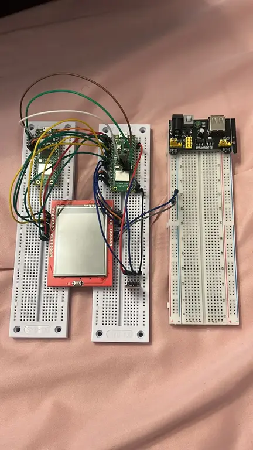
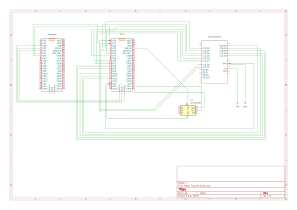

# Mood Tracker

An emotional journal based on button inputs for daily mood tracking

:::info
**Author**: Miriam Constantinescu \
**GitHub Project Link**: https://github.com/UPB-PMRust-Students/project-miriamct20
:::

## Description
A simple mood tracking device that allows users to record their daily emotional state by pressing buttons. The device saves these states and displays a graph of the last 7 days on a small LCD screen, providing a visual representation of emotional patterns.After the 7 inputs a mood analysis will be done via ChatGPT with its API

## Motivation
I chose this project because keeping track of one's emotional state can be beneficial for mental health awareness. A physical device with simple button inputs makes the process of mood tracking more tangible and accessible than smartphone apps, potentially encouraging more consistent usage. I'm also interested in creating a device that combines hardware interaction with data visualization.

## Architecture
The main components of the system are:
- **Input Module**: Buttons for mood selection (happy/sad/neutral)
- **Storage Module**: EEPROM for persistent mood data storage
- **Processing Unit**: Raspberry Pi Pico W as the central controller
- **Display Module**: LCD screen for visualization of mood data
- **Audio Feedback Module**: Sound output for interaction confirmation

These components interact as follows:
- User inputs mood via button presses
- The Processing Unit registers the input and stores it in the EEPROM
- The Processing Unit retrieves historical data from EEPROM
- The Processing Unit processes data and generates visualization
- The Display Module shows the mood history graph
- The Audio Module provides feedback sounds for interactions

## Log

### Week 5 - 11 May
- Set up development environment
- Created initial project structure
- Researched EEPROM interfacing with Raspberry Pi Pico

### Week 12 - 18 May
-Initialized the Rust project and strated working with the software
-Finished the hardware for the milestone 
-Research in data visualization with matplotlab

### Week 19 - 25 May

## Hardware

The project uses a Raspberry Pi Pico W as the main controller, with a 2.4" LCD screen for display, a TPA3118 mono audio amplifier for sound feedback, and an AT24C256 EEPROM module for data storage. Buttons for input and basic resistors are used for the interface.

### Schematics

### Bill of Materials
| Device | Usage | Price |
|--------|--------|-------|
| [Raspberry Pi Pico W](https://www.raspberrypi.com/documentation/microcontrollers/raspberry-pi-pico.html) | Main microcontroller | [40 RON](https://www.optimusdigital.ro/en/raspberry-pi-boards/12394-raspberry-pi-pico-w.html) |
| [2.4" LCD Display](https://www.adafruit.com/product/2478) | Displays mood history graph | [40 RON](https://www.optimusdigital.ro/en/displays/lcd-displays) |
| [TPA3118 Mono Audio Amplifier](https://www.ti.com/product/TPA3118) | Provides audio feedback | [20 RON](https://www.optimusdigital.ro/en/audio-modules) |
| [AT24C256 EEPROM Module](https://www.microchip.com/wwwproducts/en/AT24C256) | Stores mood history data | [9 RON](https://www.optimusdigital.ro/en/storage-modules) |
| [HQ830 Breadboard Kit](https://www.optimusdigital.ro/en/breadboards/hq830-breadboard-kit) | For prototyping | [22 RON](https://www.optimusdigital.ro/en/breadboards/hq830-breadboard-kit) |
| Push Buttons and Resistors | User input interface | [5 RON](https://www.optimusdigital.ro/en/buttons-and-switches) |

## Software
| Library | Description | Usage |
|---------|-------------|-------|
| [LittleFS](https://github.com/littlefs-project/littlefs) | File system for microcontrollers | Storage of mood data on the Pico |
| [ST7789](https://github.com/almindor/st7789) | Display driver for LCD | Interfacing with the 2.4" LCD display |
| [embedded-graphics](https://github.com/embedded-graphics/embedded-graphics) | 2D graphics library | Creating the mood history graph |
| [I2C-EEPROM](https://github.com/arduino-libraries/Arduino_EEPROM) | EEPROM interface library | Communication with the AT24C256 module |
| [pico-sdk](https://github.com/raspberrypi/pico-sdk) | Raspberry Pi Pico SDK | Core functionality for the Pico W |
| [embedded-hal](https://github.com/rust-embedded/embedded-hal) | Hardware abstraction layer | Consistent interface for hardware components |

## Links
1. [Mood Tracking for Mental Health](https://www.verywellmind.com/mood-tracking-4171656)
2. [Rust on Raspberry Pi Pico](https://github.com/rp-rs/rp-hal)
3. [Working with EEPROM in Embedded Systems](https://www.embedded.com/working-with-eeprom-in-embedded-systems/)
4. [ST7789 Display Controller Guide](https://cdn-shop.adafruit.com/datasheets/ST7789V.pdf)
5. [Data Visualization on Embedded Devices](https://www.embedded.com/data-visualization-techniques-for-embedded-systems/)