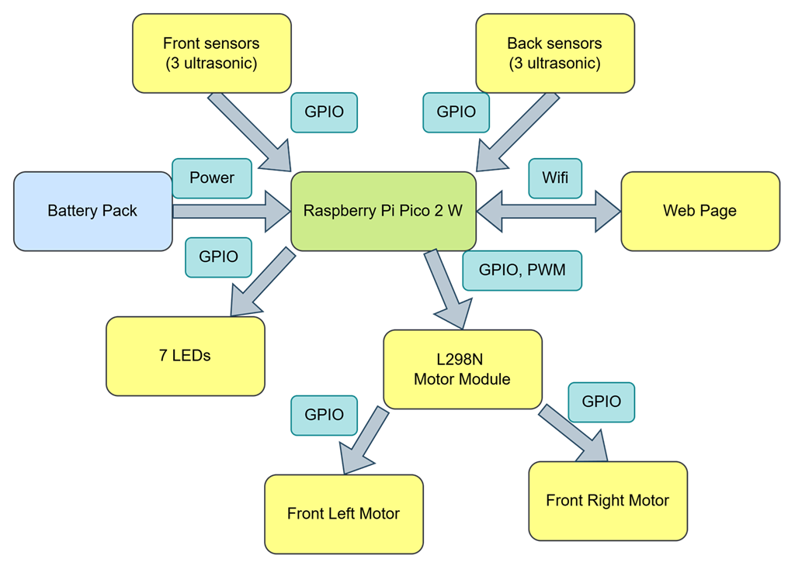
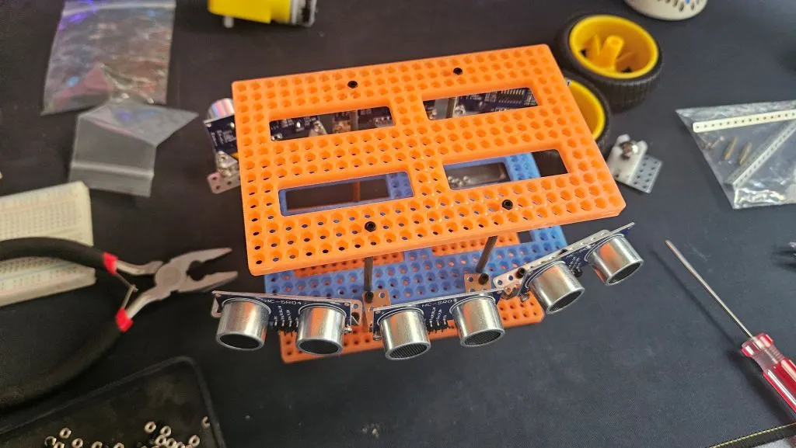
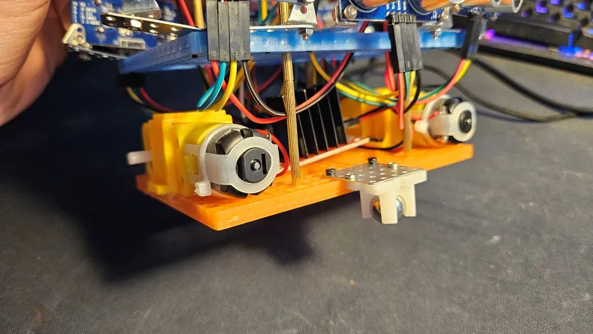
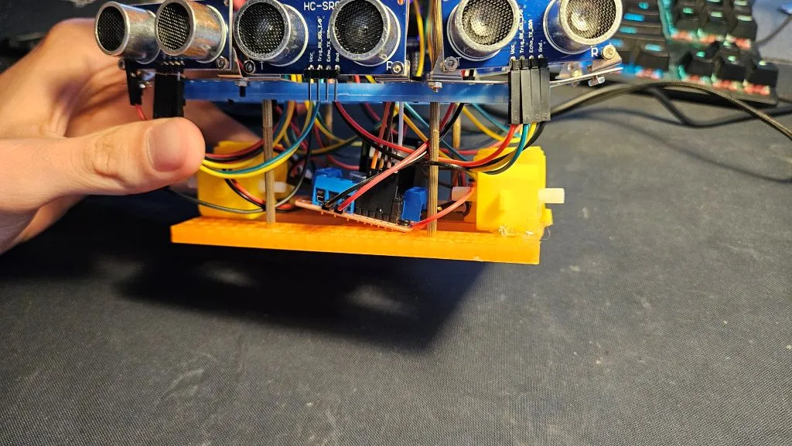
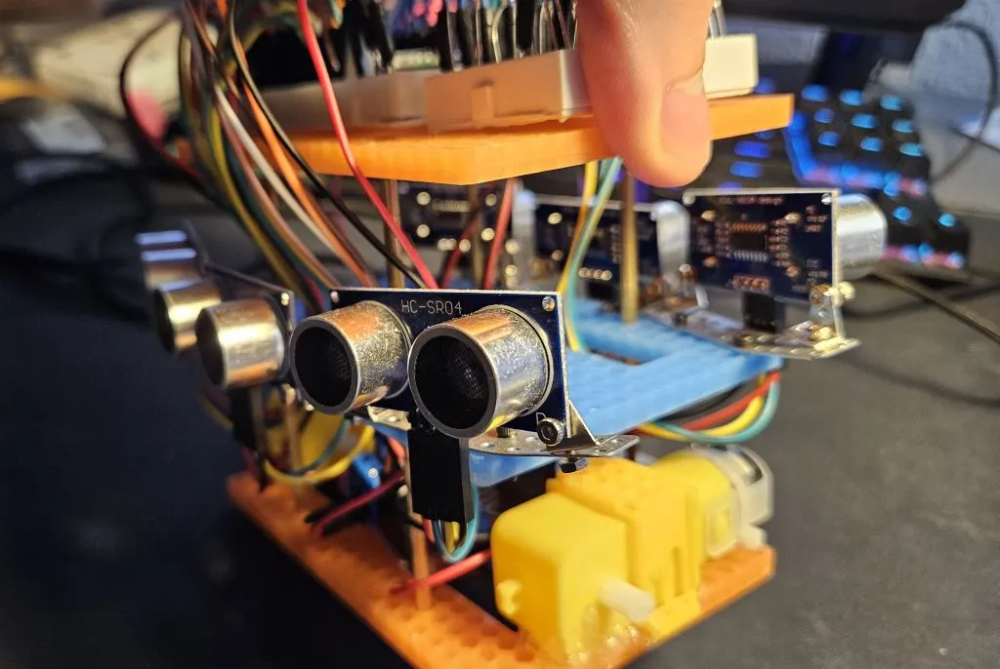
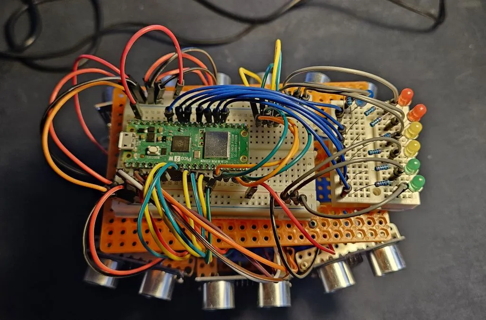
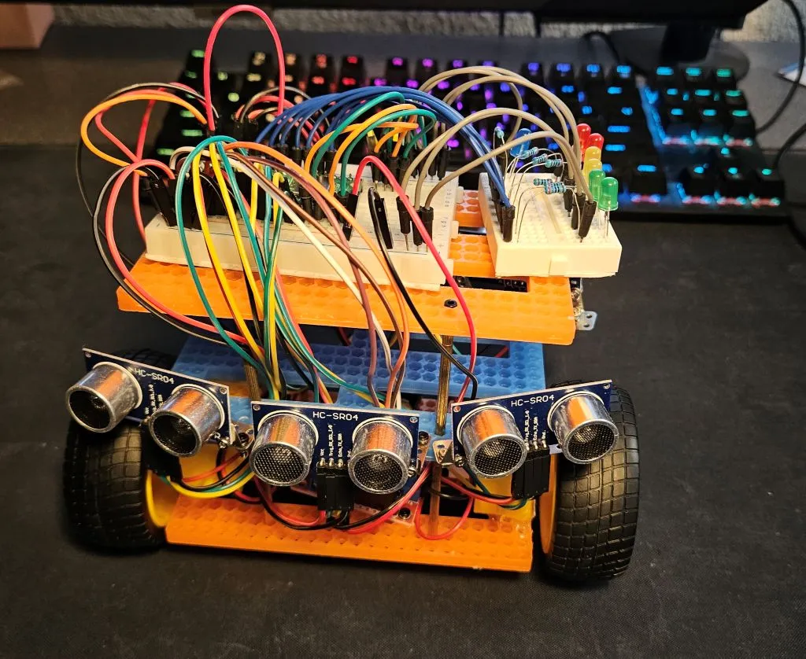
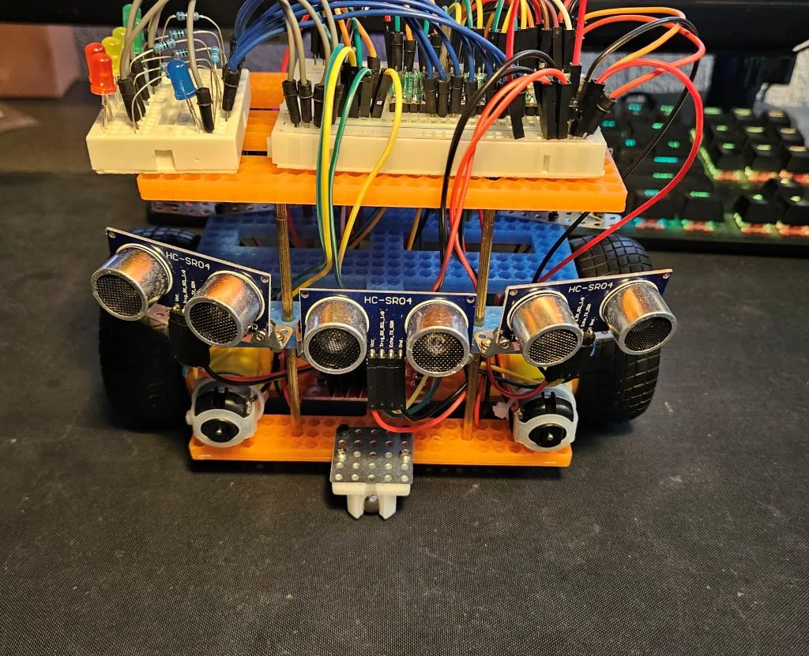
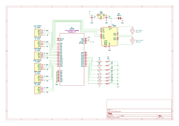

# Car with Parking Sensors

A car equipped with front and back parking sensors. 

:::info 

**Author**: Popazu Petru Andrei\
**GitHub Project Link**: https://github.com/UPB-PMRust-Students/project-PetruPopazu.git

:::

## Description

The project consists of a car equipped with 6 ultrasonic sensors (3 at the front and 3 at the rear), 2 DC motors that allow it to move forward, backward, left and right. It detects the obstacles nearby, expressing the distance using LEDs, and based on readings of the sensors it stops when getting close to an object and looks for a way to go around it. Using the Wi-Fi chip on the Pico, sensor data is transmitted from the Pico to a web page, while control signals (such as forward, stop, or backward) are sent from the web page back to the Pico.

## Motivation

The reason behind choosing the theme for this project is my great passion for cars, wanting to do something related to it. As i drive an older car with no parking sensors, i've always wished for this feature. I wanted to build them myself and learn how they operate. Along the way of building this project, i hope to gather as much knowledge as possible about microprocessor architecture and electronics.

## Architecture 
### Diagram



**Raspberry Pi Pico 2 W**
- Controls all peripherals: reads distance from the ultrasonic sensors, manages the motors and the LEDs, sends data to the web page

**HC-SR04 Ultrasonic sensors**
- They constantly read distances, detecting obstacles in front and back
- Interface: GPIO

**LEDs**
- They light up reacting to the distances read by the ultrasonic sensors
- 2 Green LEDs, 2 Yellow LEDs, 2 Red LEDs and one Blue LED (Green = Safe, Yellow = Caution, Red = Stop, Blue: On = front detection, Off = rear detection)
- Interface: GPIO

**L298n Motor Driver Module**
- Controls the DC motors: forward and backward
- PWM speed control
- Interface: GPIO

**DC Motors**
- Drive the car forward, backward, right and left
- Interface: GPIO

## Log

<!-- write your progress here every week -->

### Week 28 April - 4 May
Started to visualize the idea of the project and wanted to better understand the overall concept, so i started to translate the idea into something more detailed using Kicad. During the drawing of the schematic I added to the cart the components of the project and ordered them.
### Week 5 - 11 May
The Ultrasonic Sensors have arrived, so i began building the layers of the car. I put together the 3 layers:
- first layer will be for the motors with the wheels and driver module
- second layer is where the ultrasonic sensors will be placed; also the battery is going to sit here
- third layer is where the 2 breadboards are situated: first breadboard for the Pico and the connections with the sensors and motors; second breadboard for the LED's
Secured the ultrasonic sensors to the board using small metal parts and attached the wires to them.
### Week 12 - 18 May
I added to the base layer 2 DC Motors and L298N module. I firstly screwed in a side of the Motor, but saw that it was wobbly and decided to use a Hot Glue Gun to secure it to the base. Wired them to the module and from the module to the Breadboard with the Pico.\
Going to the last layer, because the second was already done. Placed the 2 breadboards on the last layer and attached to the larger one, the Pico. Connected the previously attached wires from the sensors to the GPIO pins of the Pico and the wires from the driver module. Added to the small breadboard the LEDs and connected them to the Pico. \
This is the final form of the hardware. From now on, starting to implement the software. 

## Hardware

Raspberry Pi Pico 2W used for controlling the hardware of the project.\
DC Motors are used to move the car through the L298N driver module.\
The LEDs visualize the distance to the objects.\
HC-SR04P Ultrasonic Sensors detect objects nearby.

Initial Skeleton of the car.



First Layer





Second Layer



Third Layer



Overall view





### Schematics

This is the Kicad schematic.



### Bill of Materials

<!-- Fill out this table with all the hardware components that you might need.

The format is 
```
| [Device](link://to/device) | This is used ... | [price](link://to/store) |

```

-->

| Device | Usage | Price |
|--------|--------|-------|
| [Raspberry Pi Pico 2 W](https://www.raspberrypi.com/documentation/microcontrollers/raspberry-pi-pico.html) | The microcontroller | [40 RON](https://www.optimusdigital.ro/ro/placi-raspberry-pi/13327-raspberry-pi-pico-2-w.html?gad_source=1&gad_campaignid=19615979487&gbraid=0AAAAADv-p3DfPn0jghDBkW5rmkni4ZwoA&gclid=Cj0KCQjwlMfABhCWARIsADGXdy-2UJynBEaijVkLUjd2GMpHaLt4yTef_1SemcI0xAtDyYZ3etr6UoAaAhstEALw_wcB) |
|[Mini Breadboard](https://www.mouser.com/datasheet/2/737/breadboards_for_beginners-2489753.pdf?srsltid=AfmBOooZwwJE-Z5BTXGU_PjlmlkV8tOXefhxb5O4ve18X78d9_MAQ3II)|Used for connecting the LEDs|[2.35 RON ](https://www.optimusdigital.ro/ro/prototipare-breadboard-uri/244-mini-breadboard-colorat.html?search_query=breadboard&results=125)|
|[Breadboard HQ (830 Puncte)](https://www.mouser.com/datasheet/2/737/breadboards_for_beginners-2489753.pdf?srsltid=AfmBOooZwwJE-Z5BTXGU_PjlmlkV8tOXefhxb5O4ve18X78d9_MAQ3II)|Main board for connecting the components|[4.56 RON](https://www.optimusdigital.ro/ro/prototipare-breadboard-uri/44-breadboard-400-points.html?search_query=breadboard&results=125)|
|[6 x HC-SR04 Ultrasonic sensor](https://cdn.sparkfun.com/datasheets/Sensors/Proximity/HCSR04.pdf)|The base of the parking feature|[40 RON](https://www.optimusdigital.ro/ro/senzori-senzori-ultrasonici/9-senzor-ultrasonic-hc-sr04-.html?search_query=senzor+ultrasonic&results=42)|
|[2 x DC motors with Wheels](https://handsontec.com/index.php/product/36v-mini-dc-gear-motor/)|Drive Motors|[30 RON](https://www.optimusdigital.ro/ro/motoare-altele/139-motor-cu-reductor-si-roata.html?search_query=motor+cu+roata&results=33)|
|[L298N Motor Driver Module](https://www.handsontec.com/dataspecs/L298N%20Motor%20Driver.pdf)|The motor driver module|[10.99 RON](https://www.optimusdigital.ro/ro/drivere-de-motoare-cu-perii/145-driver-de-motoare-dual-l298n.html?search_query=l298n&results=4)|
|[Plusivo LED set](https://www.plusivo.com/electronics-kit/36-plusivo-3mm-and-5mm-diffused-led-light-emitting-diode-assortment-kit.html)|Indicators for distance|[26.99 RON](https://www.optimusdigital.ro/ro/kituri-optimus-digital/9517-set-de-led-uri-asortate-de-5-mm-si-3-mm-310-buc-cu-rezistoare-bonus.html?search_query=led&results=779)|
|[Battery Support](https://www.optimusdigital.ro/ro/suporturi-de-baterii/20-conector-pentru-baterie-de-9-v.html?search_query=suport+pentru+baterie&results=56)|Connection between battery and current for the pico|[1.29 Ron](https://www.optimusdigital.ro/ro/suporturi-de-baterii/20-conector-pentru-baterie-de-9-v.html?search_query=suport+pentru+baterie&results=56)|
|[Battery](https://www.optimusdigital.ro/ro/baterii-de-9-v-pp3/3155-baterie-alcalina-de-9-v-maxell-6lr61-4902580165017.html?search_query=baterie+9v&results=311)|Supplying current to the circuit|[7.99 RON](https://www.optimusdigital.ro/ro/baterii-de-9-v-pp3/3155-baterie-alcalina-de-9-v-maxell-6lr61-4902580165017.html?search_query=baterie+9v&results=311)|


## Software

| Library | Description | Usage |
|---------|-------------|-------|
|[embassy_rp](https://docs.embassy.dev/embassy-rp/git/rp235xb/index.html)|Embassy RP|Initializing and interacting with the peripherals|
|[gpio](https://docs.embassy.dev/embassy-stm32/git/stm32c011d6/gpio/index.html)|General Purpose Input/Output|Used for controlling digital pins connected to motors, LEDs, and ultrasonic sensors|
|[hc_sr04](https://docs.rs/hc-sr04/latest/hc_sr04/)|Driver for the ultrasonic sensors|Reading measurements|
|[pwm](https://docs.embassy.dev/embassy-rp/git/rp235xb/pwm/index.html)|PWM Module|For controlling the motors speed|
|[cyw43](https://docs.rs/cyw43/latest/cyw43/)|Rust driver for the CYW43 wifi chip|Interacting with the Wi-fi chip|
|[embassy-net](https://docs.rs/embassy-net/latest/embassy_net/)|async network stack, designed for embedded systems|To send data of the sensor and receive commands for the car|

## Links

<!-- Add a few links that inspired you and that you think you will use for your project -->

1. [Embedded Programming with Rust](https://pico.implrust.com/ultrasonic/circuit.html)
2. [NerdCave](https://www.youtube.com/@NerdCaveYT)