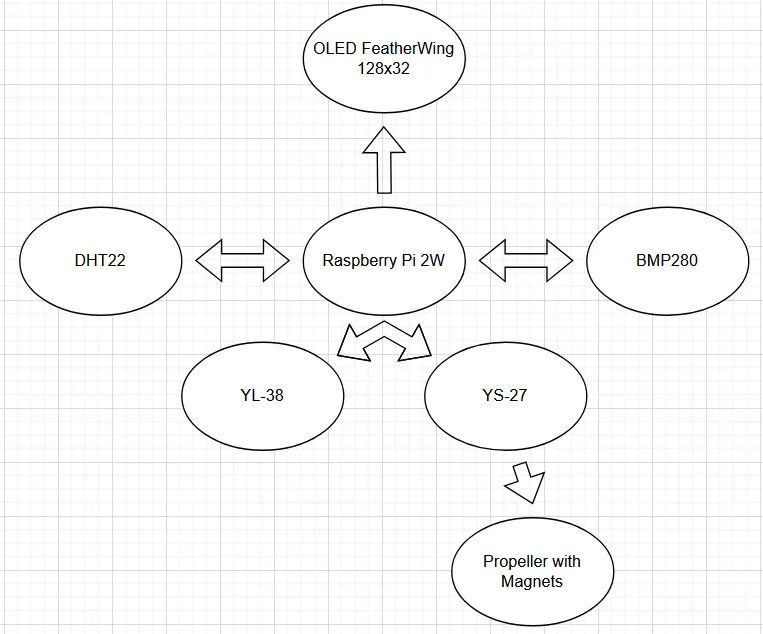
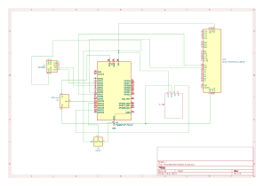
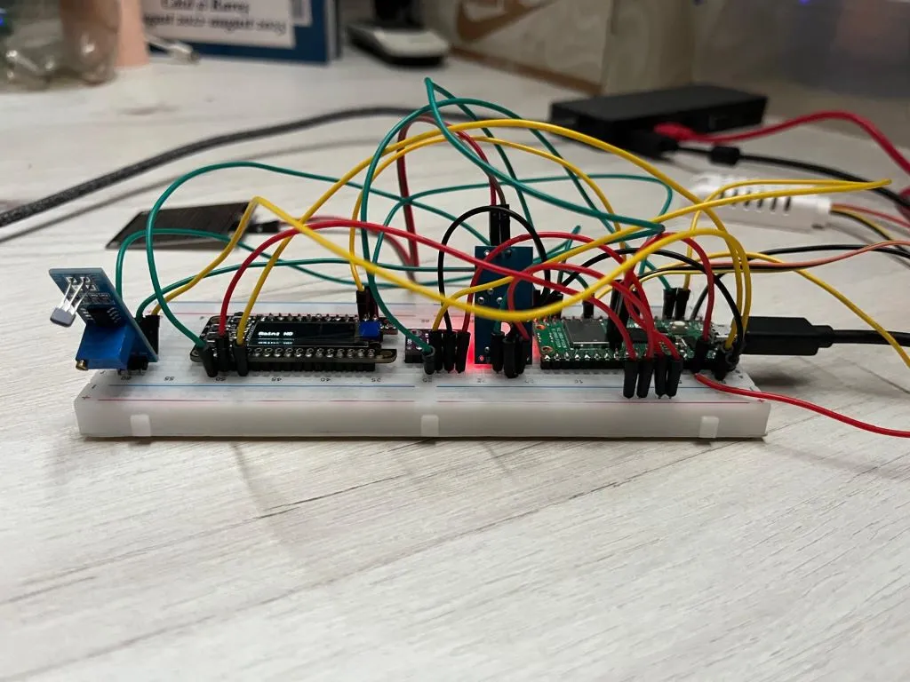
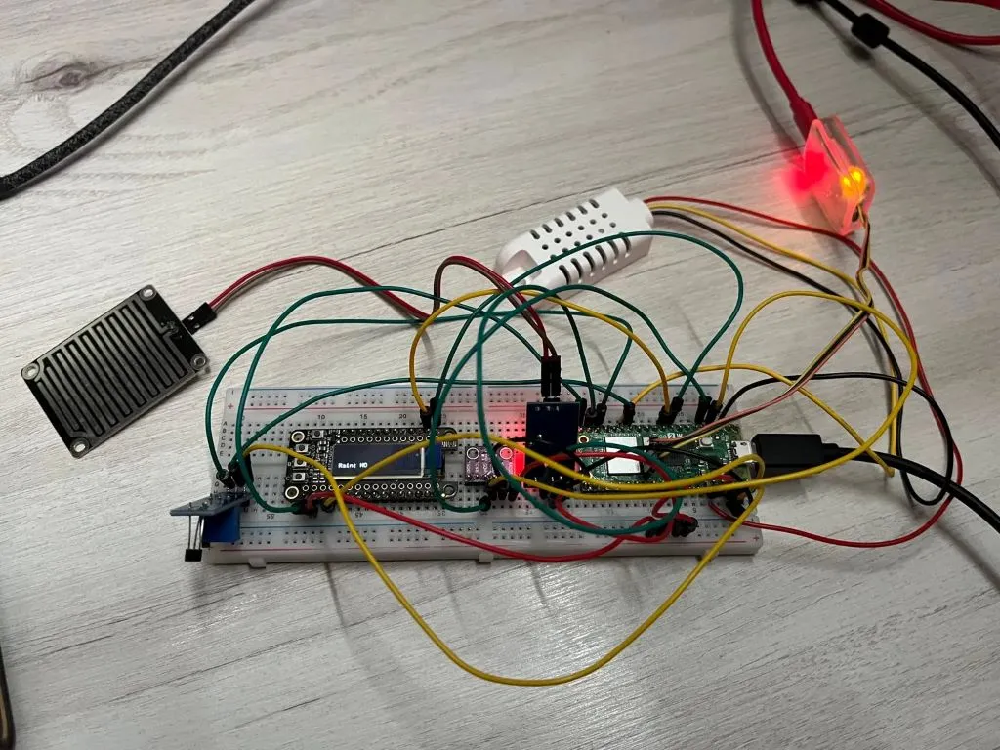

# Smart Weather Station
A Raspberry Pi-based weather monitoring system that collects temperature, humidity, air pressure, wind speed/direction, and rainfall data, displaying it locally and on a web dashboard.

:::info 
**Author**: Tone Rares-Mihai \
**GitHub Project Link**: https://github.com/UPB-PMRust-Students/project-toniyiy
:::

## Description
This project uses a Raspberry Pi to collect environmental data from multiple sensors:
- **DHT22**: Temperature and humidity
- **BMP280**: Atmospheric pressure
- **YS-27**: Wind speed (via propeller that has magnets attached to it, it keeps track of the propellers RPMs counting how many times the magnets pass the sensor)
- **YL-38**: Rainfall detection

Relevant labs/concepts applied:
- I2C communication
- Sensor calibration
- Web server development (Django)
- Real-time data visualization

## Motivation
I wanted to build a practical IoT device that bridges hardware and software, while contributing to environmental monitoring. This project challenges me to integrate multiple sensor protocols, design a user-friendly dashboard, and apply embedded systems knowledge from coursework, which i find very interesting. 

---

## Architecture
### Connections 

### Schematic Diagram

**Key Components**:
1. **Raspberry Pi**
   - Central controller for data collection and processing
   - Interfaces with all sensors via GPIO/I2C
2. **YS-27 module with a3144 hall effect sensor + Propeller**
   - **Interface**: GPIO with interrupts
   - **Role**: Measures wind speed and direction using the magnets attached to the propeller 
3. **DHT22 & BMP280 & YL-38**
   - **Interface**: I2C
   - **Role**: Core environmental sensing, like rain (YL-38), temperature and humidity (DHT22) and atmospheric pressure (BMP280)
4. **OLED FeatherWing 128x32**
   - **Interface**: I2C
   - **Role**: Display information locally
---

## Log 
### Week 1
The first week of the project was intense, but i got around to setting up the sensors, and even got around to working on the code. I hope the code will turn out nicely as well in the end. The only thing left for the hardware part is setting up the propeller, which im not sure yet how to do. I do have some ideas but i need to experiment. Also, i started working on the code for the other sensors, but i have some problems with the dht22 and the pressure bme280 sensor. The only one i got to work (other than the display) is the rain module, which displays if it's raining or not.
This is how it looks so far:

### Week 2

---

## Hardware
### Bill of Materials
| Component                | Purpose                  | Price   | Link |
|--------------------------|--------------------------|---------|------|
| Raspberry Pi 2W          | Main controller          |  40 RON | https://www.optimusdigital.ro/ro/placi-raspberry-pi/13327-raspberry-pi-pico-2-w.html?search_query=Raspberry+Pi+Pico+2W&results=26 |
| Debugger for Pico        | Debugger                 |  66 RON | https://www.optimusdigital.ro/ro/accesorii/12777-placa-pentru-depanare-raspberry-pi.html?search_query=Placa+pentru+Depanare+Raspberry+Pi&results=5 |
| DHT22 Sensor             | Temp/Humidity            |  25 RON | https://www.optimusdigital.ro/ro/senzori-senzori-de-temperatura/3157-senzor-de-temperatura-i-umiditate-dht22am2302b.html?search_query=dht22&results=6 |
| BMP280 Sensor            | Air pressure             |  35 RON | https://www.optimusdigital.ro/ro/senzori-senzori-de-presiune/1666-modul-senzor-de-presiune-barometric-bmp280.html?search_query=Modul+Senzor+de+Presiune+Barometric+BMP280+GY&results=3 |
| YS-27                    | Anemometer integration   |  15 RON | https://www.optimusdigital.ro/ro/senzori-senzori-hall/596-modul-cu-senzor-hall-ys-27.html?search_query=Modul+cu+Senzor+Hall+YS-27&results=17 |
| Propeller                | Direction measurement    |  5  RON | https://www.optimusdigital.ro/ro/mecanica-elice/421-elice-albastra-de-80-mm.html?search_query=Elice+Albastra+de+80+mm&results=3 |
| YL-38                    | Rainfall detection       |  20 RON | https://www.optimusdigital.ro/ro/senzori-senzori-de-umiditate/5775-modul-senzor-de-ploaie.html?search_query=Modul+Senzor+de+Ploaie&results=1 |
| FeatherWing OLED Display | Local display of info    | 100 RON | https://www.optimusdigital.ro/ro/optoelectronice-lcd-uri/3335-shield-featherwing-cu-ecran-oled-128-x-32-pentru-adafruit-feather.html?search_query=Shield+FeatherWing+cu+Ecran+OLED+128+x+32+pentru+Adafruit+Feather&results=1 |
---

## Software
| Tool/Library            | Purpose                          | Link |
|-------------------------|----------------------------------|------|
| Rust with Embassy       | Core programming language        | https://embassy.dev/                               |
| Django                  | Web dashboard framework          | https://www.djangoproject.com                      |
| Matplotlib              | Data graphing                    | https://matplotlib.org                             |

---

## Links
