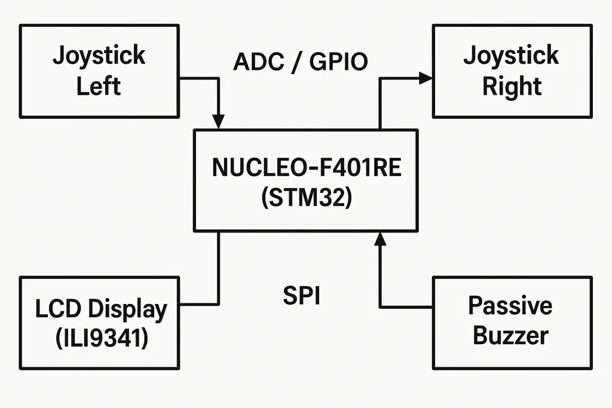

# SNAKE GAME

A snake game inspired by the timeless classic that aims to bring back the good times of the past and a modern touch with a 2-player mode and touch-screen compatibility.

:::info 

**Author**: Beldie Razvan-Gabriel

**GitHub Project Link**: https://github.com/UPB-PMRust-Students/project-IRazvannN

:::

## Description
This project implements a two-player version of the classic Snake game on an STM32 NUCLEO-F401RE microcontroller, written entirely in Rust using the Embassy asynchronous framework.The firmware handles real-time input polling from joysticks, manages game state logic, drives the SPI display using embedded-graphics, and generates PWM audio signals concurrently using Embassy's async tasks.

## Motivation
The primary motivation for choosing this project was to create an engaging and enjoyable embedded system application that goes beyond basic hardware interaction. Developing a game, particularly a well-known classic like Snake, provides a fun platform that can be used and demonstrated after completion.Furthermore, the project presents several interesting technical challenges well-suited for exploring the capabilities of Rust and the Embassy framework in an embedded context

## Architecture 

The system architecture revolves around the NUCLEO-F401RE board acting as the central controller. It runs firmware developed in Rust using the Embassy asynchronous framework.

1.Input Subsystem:

 - Two analog joystick modules are connected to the Nucleo board. The X and Y analog outputs are routed to distinct ADC channels, while the digital switch output of each joystick is connected to a separate GPIO input pin.

 - An asynchronous Embassy task periodically polls the ADC channels and GPIO pins corresponding to both joysticks.

 - Raw ADC values are converted into directional commands (Up, Down, Left, Right) based on deviation from a center resting value. Digital button states are read directly.

 - These processed inputs are likely sent via Embassy channels or signals to the main game logic task.

2.Game Logic Subsystem (snake_game_lib):

 - This core logic resides in a separate no_std library crate.

 - It maintains the GameState, including the positions and directions of both snakes, the food location, player scores, and the game over status.

 - A central tick() function updates the game state based on the latest player inputs received from the input subsystem. This includes moving snakes, checking for collisions (wall, self, other player), handling food consumption, and managing scoring.

 - It operates independently of the specific hardware, receiving abstract input commands and outputting the game state.

3.Display Output Subsystem:

 - The ILI9341 TFT display is connected via SPI.

 - An asynchronous Embassy task is responsible for rendering. It receives the current GameState (potentially via an Embassy channel or by accessing shared state protected by a Mutex/Signal).

 - Using the embedded-graphics library and an ili9341 driver crate, this task draws the game board, snakes, food, scores, and any active menu/UI elements onto a framebuffer or directly to the display.

 - Communication with the display happens over SPI, managed by the embassy-stm32 HAL and the display driver.

4.Audio Output Subsystem:

 - A passive buzzer is connected to a PWM-capable GPIO pin.

 - An Embassy task or dedicated functions within the game logic trigger sound effects based on game events (food eaten, collision/game over, menu interaction).

 - These triggers configure and briefly enable a PWM peripheral channel on the STM32 to generate the appropriate frequency/tone on the buzzer.

5.Concurrency:

 - The Embassy executor manages multiple asynchronous tasks: one for input polling, one for the main game loop/state updates, and potentially one dedicated to rendering or sound if needed, although rendering might be part of the main loop.

 - Embassy channels (Channel, Signal) or shared state (Mutex) are used for safe communication and data sharing between tasks (e.g., sending input commands to the game logic, sending game state to the display task).

6.User Interface / State Machine:

 - The application includes different states (Main Menu, Side Select, Playing, Paused, Game Over, Leaderboard).

 - The main loop transitions between these states based on user input and game events.

Each state dictates what is drawn on the screen and how user input is interpreted.
 - what are the main components (architecture components, not hardware components)
 - how they connect with each other



## Log

<!-- write your progress here every week -->

### Week 5 - 11 May

### Week 12 - 18 May

### Week 19 - 25 May

## Hardware

This project utilizes the following hardware components:

1. Main Controller Board: STMicroelectronics NUCLEO-F401RE

 -  Features the STM32F401RE microcontroller (ARM Cortex-M4 core).

 -  Provides the main processing power for running the game logic, handling inputs, and driving outputs.

 -  Includes an onboard ST-LINK/V2-1 debugger for programming and debugging via USB connection to the host computer.

 - Powered via the ST-LINK USB connection during development, or optionally via an external 5V supply connected to the E5V pin (requires jumper change).

2. Display: 2.4" SPI TFT LCD Display Module (ILI9341 Controller)

 - A 240x320 pixel color liquid-crystal display.

 - Used to render the game visuals, including the snakes, food, score, game area, and menus.

 - Interfaces with the NUCLEO board via the SPI (Serial Peripheral Interface) protocol.

 - Requires connections for SPI signals (SCK, MOSI, MISO), Chip Select (CS), Data/Command (DC), Reset (RST), Power (VCC 3.3V), Ground (GND), and Backlight (LED).

3. Input Devices: 2x Analog Joystick Modules (XY-axis + Switch)

 - Standard "thumbstick" style modules, each providing two analog outputs (X and Y axes) and one digital output (push-button switch).

 - Used for player input to control the direction of the snakes and potentially for menu navigation/selection.

 - The analog outputs connect to ADC pins on the NUCLEO board.

 - The digital switch output connects to GPIO pins on the NUCLEO board.

 - Powered by the 3.3V output from the NUCLEO board.

4. Audio Output: 1x Passive Buzzer

 - A simple piezoelectric buzzer that produces sound when driven by an oscillating signal.

 - Used to provide basic audio feedback for game events (e.g., eating food, game over).

 - Driven by a PWM (Pulse Width Modulation) signal generated by a timer peripheral on the NUCLEO board, connected via a GPIO pin.

Accessories:

1. Breadboard(s): (Optional) May be used for cleanly connecting components or power rails if needed.

2. Jumper Wires: Male-Female and Male-Male wires for connecting the display module, joysticks, and buzzer to the NUCLEO board headers.

3. USB Cable: Standard USB-A to Mini-B cable for connecting the NUCLEO's ST-LINK port to the development laptop for power, programming, and debugging.

### Schematics

Place your KiCAD schematics here.

### Bill of Materials

<!-- Fill out this table with all the hardware components that you might need.

The format is 
```
| [Device](link://to/device) | This is used ... | [price](link://to/store) |

```

-->

| Device | Usage | Price |
|--------|--------|-------|
| [NUCLEO-F401RE](https://www.st.com/resource/en/data_brief/nucleo-c031c6.pdf) | The microcontroller | [64.99 RON](https://ro.mouser.com/ProductDetail/STMicroelectronics/NUCLEO-F401RE?qs=sGAEpiMZZMuqBwn8WqcFUv%2FX0DKhApUpi46qP7WpjrffIid8Wo1rTg%3D%3D) |
| [2.4" SPI TFT LCD Display Touch Panel ILI9341 240x320](http://www.lcdwiki.com/2.4inch_SPI_Module_ILI9341_SKU:MSP2402) | LCD Display | [22.27 RON](https://www.aliexpress.com/item/1005008314274054.html?spm=a2g0o.order_list.order_list_main.10.79d618026j9iNt) |
| [2 x Breadboard HQ](https://components101.com/sites/default/files/component_datasheet/Breadboard%20Datasheet.pdf) | Building the circuit | [9.78 RON](https://www.aliexpress.com/item/1005007975904953.html?spm=a2g0o.order_list.order_list_main.15.79d618026j9iNt) |
| [Resistors](https://www.farnell.com/datasheets/3760829.pdf) | Building the circuit | [18.52 RON](https://www.aliexpress.com/item/32636020144.html?spm=a2g0o.order_list.order_list_main.26.79d618026j9iNt) |
| [Passive Buzzer](https://www.farnell.com/datasheets/2171929.pdf) | For Sound | [1.40 RON](https://www.optimusdigital.ro/ro/audio-buzzere/634-buzzer-pasiv-de-5-v.html?search_query=buzzer&results=63) |
| [Jumper wires](https://www.tubesandmore.com/sites/default/files/associated_files/s-w604_spec.pdf) | Connections | [11.92 RON](https://www.aliexpress.com/item/1005008657927457.html?spm=a2g0o.order_list.order_list_main.20.79d618026j9iNt) |
| [M-T wires, 30cm,](https://www.st.com/resource/en/data_brief/nucleo-c031c6.pdf) | Connections | [4.81 RON](https://www.optimusdigital.ro/ro/fire-fire-mufate/879-set-fire-mama-tata-10p-30-cm.html?search_query=fire+colorate&results=49) |
| [T-T wires, 10cm](https://www.st.com/resource/en/data_brief/nucleo-c031c6.pdf) | Connections | [4.99 RON](https://www.optimusdigital.ro/ro/fire-fire-mufate/884-set-fire-tata-tata-40p-10-cm.html?search_query=fire+colorate&results=49) |
| [Micro-USB Cable](https://www.st.com/resource/en/data_brief/nucleo-c031c6.pdf) | Powering the microcontroller using the laptop | [4.37 RON](https://www.optimusdigital.ro/ro/cabluri-cabluri-usb/3147-cablu-albastru-usb-am-b-mini-30-cm-pentru-arduino-nano.html?search_query=Cablu+Albastru+USB+AM+-+B&results=17) |
| [LEDS](https://media.digikey.com/pdf/Data%20Sheets/Kitronik%20PDFs/LEDs.pdf) | Debugging | [26.99 RON](https://www.optimusdigital.ro/ro/kituri-optimus-digital/9517-set-de-led-uri-asortate-de-5-mm-si-3-mm-310-buc-cu-rezistoare-bonus.html?search_query=Set+de+LED-uri+Asortate+de&results=3) |


## Software

This table lists the key Rust crates and software components used in this project.

| Library                                                                       | Description                                                                                     | Usage                                                                                       |
| :---------------------------------------------------------------------------- | :---------------------------------------------------------------------------------------------- | :------------------------------------------------------------------------------------------ |
| [Embassy](https://embassy.dev/)                                               | Overall asynchronous framework for embedded Rust.                                               | Provides the runtime, basic utilities, and HAL abstractions.                                |
| [embassy-executor](https://docs.embassy.dev/embassy-executor/latest/)         | An async/await executor designed for embedded usage.                                            | Manages and runs the asynchronous tasks (input, game logic, display, sound).                |
| [embassy-time](https://docs.embassy.dev/embassy-time/latest/)                 | Timekeeping, delays, and timeouts integrated with the executor.                                 | Used for game loop timing, delays, and potentially timeouts.                                |
| [embassy-sync](https://docs.embassy.dev/embassy-sync/latest/)                 | Synchronization primitives (Mutex, Channels, Signals) for async tasks.                          | Used for safe communication and sharing data between tasks (e.g., input -> game logic).     |
| **[embassy-stm32](https://docs.embassy.dev/embassy-stm32/latest/)**           | **Hardware Abstraction Layer (HAL) for STM32 microcontrollers within Embassy.**                 | **Initializing and interacting with board peripherals (GPIO, ADC, SPI, PWM, RCC, Timers).** |
|   ↪ `gpio` module                                                     | Part of `embassy-stm32` for General Purpose Input/Output management.                          | Controlling joystick buttons and display control pins (DC, RST).                            |
|   ↪ `adc` module                                                      | Part of `embassy-stm32` for Analog-to-Digital Converter driver.                               | Reading analog values from the joystick axes.                                               |
|   ↪ `spi` module                                                      | Part of `embassy-stm32` for Serial Peripheral Interface communication.                        | Communicating with the ILI9341 display.                                                     |
|   ↪ `pwm` module                                                      | Part of `embassy-stm32` for Pulse Width Modulation output.                                    | Driving the passive buzzer to generate sounds.                                              |
| [ili9341](https://crates.io/crates/ili9341)                                   | Driver crate specifically for the ILI9341 TFT LCD display controller.                           | Used to initialize the display and send drawing commands (like `clear`).                    |
| [display-interface-spi](https://crates.io/crates/display-interface-spi)         | Adapter between `display-interface` and `embedded-hal` SPI implementations.                   | Connects the `ili9341` driver to the underlying SPI peripheral HAL adapter.                 |
| [embedded-graphics](https://github.com/embedded-graphics/embedded-graphics)     | 2D graphics library focused on memory-constrained embedded devices.                           | Used for drawing game elements (snakes, food, score, text, menus) onto the display.       |
| [embedded-hal](https://github.com/rust-embedded/embedded-hal)                   | Standard Hardware Abstraction Layer traits (`v1.0.0`).                                          | Provides the common traits (`OutputPin`, `SpiBus`, `DelayNs`, `SetDutyCycle`) used by drivers. |
| [embassy-embedded-hal](https://docs.embassy.dev/embassy-embedded-hal/latest/)   | Adapters to bridge Embassy HAL types with `embedded-hal` `v1.0.0` traits.                       | Used to make Embassy's SPI/GPIO types compatible with the display driver's requirements.      |
| [defmt](https://defmt.ferrous-systems.com/)                                   | Efficient, deferred formatting logging framework for embedded systems.                          | Used for debugging output over RTT/probe-rs.                                                |
| [panic-probe](https://crates.io/crates/panic-probe)                           | Panic handler that prints backtraces over `defmt`.                                              | Handles program panics and provides debug information.                                      |
| `cortex-m` / `cortex-m-rt`                                                    | Low-level access crates for ARM Cortex-M cores and runtime setup.                             | Provides core interrupt handling, vector table setup, and runtime initialization.           |

## Links

<!-- Add a few links that inspired you and that you think you will use for your project -->

1.  [Embassy Project](https://embassy.dev/)
2.  [Embassy STM32 HAL Docs](https://docs.embassy.dev/embassy-stm32/latest/)
3.  [ILI9341 Driver Crate (crates.io)](https://crates.io/crates/ili9341)
4.  [Embedded Graphics Docs](https://docs.rs/embedded-graphics/latest/embedded_graphics/)
5.  [NUCLEO-F401RE Product Page](https://www.st.com/en/evaluation-tools/nucleo-f401re.html)
6.  [STM32F401RE Reference Manual (RM0368)](https://www.st.com/resource/en/reference_manual/rm0368-stm32f401xbc-and-stm32f401xde-advanced-armbased-32bit-mcus-stmicroelectronics.pdf)
7.  [The Embedded Rust Book](https://docs.rust-embedded.org/book/)
8.  [Awesome Embedded Rust](https://github.com/rust-embedded/awesome-embedded-rust)
