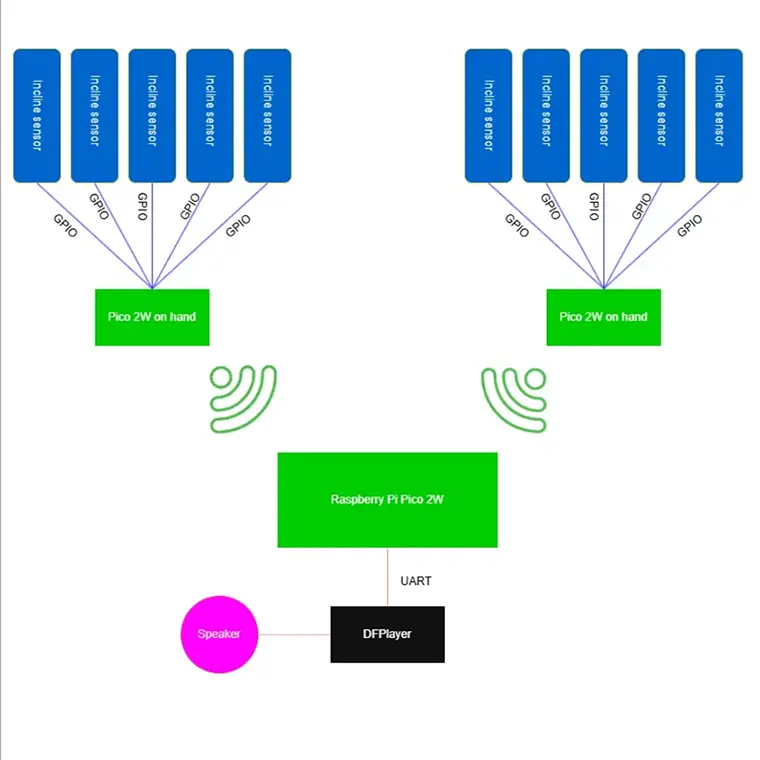
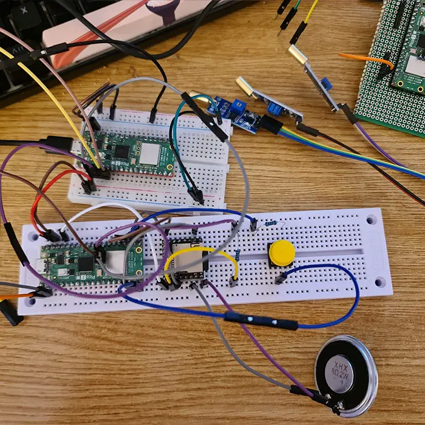
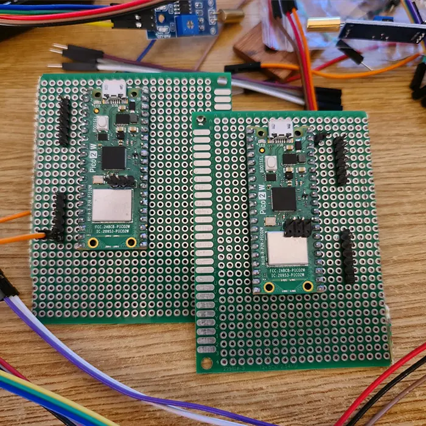
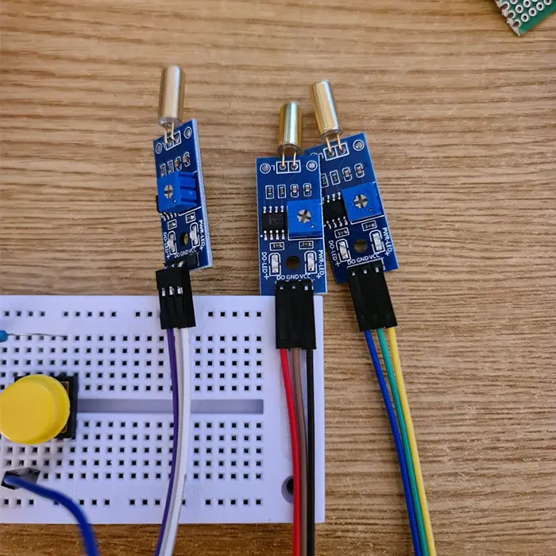
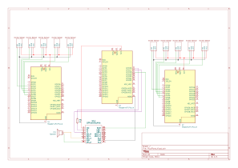

# Pico Piano

Inspired by the idea of the Power Glove accessory for the Nintendo Entertainment System, the Pico Piano is built to give the same cyber-punk feeling of virtual control over an instrument, without needing the actual piano physically.

:::info

**Author**: Bercut Remus-Gabriel \
**GitHub Project Link**: https://github.com/UPB-PMRust-Students/project-GnarGnaw

:::

## Description

The Pico Piano simulates playing the piano by using incline sensors on each finger, connected to a Pico 2W board for each hand which communicate wirelessly to a main Pico 2W sending signals for each note to a DFPlayer.

## Motivation

I got the idea after browsing optimus and seeing incline sensors. I knew immediately that it would be amazing to connect them to a finger and work some magic. After that, everything came naturally with the musical instruments, piano was the most intuitive idea.

## Architecture

**Components used**

**Raspeberry Pi Pico 2W**: This is used for communicating with the sensors through GPIO, controlling the DFPlayer through UART, debugging throughout.

**DFPLayer**: This module is used for playing the actual sound. It includes a DAC and an SD Card reader which reduces the amount of work needed in order to communicate between modules. Connection with the Pico is done via UART.

**Incline Sensors**: The sensors use a very simple mechanism inside with 2 balls that are acted upon by gravity. They send a signal when they touch each other and a metal pin at the base of the sensor. They communicate via GPIO with the Pico.

## Log

### Week 5-11 May

I've received all 12 incline sensors and the DFPlayer last week so I can finally start to test everything. The sensors can communicate through GPIO since their signal need not be processed, but I'm having trouble figuring how the DFPlayer works and how to use UART.

Song of the week is: [TOOL - Reflection](https://youtu.be/4MzVuHqsNoM?si=4Z2zsSdlizm-3E6u)

### Week 12-18 May

Finally I got the DFPlayer working. It's really magic, it does all I need and I found some example code in the library of the **ONLY** crate for the module, [dfplayer_async](https://docs.rs/dfplayer-async/latest/dfplayer_async/), which is honestly **GOATED**. I also got some 8Ohm, 1W and 2W speakers and they sound great! I am considering upgrading the project to make it more complex - that being, to add a button of some sort to change the instrument, so **Pico Piano** will become **Pico Band**??, haven't yet decided the name.

I have yet to solder everything in place, but I know for a fact everything is working, except for the Wi-Fi which I haven't tested, that's a formality. I bought some battery holders for 2x AA's (that's 3V, so it was a waste), I'll need to order 3x for 4x AA holders. My project is a mosaic of every Optimus Digital order I've ever placed, even for battery holders.

Song of the week is: [Kanye West - Runaway](https://www.youtube.com/watch?v=EMnQwBTJnMM)

## Hardware

Setup consists of 3 Raspeberry Pi Pico 2W boards, one for each hand and one acting as the main unit for playing the music. The music is played through a speaker connected to a DFPlayer module which receives signal from the main Pico board.
The DFPlayer connects to the main Pico 2W through UART and to the speaker via the SPK pins. VCC is supplied by the Pico board. 5 incline sensors are connected through GPIO to a Pico 2W for each hand.

This will be the main pico (in this case the debug probe is still connected and it can stay for the project). I soldered wires to the speaker because it's very hard to test while holding 2 wires in place with my hands. I also added a button for changing the instrument to add complexity.

These are the 2 boards that will be places on the gloves. I have partially soldered them to the prototyping board and also soldered pins for VCC and GND for the sensors, 6 pins, 5 for the sensors and 1 for the connection to the board with a wire. It's easier this way I reckon.

Finally, these are the sensors. They are tested and work fine but I have yet to connect ALL of them to the boards. This will be done when I test the final version of the code.

### Schematics

I used KiCAD to draw this schematic. Nothing to add to this really, it's quite clear.

### Bill of Materials
| Device                                                  | Usage                        | Price                           |
|---------------------------------------------------------|------------------------------|---------------------------------|
| [3x Raspberry Pi Pico W](https://www.raspberrypi.com/documentation/microcontrollers/raspberry-pi-pico.html) | Microcontrollers | [120 RON](https://www.optimusdigital.ro/en/raspberry-pi-boards/13327-raspberry-pi-pico-2-w.html) |
| [DFPlayer Mini](https://picaxe.com/docs/spe033.pdf) | MP3 Module with SD Card | [14 RON](https://www.optimusdigital.ro/en/audio/1484-dfplayer-mini-miniature-mp3-player-module.html) |
| [10x Incline Sensor](https://components101.com/sensors/sw-520d-tilt-sensor-module)| Incline Sensor | [10x5 RON](https://www.bitmi.ro/electronica/senzor-inclinare-sw-520d-11527.html) |
| [Resistor 1K Ohm](https://www.optimusdigital.ro/en/resistors/10928-250-pcs-plusivo-resistor-kit.html)| Resistor from Kit  | [15 RON](https://www.optimusdigital.ro/en/resistors/10928-250-pcs-plusivo-resistor-kit.html) |
| Wires | Wires, Male-Male and Female-Female | [~10 RON](https://www.optimusdigital.ro/en/wires-with-connectors/885-wires-male-male-10p-10cm.html) |
| Speaker 8Ohm 1W | Speaker | [4,28 RON](https://ardushop.ro/ro/componente-discrete/1084-difuzor-1w-8ohm-50mm-6427854014900.html) |
| Prototyping Board | Light-weight breadboard for the gloves | [4 RON](https://www.optimusdigital.ro/ro/prototipare-cablaje-de-test/721-placa-de-test-universala-verde-70x90-mm.html)

## Software
| Library | Description | Usage |
|---------|-------------|-------|
[embassy-rp](https://docs.embassy.dev/embassy-rp/git/rp235xb/index.html) | For communication with the peripherals |  |
[embassy-executor](https://docs.embassy.dev/embassy-executor/git/cortex-m/index.html) | Executor for tasks |  |
[embassy-time](https://docs.embassy.dev/embassy-time/git/default/index.html) | Used for timers, delay, duration etc |  |
[embassy-sync](https://docs.embassy.dev/embassy-sync/git/default/index.html) | Used for synchronization |  |
[dfplayer_async](https://docs.rs/dfplayer-async/latest/dfplayer_async/) | Found on crates.io, made specifically for the DFPlayer module |  |  |
## Links