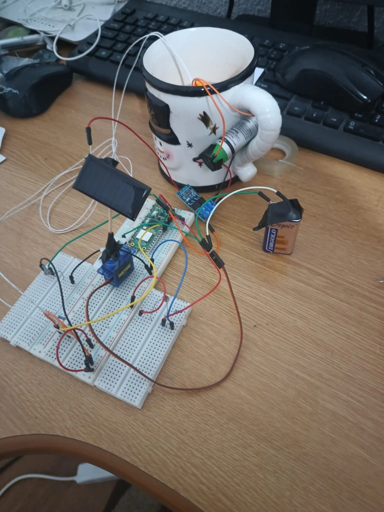
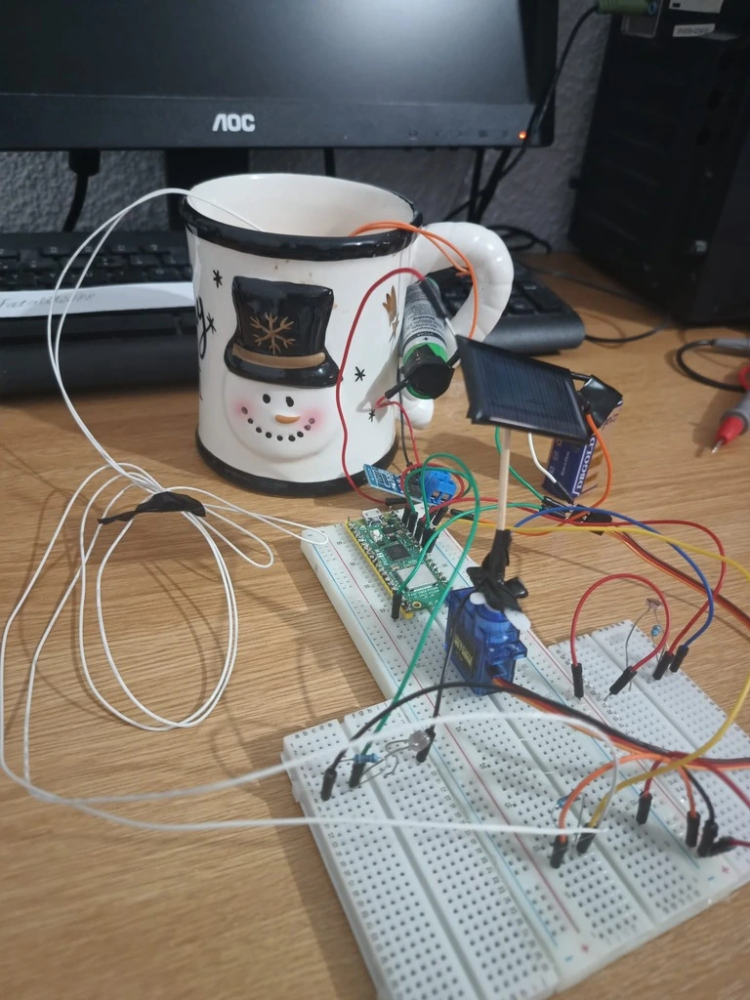
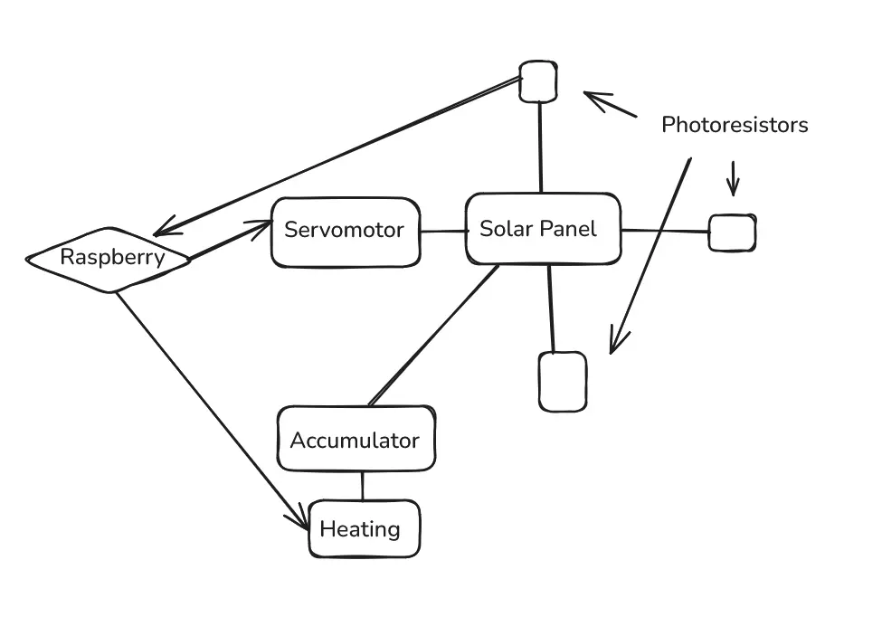
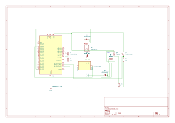

# Solar Panel
A rotative solar panel that moves toward the sun.

:::info 

**Author**: Andrei Valentin-Alexandru \
**GitHub Project Link**: https://github.com/UPB-PMRust-Students/project-ValiRupe

:::

## Description

The project will consist of a small solar panel attached to a servo motor. A number of photoresistors will be placed around the solar panel and the panel will move depending in the direction of the highest sunlight input. The energy will be stored and used for heating water behind it and a sensor will measure the temperature.


## Motivation

I wanted for a long time to learn and to do a project based around solar energy. I am not as motivated for a solar future as I am about the solar cell tehnology and it's intricacies.

## Architecture 

Raspberry Pi Pico 2W is the machine which controls everything.

The solar panel is the main component which will be used for the application in gathering energy.

The photoresistors will be used as sensors and we will compare where is the lowest resistance and move in that direction.

The servomotor will rotate the panel based on the data from the photoresistors.

The PWM power controller will help control the flow of energy so the accumulator doesn't burn.

The accumulator stores energy.

The heating element heats the water.

The sensor for temperature reads data from the water.

## Log

<!-- write your progress here every week -->

### Week 5 - 11 May

I did the documentation part and bought some of the components ( I already had some of them ). I did the setup for picotool on my laptop.

### Week 12 - 18 May

I assembled the hardware parts, I did the KiCAD scheme, I managed progress with the picotool.





### Week 19 - 25 May

## Hardware

Raspberry Pi Pico 2W is the main part of the hardware.

Solar Panel - 5V 25mA, 45x25 mm

Photoresistors - 1 MΩ at 0 Lux, 10kΩ at 25 Lux

Servomotor - moves 180 degrees, 5 V

PWM power controller - 5-36 V, 15 A

Acummulator - 5 V

Heating element - 5V / 50 ℃ / 0.3-1W

Sensor for temperature - NTC 100k


### Schematics 



Place your KiCAD schematics here.

### Bill of Materials

<!-- Fill out this table with all the hardware components that you might need.

The format is 
```
| [Device](link://to/device) | This is used ... | [price](link://to/store) |

```

-->

| Device | Usage | Price |
|--------|--------|-------|
| [Raspberry Pi Pico W](https://www.raspberrypi.com/documentation/microcontrollers/raspberry-pi-pico.html) | The microcontroller | [40 RON](https://www.optimusdigital.ro/en/raspberry-pi-boards/12394-raspberry-pi-pico-w.html) |
| [Heating element] | Heats the water | [15 RON](https://www.optimusdigital.ro/ro/altele/3060-mini-element-de-incalzire-ptc-5v-50-03-1w.html) |
| [PWM Controller] | Controls the electricity sent to the accumulator | [7 RON](https://www.optimusdigital.ro/ro/butoane-i-comutatoare/2387-modul-comutator-pwm-de-putere-5-36-v-15-a.html)| 
[Photoresistors] | Detects the light | [3 RON](https://www.optimusdigital.ro/ro/componente-electronice-altele/1863-fotorezistor-tip-5528.html) |
| [Thermoresistor] | Detects the temperature | [4 RON](https://www.optimusdigital.ro/ro/senzori-senzori-de-temperatura/798-senzor-de-temperatura-100k-ntc.html) |
| [Accumulator] | The battery that charges | Free from a friend's vape |
| [Solar Panel] | Gets energy from the sunlight | [13 RON](https://ardushop.ro/ro/alimentare/1377-mini-panou-fotovoltaic-5v-25ma-6427854020109.html) |
| [Servomotor] | Moves the panel left and right | From someone's kit, basically free |


## Software

| Library | Description | Usage |
|---------|-------------|-------|
| [st7789](https://github.com/almindor/st7789) | Display driver for ST7789 | Used for the display for the Pico Explorer Base |
| [embedded-graphics](https://github.com/embedded-graphics/embedded-graphics) | 2D graphics library | Used for drawing to the display |

## Links

<!-- Add a few links that inspired you and that you think you will use for your project -->

1. [Solar powered pi pico](https://www.youtube.com/watch?v=molEMt655YQ)

