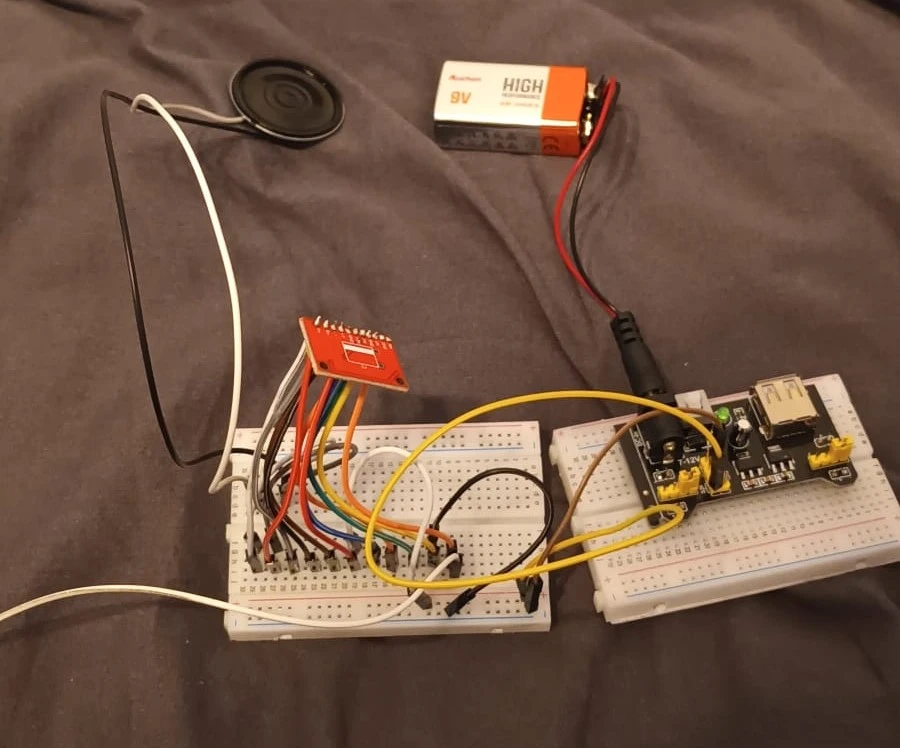
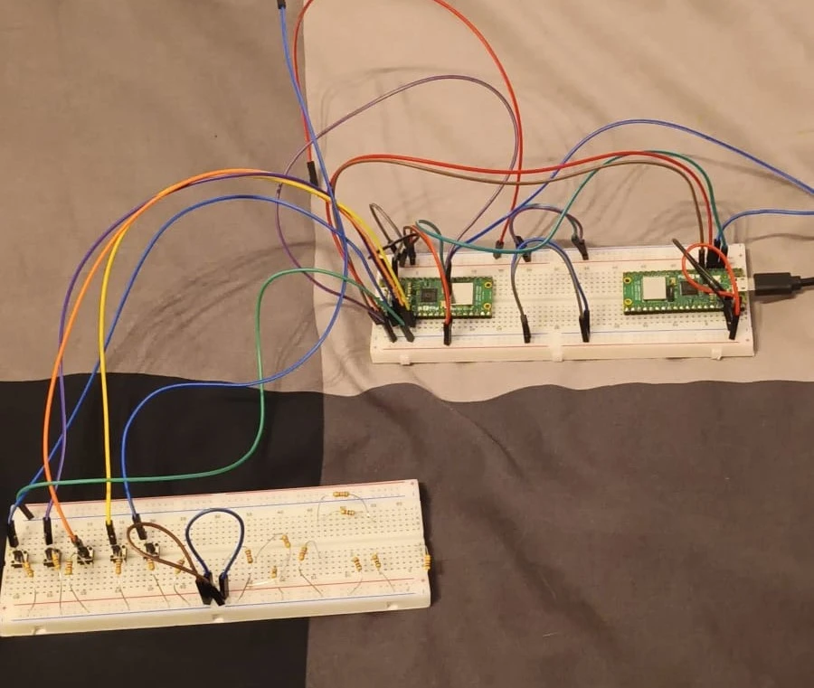
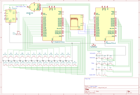

# Electric Piano
An electric piano made using mainly buttons and the Raspberry Pico 2W

:::info 

**Author**: Preda Vlad \
**GitHub Project Link**: [Github](https://github.com/UPB-PMRust-Students/project-Mrpokemon04)

:::

## Description

This project aims to create a functional electric piano using the Raspberry Pico's many GPIO ports. Alongside the standard function to play notes, I aim to implement several others, such as a metronome, the choice between 5 separate instruments, a delay feature, the option to offset the used octaves and a playback feature. The main shell of the project will essentially be a 3D printed hull whose keys will press down on buttons that activate a specific GPIO to play a specific note. On command, a signal will be sent which will play an audio file specific to the current settings through a speaker.

## Motivation

For a few years now, I've been learning to play the piano, using an old keyboard that I received a long time ago. Aside from the pleasure of playing, I have been interested in recreating the specific functions that my keyboard has, but also really wished it had more. The delay and playback features are not present on the keyboard I play, yet I feel my creativity could have fun with these features. Therefore, I chose such a topic out of love for music, but a desire to not be held back by the functionality of what I currently own.

## Architecture 

### Diagram

 

### Components

 The 2 Raspberry Pi Picos are used to control the entire project. One of them, on top of being used as a debugger, also lends its GPIO ports for the numerous buttons.
 For the note buttons, they cover 2 octaves + a note, and connect to GPIO pins from both Picos. The function buttons each cover a different purpose. There's a power supply which is needed to power a PAM8430 audio amplifier, which feeds into a speaker to play the sound of the note.

## Log

### Week 5 - 11 May

Since my project idea was approved, I started seriously organizing the tasks in my head. I gathered most of the components that I need, including the picos, a sound amplifier and the speaker. I still need to find the right buttons, though, since I ran into the issue that the standard buttons we use make too much noise when pressed down. Unfortunately, I found no suitable candidates in Romania, so, taking into account shipping times, the entire set of my components will take longer to arrive than expected.

Nevertheless, I can start testing. I started creating a few rust files to test certain systems using the few buttons I got for early prototyping. I made a simple example where a few buttons each print a different message when pressed, however I ran into the (probably forever-haunting) issue that two or more buttons will not register when pressed at the same time. I started researching ways to combat this, however I have yet to find anything. At the very least, I continued my work on the KiCAD scheme, which helped me organize the thoughts in my head.

Around this time, I started collecting audio files for every single note in every single instrument. I installed FL Studio (which proved to have a rather unintuitive UI) and struggled to get the right settings in place to create a short sound byte for each note. Despite this, I collected all the notes I needed for a piano and a classical guitar. I have yet to find suitable sounds for the other instruments I plan on having, but I still have time.

The first test file I made and worked on was the playback system. At first, I just wanted to code a system where you, after pressing a "record" button, could press notes which would be recorded somewhere and could be played back. After some work, I managed to essentially finish the whole system, complete with waiting the same amount of time between notes as when recording.

After, I worked on an example system for the metronome. Since I don't yet have my speaker set up, instead of working with sounds, I just print out messages for now. The biggest challenge I faced was updating the BPM live. Although I learned how to use asynchronous tasks when working on the playback code, it still proved difficult to make live changes to the data in the metronome function.

### Week 12 - 18 May

### Week 19 - 25 May

## Hardware

- *Raspberry Pico 2W*: The brain of the project, it handles all the the input/output signals regarding keys and other features.
- *SD Card Reader*: This is used to store all the audio files, since the Pico's storage is not large enough.
- *Speaker*: Used in order to play the sound files, hooked up to an amplifier.
- *PAM8403 Amplifier*: This is used to strengthen the audio files to be later sent to the speaker.
- *Potentiometer*: Used to change volume.
- *Buttons*: Used for keys, as well as supplementary features.

### Photos

 
 
 

### Schematics

 

### Bill of Materials

| Device | Usage | Price |
|--------|--------|-------|
| [Raspberry Pi Pico 2W](https://www.raspberrypi.com/documentation/microcontrollers/raspberry-pi-pico.html) | The microcontroller | [39.66 RON](https://www.optimusdigital.ro/ro/placi-raspberry-pi/13327-raspberry-pi-pico-2-w.html) |
| Header pins | Pins for the microcontroller + other modules | [2 RON](https://www.optimusdigital.ro/ro/componente-electronice-headere-de-pini/85-header-de-pini.html) |
| Amplifier module PAM8403 | Module for the speaker | [4 RON](https://www.optimusdigital.ro/ro/audio-amplificatoare-audio/165-amplificator-in-miniatura.html) |
| [3x Breadboard](http://www.pgccphy.net/1020/datasheets/ELEGOO%20830%20430%20tie-points%20Breadboard.pdf) | Breadboards for picos and other components | [30 RON](https://www.optimusdigital.ro/ro/prototipare-breadboard-uri/8-breadboard-830-points.html) |
| 10k WH148 Potentiometer | Controlling volume | [2.39 RON](https://www.optimusdigital.ro/ro/componente-electronice-potentiometre/12360-rezistor-variabil-10k-wh148-poteniometru-fara-aiba-i-piulia.html) |
| Cap for potentiometer | Covers the potentiometer | [1 RON](https://www.optimusdigital.ro/ro/altele/267-capac-colorat-pentru-potentiometru-.html) |
| Micro USB cable | Connecting to the microcontroller | [4 RON](https://www.optimusdigital.ro/ro/cabluri-cabluri-usb/11939-cablu-negru-micro-usb-1-m.html) |
| 40x Button | Keys + other functions | |
| 10cm Male-to-Male jumper wires | Connections between components | [5 RON](https://www.optimusdigital.ro/ro/fire-fire-mufate/884-set-fire-tata-tata-40p-10-cm.html) |
| 10cm Male-to-Female jumper wires | Connections between debug and main pico | [3 RON](https://www.optimusdigital.ro/ro/fire-fire-mufate/650-fire-colorate-mama-tata-10p.html) |

## Software

| Library | Description | Usage |
|---------|-------------|-------|
| [embassy-rp](https://docs.embassy.dev/embassy-rp/git/rp2040/index.html) | The HAL implements both blocking and async APIs for many peripherals. | 
| [defmt](https://docs.rs/defmt/latest/defmt/) | Adds several debugging features | Logging/Debugging along the way
| [cortex-m-rt](https://docs.rs/cortex-m-rt/latest/cortex_m_rt/) | Contains all the required parts to build a no_std application | 
| [embassy-time](https://embassy.dev/book/dev/time_keeping.html) | Time management library  | Used for time-based operations such as delays |
| [embassy-sync](https://docs.embassy.dev/embassy-sync/git/default/index.html) | Provides synchronization features | Used for channels and signals to send data between tasks |

## Links

<!-- Add a few links that inspired you and that you think you will use for your project -->

1. [RP2350 Documentation](https://datasheets.raspberrypi.com/rp2350/rp2350-datasheet.pdf)
2. [Inspiration](https://www.instructables.com/Electric-Piano/)