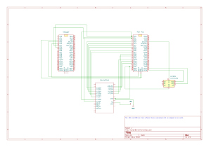

# HumanBenchmark

A human memory and reflexes tester

:::info

**Author**: Stoica Vlad-Alexandru
**Github Project Link**: https://github.com/UPB-PMRust-Students/project-Playsu

:::

## Description

A device that is used to see the reaction time and the memory score of people in a fun and interactive way.

## Motivation

I always liked to use sites like HumanBenchmark to see the differences between me and my friends. We used it in a competitive way and I figured that it would make an interesting project for this subject.

## Architecture

Here is the schematic of the project:

## Log

### Week 5 - 11 May

I bought all necessary components for the project. This involved researching and selecting the appropriate hardware specifications to match the project requirements and placing orders for all components.

### Week 12 - 18 May

I focused on building the complete hardware setup of the device. This included:
- Connecting the main Raspberry Pi Pico 2W to the LCD shield using the 8-bit parallel interface
- Setting up the AT24C256 EEPROM module with I2C connections to the main Pico
- Configuring the second Raspberry Pi Pico 2W as a debugger with SWD interface
- Assembling the power distribution system with the breadboard power supply and 12V adapter

By the end of the week, I had a fully assembled hardware prototype ready for the software implementation phase.

### Week 19 - 25 May

## Hardware

The project uses two Raspberry Pi Pico 2W microcontrollers - one as the main controller and one as a debugger. The display is a 2.4" TFT LCD Shield with ILI9325 controller that provides both visual output and touch input capabilities. For persistent storage, an AT24C256 EEPROM module stores game highscores. The system is powered by a breadboard power supply connected to a 12V adapter, which was chosen to provide sufficient power for the LCD's higher current requirements. All components are connected using jumper wires on a breadboard.

The main Pico 2W is connected to the LCD through an 8-bit parallel interface (D0-D7) plus control signals (RS, WR, RD, CS, RST), while the EEPROM communicates with the Pico via I2C (SDA, SCL). The second Pico 2W is configured as a debugger using the SWD interface, allowing for real-time debugging and program uploading.

### Schematics

### Bill of Materials
| Device | Usage | Price |
|--------|-------|-------|
| [Raspberry Pi Pico 2W](https://www.raspberrypi.com/documentation/microcontrollers/pico-series.html) | Main microcontroller for running the game logic and interfacing with peripherals | [40 RON](https://www.optimusdigital.ro/en/raspberry-pi-boards/13327-raspberry-pi-pico-2-w.html?search_query=raspberry+pi+pico+2W&results=36) |
| [Raspberry Pi Pico 2W](https://www.raspberrypi.com/documentation/microcontrollers/pico-series.html) | Secondary microcontroller used as a debugger | [40 RON](https://www.optimusdigital.ro/en/raspberry-pi-boards/13327-raspberry-pi-pico-2-w.html?search_query=raspberry+pi+pico+2W&results=36) |
| 2.4" Arduino LCD Red with Touchscreen | Display for the game interface with touchscreen capabilities | [40 RON](https://www.optimusdigital.ro/en/lcds/12489-4-inch-touch-screen-tft-display-shield-for-arduino-uno-mega.html?search_query=arduino+lcd&results=66) |
| AT24C256 EEPROM Module | Non-volatile memory for storing high scores and game settings | [9 RON](https://www.optimusdigital.ro/en/memories/632-modul-eeprom-at24c256.html?search_query=eeprom+at&results=89) |
| Breadboard Kit HQ830 with Wires and Source | It is used for powering the Arduino Shield | 22 RON |
| 12V Power Adapter | Power source for the breadboard power supply | [19 RON](https://www.optimusdigital.ro/ro/electronica-de-putere-alimentatoare-priza/2885-alimentator-stabilizat-12v-1000ma.html?search_query=alimentator+stabilizat+12+V&results=12) |
| 2 Separate Breadboards | Prototyping platform for connecting components | 18 RON |
| 2 Micro-USB cables | Connecting the 2 Raspberry Pi Pico 2W | [8 RON](https://www.optimusdigital.ro/en/usb-cables/11939-micro-usb-black-cable-1-m.html?search_query=micro+usb+1m&results=474) |

## Software

## Links